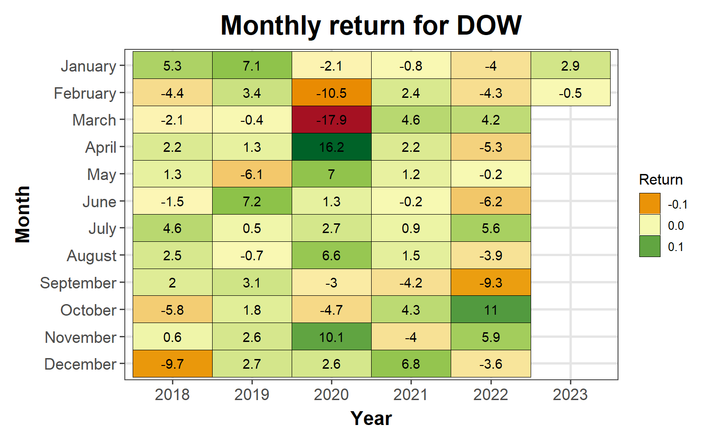

<link href="index_files/libs/tabwid-1.1.2/tabwid.css" rel="stylesheet" />

## Equity markets

After the poor performance in 2022, stock market had a good start to 2023. Technology and small cap companies outperformed the S&P last week and for the month of January.

<table data-quarto-disable-processing='true' class='cl-42b33b5a'><caption></caption><thead><tr style="overflow-wrap:break-word;"><th class="cl-42ab70aa">
Index
</th><th class="cl-42ab70aa">
Week
</th><th class="cl-42ab70b4">
Weekly Return
</th></tr></thead><tbody><tr style="overflow-wrap:break-word;"><td class="cl-42ab70b5">
S&amp;P 500
</td><td class="cl-42ab70b5">
202305
</td><td class="cl-42ab70be">
2.95%
</td></tr><tr style="overflow-wrap:break-word;"><td class="cl-42ab70bf">
Nasdaq
</td><td class="cl-42ab70bf">
202305
</td><td class="cl-42ab70c8">
5.38%
</td></tr><tr style="overflow-wrap:break-word;"><td class="cl-42ab70b5">
Dow Jones
</td><td class="cl-42ab70b5">
202305
</td><td class="cl-42ab70be">
0.62%
</td></tr><tr style="overflow-wrap:break-word;"><td class="cl-42ab70bf">
Russell
</td><td class="cl-42ab70bf">
202305
</td><td class="cl-42ab70c8">
5.29%
</td></tr><tr style="overflow-wrap:break-word;"><td class="cl-42ab70b5">
VIX
</td><td class="cl-42ab70b5">
202305
</td><td class="cl-42ab70be">
-8.07%
</td></tr></tbody></table>

### S&P 500

S&P 500 has an impressive 6.6% gain in the first month of 2023. It is the biggest percent gain for S&P since 2019 in January

### NASDAQ

Technology stocks outperformed S&P significantly to start the year with a solid gain of 11.5%. Only April 2020 had higher gain than January 2023 since the last 5 years.

### DOW Jones

However, blue chip dow stocks underperformed significanlty in January

### Russell

Small cap stocks showed strength with 10.3% gain. The index recovered it's losses in December 2022 and gained \~4% over December losses

## Bond markets

### Interest rates

Longer term interest rates for treasuries are trending down while shorter term rates are staying flat to slightly down for the year.

    Warning: Using an external vector in selections was deprecated in tidyselect 1.1.0.
    ℹ Please use `all_of()` or `any_of()` instead.
      # Was:
      data %>% select(rates)

      # Now:
      data %>% select(all_of(rates))

    See <https://tidyselect.r-lib.org/reference/faq-external-vector.html>.

    Warning in grid.Call(C_stringMetric, as.graphicsAnnot(x$label)): font family
    not found in Windows font database

    Warning in grid.Call(C_stringMetric, as.graphicsAnnot(x$label)): font family
    not found in Windows font database

    Warning in grid.Call(C_stringMetric, as.graphicsAnnot(x$label)): font family
    not found in Windows font database

    Warning in grid.Call(C_textBounds, as.graphicsAnnot(x$label), x$x, x$y, : font
    family not found in Windows font database

    Warning in grid.Call(C_textBounds, as.graphicsAnnot(x$label), x$x, x$y, : font
    family not found in Windows font database

    Warning in grid.Call(C_textBounds, as.graphicsAnnot(x$label), x$x, x$y, : font
    family not found in Windows font database

    Warning in grid.Call(C_textBounds, as.graphicsAnnot(x$label), x$x, x$y, : font
    family not found in Windows font database

    Warning in grid.Call(C_textBounds, as.graphicsAnnot(x$label), x$x, x$y, : font
    family not found in Windows font database

    Warning in grid.Call(C_textBounds, as.graphicsAnnot(x$label), x$x, x$y, : font
    family not found in Windows font database

    Warning in grid.Call(C_textBounds, as.graphicsAnnot(x$label), x$x, x$y, : font
    family not found in Windows font database

    Warning in grid.Call.graphics(C_text, as.graphicsAnnot(x$label), x$x, x$y, :
    font family not found in Windows font database

    Warning in grid.Call(C_textBounds, as.graphicsAnnot(x$label), x$x, x$y, : font
    family not found in Windows font database

### Yeild Curve

Yield curve continues to slope negatively (inverted). At the higher end, it appears that it is starting to slope positively or flat but at the lower end, it still slopes significantly negative

    Warning in grid.Call(C_textBounds, as.graphicsAnnot(x$label), x$x, x$y, : font
    family not found in Windows font database

    Warning in grid.Call(C_textBounds, as.graphicsAnnot(x$label), x$x, x$y, : font
    family not found in Windows font database

    Warning in grid.Call(C_textBounds, as.graphicsAnnot(x$label), x$x, x$y, : font
    family not found in Windows font database

    Warning in grid.Call(C_textBounds, as.graphicsAnnot(x$label), x$x, x$y, : font
    family not found in Windows font database

    Warning in grid.Call(C_textBounds, as.graphicsAnnot(x$label), x$x, x$y, : font
    family not found in Windows font database

    Warning in grid.Call(C_textBounds, as.graphicsAnnot(x$label), x$x, x$y, : font
    family not found in Windows font database

    Warning in grid.Call(C_textBounds, as.graphicsAnnot(x$label), x$x, x$y, : font
    family not found in Windows font database

    Warning in grid.Call.graphics(C_text, as.graphicsAnnot(x$label), x$x, x$y, :
    font family not found in Windows font database

    Warning in grid.Call(C_textBounds, as.graphicsAnnot(x$label), x$x, x$y, : font
    family not found in Windows font database

    Warning in grid.Call(C_stringMetric, as.graphicsAnnot(x$label)): font family
    not found in Windows font database

    Warning in grid.Call(C_textBounds, as.graphicsAnnot(x$label), x$x, x$y, : font
    family not found in Windows font database

    Warning in grid.Call(C_textBounds, as.graphicsAnnot(x$label), x$x, x$y, : font
    family not found in Windows font database

    Warning in grid.Call(C_textBounds, as.graphicsAnnot(x$label), x$x, x$y, : font
    family not found in Windows font database

    Warning in grid.Call(C_textBounds, as.graphicsAnnot(x$label), x$x, x$y, : font
    family not found in Windows font database

    Warning in grid.Call(C_textBounds, as.graphicsAnnot(x$label), x$x, x$y, : font
    family not found in Windows font database

    Warning in grid.Call(C_textBounds, as.graphicsAnnot(x$label), x$x, x$y, : font
    family not found in Windows font database

    Warning in grid.Call(C_textBounds, as.graphicsAnnot(x$label), x$x, x$y, : font
    family not found in Windows font database

    Warning in grid.Call(C_textBounds, as.graphicsAnnot(x$label), x$x, x$y, : font
    family not found in Windows font database

    Warning in grid.Call(C_textBounds, as.graphicsAnnot(x$label), x$x, x$y, : font
    family not found in Windows font database

    Warning in grid.Call(C_textBounds, as.graphicsAnnot(x$label), x$x, x$y, : font
    family not found in Windows font database

    Warning in grid.Call.graphics(C_text, as.graphicsAnnot(x$label), x$x, x$y, :
    font family not found in Windows font database

    Warning in grid.Call(C_textBounds, as.graphicsAnnot(x$label), x$x, x$y, : font
    family not found in Windows font database

    Warning in grid.Call(C_textBounds, as.graphicsAnnot(x$label), x$x, x$y, : font
    family not found in Windows font database

