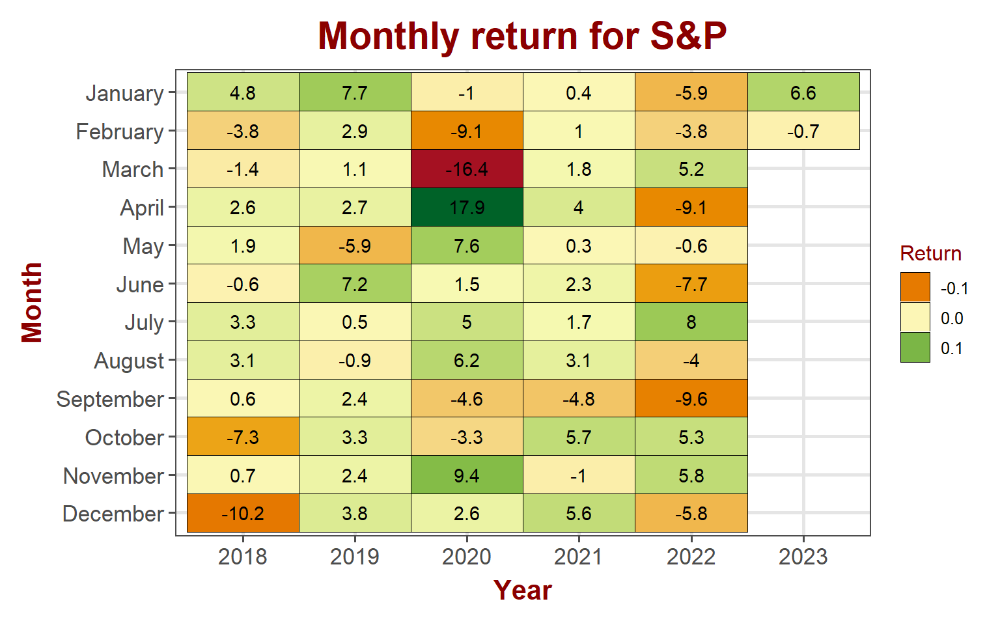
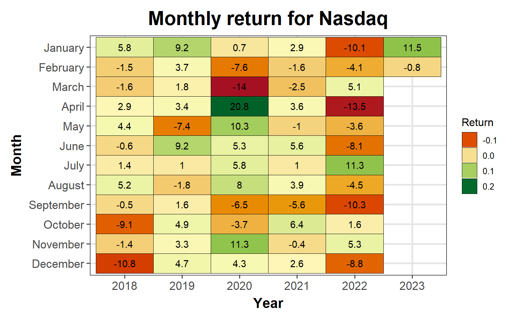
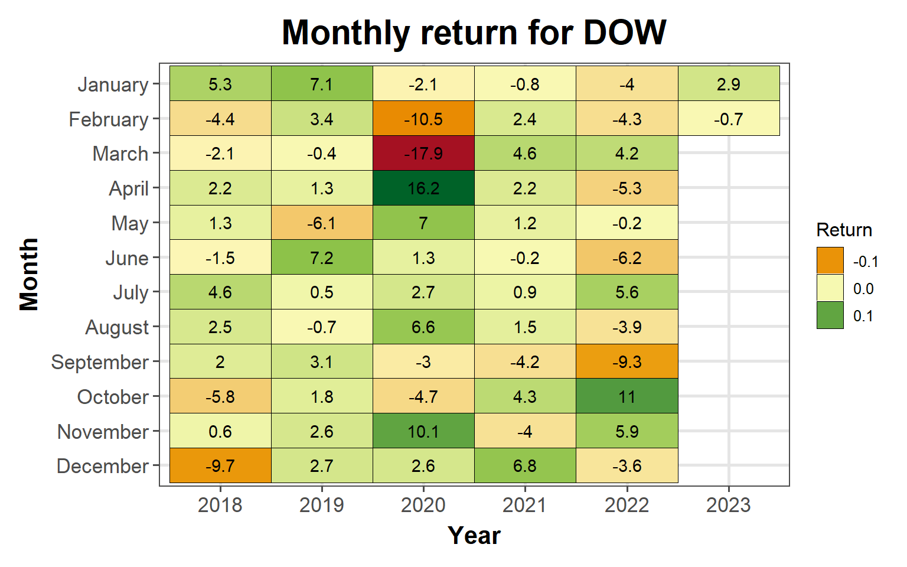
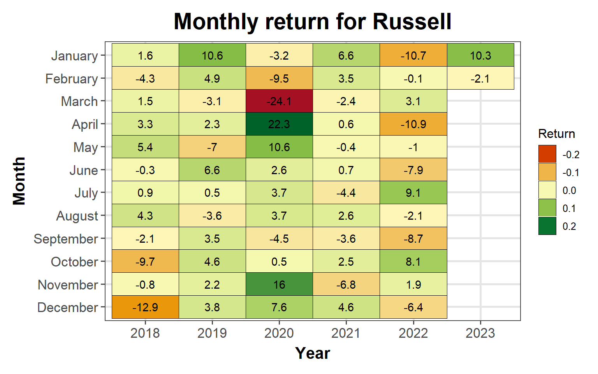
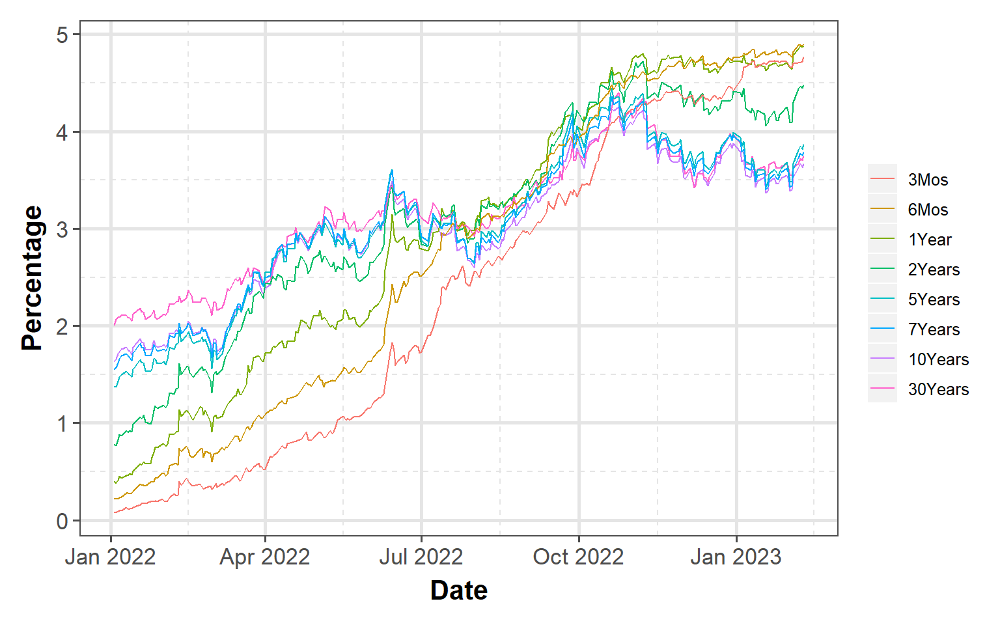
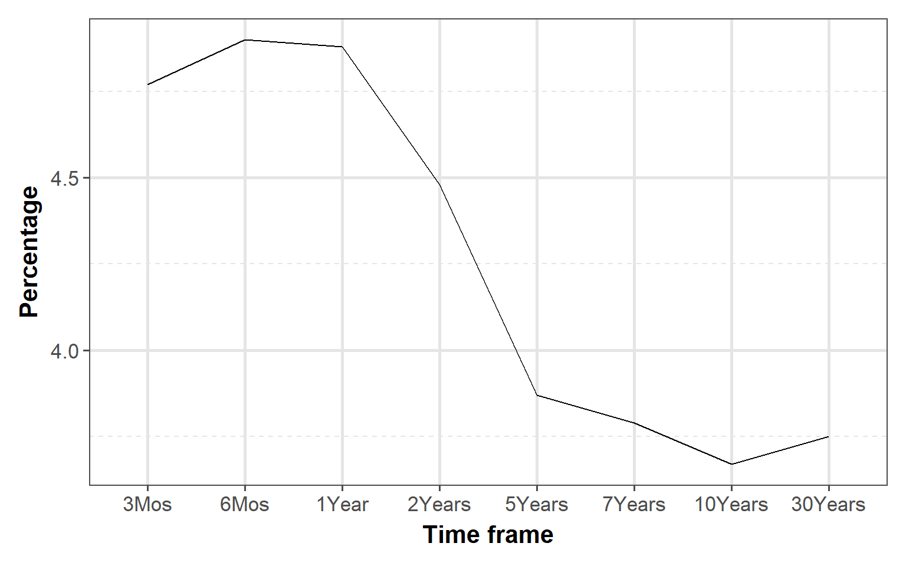
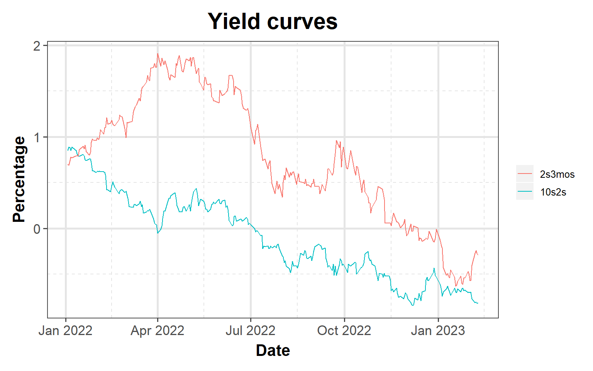

<link href="index_files/libs/tabwid-1.1.2/tabwid.css" rel="stylesheet" />

-   <a href="#equity-markets" id="toc-equity-markets">Equity markets</a>
    -   <a href="#sp-500" id="toc-sp-500">S&amp;P 500</a>
    -   <a href="#nasdaq" id="toc-nasdaq">NASDAQ</a>
    -   <a href="#dow-jones" id="toc-dow-jones">DOW Jones</a>
    -   <a href="#russell" id="toc-russell">Russell</a>
-   <a href="#bond-markets" id="toc-bond-markets">Bond markets</a>
    -   <a href="#interest-rates" id="toc-interest-rates">Interest rates</a>
    -   <a href="#yeild-curve" id="toc-yeild-curve">Yeild Curve</a>

## Equity markets

Equity markets took a pause last week after the very good performance the week prior. Most indexes stayed pretty much flat to slightly down for the week.

<table data-quarto-disable-processing='true' class='cl-d8a138ee'><caption></caption><thead><tr style="overflow-wrap:break-word;"><th class="cl-d8998afe">
Index
</th><th class="cl-d8998afe">
Week
</th><th class="cl-d8998b08">
Weekly Return
</th></tr></thead><tbody><tr style="overflow-wrap:break-word;"><td class="cl-d8998b09">
S&amp;P 500
</td><td class="cl-d8998b09">
202306
</td><td class="cl-d8998b12">
-0.50%
</td></tr><tr style="overflow-wrap:break-word;"><td class="cl-d8998b13">
Nasdaq
</td><td class="cl-d8998b13">
202306
</td><td class="cl-d8998b14">
-1.42%
</td></tr><tr style="overflow-wrap:break-word;"><td class="cl-d8998b09">
Dow Jones
</td><td class="cl-d8998b09">
202306
</td><td class="cl-d8998b12">
-0.06%
</td></tr><tr style="overflow-wrap:break-word;"><td class="cl-d8998b13">
Russell
</td><td class="cl-d8998b13">
202306
</td><td class="cl-d8998b14">
-1.99%
</td></tr><tr style="overflow-wrap:break-word;"><td class="cl-d8998b09">
VIX
</td><td class="cl-d8998b09">
202306
</td><td class="cl-d8998b12">
5.66%
</td></tr></tbody></table>

### S&P 500

S&P 500 lost 0.5%, taking a pause from big gains from the week prior and consolidating

    Warning in grid.Call(C_stringMetric, as.graphicsAnnot(x$label)): font family
    not found in Windows font database

    Warning in grid.Call(C_stringMetric, as.graphicsAnnot(x$label)): font family
    not found in Windows font database

    Warning in grid.Call(C_stringMetric, as.graphicsAnnot(x$label)): font family
    not found in Windows font database

    Warning in grid.Call(C_stringMetric, as.graphicsAnnot(x$label)): font family
    not found in Windows font database

    Warning in grid.Call(C_stringMetric, as.graphicsAnnot(x$label)): font family
    not found in Windows font database

    Warning in grid.Call(C_textBounds, as.graphicsAnnot(x$label), x$x, x$y, : font
    family not found in Windows font database

    Warning in grid.Call(C_textBounds, as.graphicsAnnot(x$label), x$x, x$y, : font
    family not found in Windows font database

    Warning in grid.Call(C_textBounds, as.graphicsAnnot(x$label), x$x, x$y, : font
    family not found in Windows font database

    Warning in grid.Call(C_textBounds, as.graphicsAnnot(x$label), x$x, x$y, : font
    family not found in Windows font database

    Warning in grid.Call(C_textBounds, as.graphicsAnnot(x$label), x$x, x$y, : font
    family not found in Windows font database

    Warning in grid.Call(C_textBounds, as.graphicsAnnot(x$label), x$x, x$y, : font
    family not found in Windows font database

    Warning in grid.Call(C_textBounds, as.graphicsAnnot(x$label), x$x, x$y, : font
    family not found in Windows font database

    Warning in grid.Call(C_textBounds, as.graphicsAnnot(x$label), x$x, x$y, : font
    family not found in Windows font database

    Warning in grid.Call(C_textBounds, as.graphicsAnnot(x$label), x$x, x$y, : font
    family not found in Windows font database

    Warning in grid.Call(C_textBounds, as.graphicsAnnot(x$label), x$x, x$y, : font
    family not found in Windows font database

    Warning in grid.Call.graphics(C_text, as.graphicsAnnot(x$label), x$x, x$y, :
    font family not found in Windows font database

    Warning in grid.Call(C_textBounds, as.graphicsAnnot(x$label), x$x, x$y, : font
    family not found in Windows font database

    Warning in grid.Call(C_textBounds, as.graphicsAnnot(x$label), x$x, x$y, : font
    family not found in Windows font database

    Warning in grid.Call(C_textBounds, as.graphicsAnnot(x$label), x$x, x$y, : font
    family not found in Windows font database

### NASDAQ

Technology stocks lost little over 1% in the week for a month to data loss of 0.8%

    Warning in grid.Call(C_textBounds, as.graphicsAnnot(x$label), x$x, x$y, : font
    family not found in Windows font database

    Warning in grid.Call(C_textBounds, as.graphicsAnnot(x$label), x$x, x$y, : font
    family not found in Windows font database

    Warning in grid.Call(C_textBounds, as.graphicsAnnot(x$label), x$x, x$y, : font
    family not found in Windows font database

    Warning in grid.Call(C_textBounds, as.graphicsAnnot(x$label), x$x, x$y, : font
    family not found in Windows font database

    Warning in grid.Call(C_textBounds, as.graphicsAnnot(x$label), x$x, x$y, : font
    family not found in Windows font database

    Warning in grid.Call(C_textBounds, as.graphicsAnnot(x$label), x$x, x$y, : font
    family not found in Windows font database

    Warning in grid.Call(C_textBounds, as.graphicsAnnot(x$label), x$x, x$y, : font
    family not found in Windows font database

    Warning in grid.Call(C_textBounds, as.graphicsAnnot(x$label), x$x, x$y, : font
    family not found in Windows font database

    Warning in grid.Call(C_textBounds, as.graphicsAnnot(x$label), x$x, x$y, : font
    family not found in Windows font database

    Warning in grid.Call(C_textBounds, as.graphicsAnnot(x$label), x$x, x$y, : font
    family not found in Windows font database

    Warning in grid.Call(C_textBounds, as.graphicsAnnot(x$label), x$x, x$y, : font
    family not found in Windows font database

    Warning in grid.Call(C_textBounds, as.graphicsAnnot(x$label), x$x, x$y, : font
    family not found in Windows font database

    Warning in grid.Call.graphics(C_text, as.graphicsAnnot(x$label), x$x, x$y, :
    font family not found in Windows font database

    Warning in grid.Call(C_textBounds, as.graphicsAnnot(x$label), x$x, x$y, : font
    family not found in Windows font database

    Warning in grid.Call(C_textBounds, as.graphicsAnnot(x$label), x$x, x$y, : font
    family not found in Windows font database

    Warning in grid.Call(C_textBounds, as.graphicsAnnot(x$label), x$x, x$y, : font
    family not found in Windows font database

### DOW Jones

Literally no change in DOW for the week. It lost 0.7% month to date

    Warning in grid.Call(C_textBounds, as.graphicsAnnot(x$label), x$x, x$y, : font
    family not found in Windows font database

    Warning in grid.Call(C_textBounds, as.graphicsAnnot(x$label), x$x, x$y, : font
    family not found in Windows font database

    Warning in grid.Call(C_textBounds, as.graphicsAnnot(x$label), x$x, x$y, : font
    family not found in Windows font database

    Warning in grid.Call(C_textBounds, as.graphicsAnnot(x$label), x$x, x$y, : font
    family not found in Windows font database

    Warning in grid.Call(C_textBounds, as.graphicsAnnot(x$label), x$x, x$y, : font
    family not found in Windows font database

    Warning in grid.Call(C_textBounds, as.graphicsAnnot(x$label), x$x, x$y, : font
    family not found in Windows font database

    Warning in grid.Call(C_textBounds, as.graphicsAnnot(x$label), x$x, x$y, : font
    family not found in Windows font database

    Warning in grid.Call(C_textBounds, as.graphicsAnnot(x$label), x$x, x$y, : font
    family not found in Windows font database

    Warning in grid.Call(C_textBounds, as.graphicsAnnot(x$label), x$x, x$y, : font
    family not found in Windows font database

    Warning in grid.Call(C_textBounds, as.graphicsAnnot(x$label), x$x, x$y, : font
    family not found in Windows font database

    Warning in grid.Call(C_textBounds, as.graphicsAnnot(x$label), x$x, x$y, : font
    family not found in Windows font database

    Warning in grid.Call(C_textBounds, as.graphicsAnnot(x$label), x$x, x$y, : font
    family not found in Windows font database

    Warning in grid.Call.graphics(C_text, as.graphicsAnnot(x$label), x$x, x$y, :
    font family not found in Windows font database

    Warning in grid.Call(C_textBounds, as.graphicsAnnot(x$label), x$x, x$y, : font
    family not found in Windows font database

    Warning in grid.Call(C_textBounds, as.graphicsAnnot(x$label), x$x, x$y, : font
    family not found in Windows font database

    Warning in grid.Call(C_textBounds, as.graphicsAnnot(x$label), x$x, x$y, : font
    family not found in Windows font database

### Russell

Small cap stocks lost \~2% for the week

    Warning in grid.Call(C_textBounds, as.graphicsAnnot(x$label), x$x, x$y, : font
    family not found in Windows font database

    Warning in grid.Call(C_textBounds, as.graphicsAnnot(x$label), x$x, x$y, : font
    family not found in Windows font database

    Warning in grid.Call(C_textBounds, as.graphicsAnnot(x$label), x$x, x$y, : font
    family not found in Windows font database

    Warning in grid.Call(C_textBounds, as.graphicsAnnot(x$label), x$x, x$y, : font
    family not found in Windows font database

    Warning in grid.Call(C_textBounds, as.graphicsAnnot(x$label), x$x, x$y, : font
    family not found in Windows font database

    Warning in grid.Call(C_textBounds, as.graphicsAnnot(x$label), x$x, x$y, : font
    family not found in Windows font database

    Warning in grid.Call(C_textBounds, as.graphicsAnnot(x$label), x$x, x$y, : font
    family not found in Windows font database

    Warning in grid.Call(C_textBounds, as.graphicsAnnot(x$label), x$x, x$y, : font
    family not found in Windows font database

    Warning in grid.Call(C_textBounds, as.graphicsAnnot(x$label), x$x, x$y, : font
    family not found in Windows font database

    Warning in grid.Call(C_textBounds, as.graphicsAnnot(x$label), x$x, x$y, : font
    family not found in Windows font database

    Warning in grid.Call(C_textBounds, as.graphicsAnnot(x$label), x$x, x$y, : font
    family not found in Windows font database

    Warning in grid.Call(C_textBounds, as.graphicsAnnot(x$label), x$x, x$y, : font
    family not found in Windows font database

    Warning in grid.Call.graphics(C_text, as.graphicsAnnot(x$label), x$x, x$y, :
    font family not found in Windows font database

    Warning in grid.Call(C_textBounds, as.graphicsAnnot(x$label), x$x, x$y, : font
    family not found in Windows font database

    Warning in grid.Call(C_textBounds, as.graphicsAnnot(x$label), x$x, x$y, : font
    family not found in Windows font database

    Warning in grid.Call(C_textBounds, as.graphicsAnnot(x$label), x$x, x$y, : font
    family not found in Windows font database

## Bond markets

### Interest rates

Longer term interest rates for treasuries are trending down while shorter term rates are staying flat to slightly down for the year.

    Warning: Using an external vector in selections was deprecated in tidyselect 1.1.0.
    ℹ Please use `all_of()` or `any_of()` instead.
      # Was:
      data %>% select(rates)

      # Now:
      data %>% select(all_of(rates))

    See <https://tidyselect.r-lib.org/reference/faq-external-vector.html>.

    Warning in grid.Call(C_textBounds, as.graphicsAnnot(x$label), x$x, x$y, : font
    family not found in Windows font database

    Warning in grid.Call(C_textBounds, as.graphicsAnnot(x$label), x$x, x$y, : font
    family not found in Windows font database

    Warning in grid.Call(C_textBounds, as.graphicsAnnot(x$label), x$x, x$y, : font
    family not found in Windows font database

    Warning in grid.Call(C_textBounds, as.graphicsAnnot(x$label), x$x, x$y, : font
    family not found in Windows font database

    Warning in grid.Call(C_textBounds, as.graphicsAnnot(x$label), x$x, x$y, : font
    family not found in Windows font database

    Warning in grid.Call(C_textBounds, as.graphicsAnnot(x$label), x$x, x$y, : font
    family not found in Windows font database

    Warning in grid.Call(C_textBounds, as.graphicsAnnot(x$label), x$x, x$y, : font
    family not found in Windows font database

    Warning in grid.Call(C_textBounds, as.graphicsAnnot(x$label), x$x, x$y, : font
    family not found in Windows font database

    Warning in grid.Call.graphics(C_text, as.graphicsAnnot(x$label), x$x, x$y, :
    font family not found in Windows font database

    Warning in grid.Call(C_textBounds, as.graphicsAnnot(x$label), x$x, x$y, : font
    family not found in Windows font database

### Yeild Curve

Yield curve continues to slope negatively (inverted). At the higher end, it appears that it is starting to slope positively or flat but at the lower end, it still slopes significantly negative

    Warning in grid.Call(C_textBounds, as.graphicsAnnot(x$label), x$x, x$y, : font
    family not found in Windows font database

    Warning in grid.Call(C_textBounds, as.graphicsAnnot(x$label), x$x, x$y, : font
    family not found in Windows font database

    Warning in grid.Call(C_textBounds, as.graphicsAnnot(x$label), x$x, x$y, : font
    family not found in Windows font database

    Warning in grid.Call(C_textBounds, as.graphicsAnnot(x$label), x$x, x$y, : font
    family not found in Windows font database

    Warning in grid.Call(C_textBounds, as.graphicsAnnot(x$label), x$x, x$y, : font
    family not found in Windows font database

    Warning in grid.Call(C_textBounds, as.graphicsAnnot(x$label), x$x, x$y, : font
    family not found in Windows font database

    Warning in grid.Call(C_textBounds, as.graphicsAnnot(x$label), x$x, x$y, : font
    family not found in Windows font database

    Warning in grid.Call.graphics(C_text, as.graphicsAnnot(x$label), x$x, x$y, :
    font family not found in Windows font database

    Warning in grid.Call(C_textBounds, as.graphicsAnnot(x$label), x$x, x$y, : font
    family not found in Windows font database

    Warning in grid.Call(C_textBounds, as.graphicsAnnot(x$label), x$x, x$y, : font
    family not found in Windows font database

    Warning in grid.Call(C_textBounds, as.graphicsAnnot(x$label), x$x, x$y, : font
    family not found in Windows font database

    Warning in grid.Call(C_textBounds, as.graphicsAnnot(x$label), x$x, x$y, : font
    family not found in Windows font database

    Warning in grid.Call(C_textBounds, as.graphicsAnnot(x$label), x$x, x$y, : font
    family not found in Windows font database

    Warning in grid.Call(C_textBounds, as.graphicsAnnot(x$label), x$x, x$y, : font
    family not found in Windows font database

    Warning in grid.Call(C_textBounds, as.graphicsAnnot(x$label), x$x, x$y, : font
    family not found in Windows font database

    Warning in grid.Call(C_textBounds, as.graphicsAnnot(x$label), x$x, x$y, : font
    family not found in Windows font database

    Warning in grid.Call(C_textBounds, as.graphicsAnnot(x$label), x$x, x$y, : font
    family not found in Windows font database

    Warning in grid.Call(C_textBounds, as.graphicsAnnot(x$label), x$x, x$y, : font
    family not found in Windows font database

    Warning in grid.Call(C_textBounds, as.graphicsAnnot(x$label), x$x, x$y, : font
    family not found in Windows font database

    Warning in grid.Call.graphics(C_text, as.graphicsAnnot(x$label), x$x, x$y, :
    font family not found in Windows font database

    Warning in grid.Call(C_textBounds, as.graphicsAnnot(x$label), x$x, x$y, : font
    family not found in Windows font database

    Warning in grid.Call(C_textBounds, as.graphicsAnnot(x$label), x$x, x$y, : font
    family not found in Windows font database

