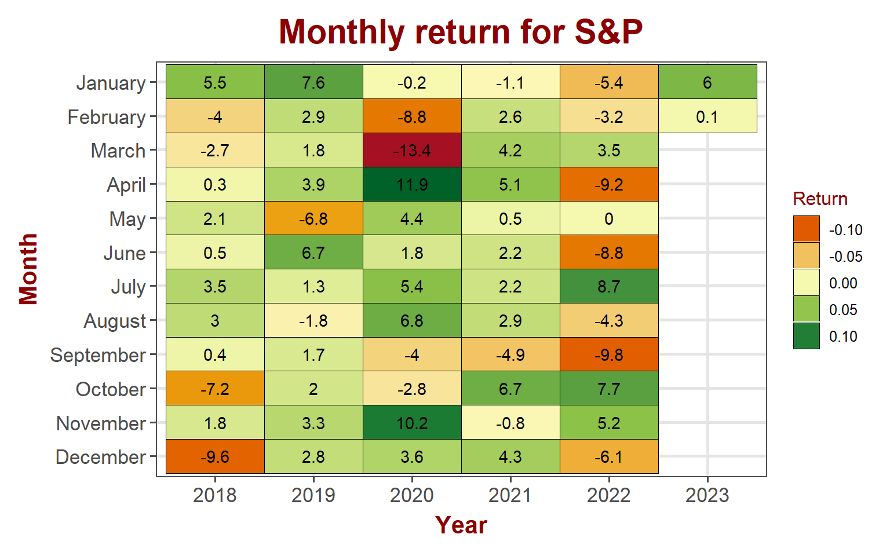
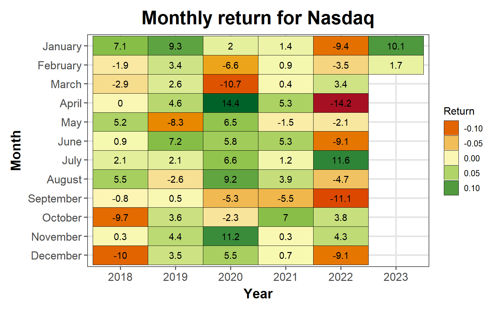
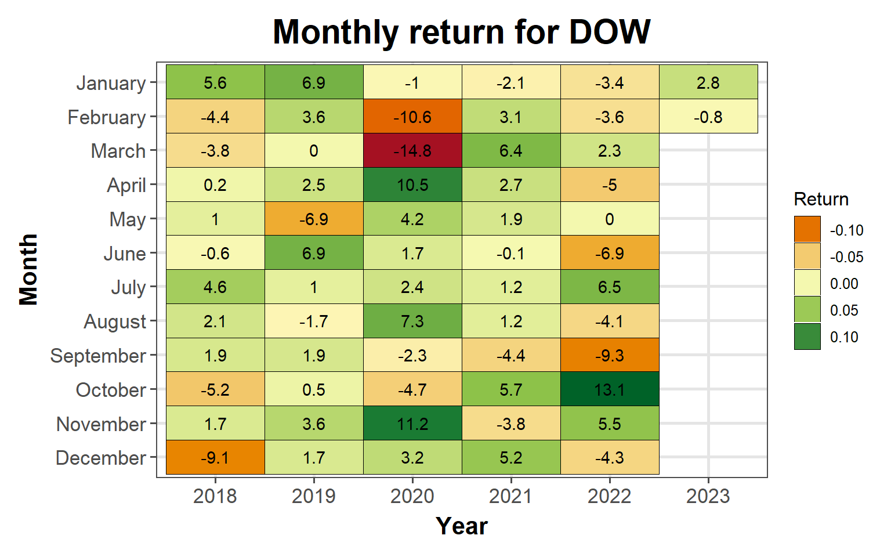
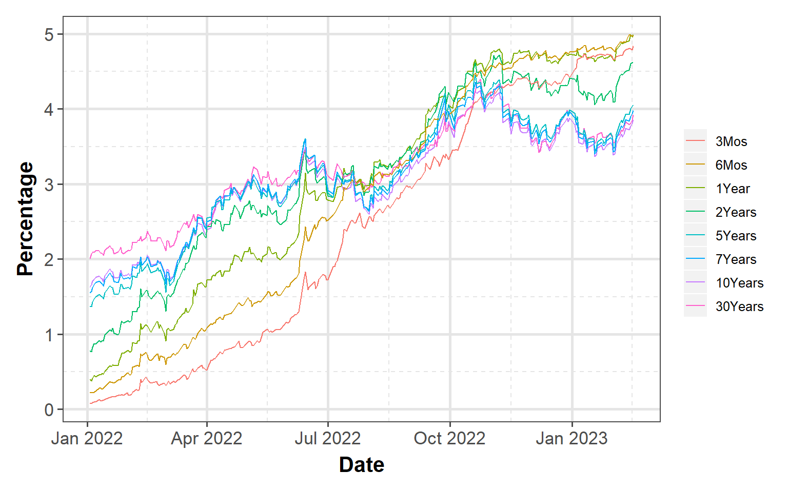
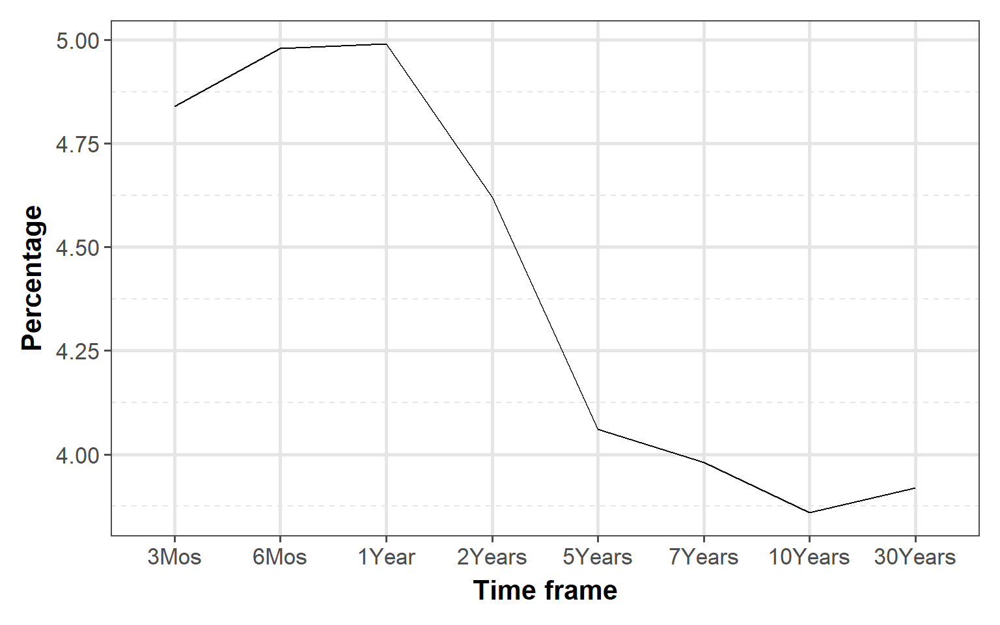
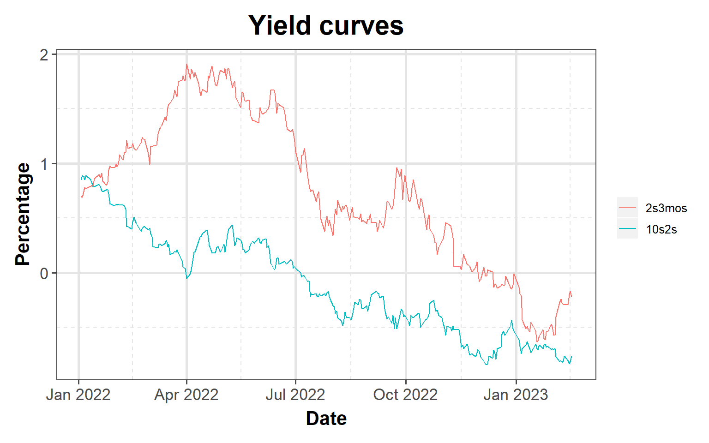

<link href="index_files/libs/tabwid-1.1.2/tabwid.css" rel="stylesheet" />

-   <a href="#equity-markets" id="toc-equity-markets">Equity markets</a>
    -   <a href="#sp-500" id="toc-sp-500">S&amp;P 500</a>
    -   <a href="#nasdaq" id="toc-nasdaq">NASDAQ</a>
    -   <a href="#dow-jones" id="toc-dow-jones">DOW Jones</a>
    -   <a href="#russell" id="toc-russell">Russell</a>
-   <a href="#bond-markets" id="toc-bond-markets">Bond markets</a>
    -   <a href="#interest-rates" id="toc-interest-rates">Interest rates</a>
    -   <a href="#yeild-curve" id="toc-yeild-curve">Yeild Curve</a>
    -   <a href="#disclaimer" id="toc-disclaimer">Disclaimer</a>

## Equity markets

Equity markets were still consolidating last week above the 200 day moving averages. CPI day last week couldn't provide any resolution to the markets on either side.

<<<<<<< HEAD

<table data-quarto-disable-processing='true' class='cl-ff6afda8'><caption></caption><thead><tr style="overflow-wrap:break-word;"><th class="cl-ff63ccd6">
Index
</th><th class="cl-ff63ccd6">
Week
</th><th class="cl-ff63ccd7">
Open
</th><th class="cl-ff63ccd7">
High
</th><th class="cl-ff63ccd7">
Low
</th><th class="cl-ff63ccd7">
Close
</th><th class="cl-ff63ccd7">
Weekly Return
</th></tr></thead><tbody><tr style="overflow-wrap:break-word;"><td class="cl-ff63cce0">
S&amp;P 500
</td><td class="cl-ff63cce0">
202307
</td><td class="cl-ff63cce1">
4,097
</td><td class="cl-ff63cce1">
4,148
</td><td class="cl-ff63cce1">
4,079
</td><td class="cl-ff63cce1">
4,079
</td><td class="cl-ff63cce1">
-0.28%
</td></tr><tr style="overflow-wrap:break-word;"><td class="cl-ff63cce2">
Nasdaq
</td><td class="cl-ff63cce2">
202307
</td><td class="cl-ff63ccea">
11,759
</td><td class="cl-ff63ccea">
12,071
</td><td class="cl-ff63ccea">
11,787
</td><td class="cl-ff63ccea">
11,787
</td><td class="cl-ff63ccea">
0.59%
</td></tr><tr style="overflow-wrap:break-word;"><td class="cl-ff63cce0">
Dow Jones
</td><td class="cl-ff63cce0">
202307
</td><td class="cl-ff63cce1">
33,887
</td><td class="cl-ff63cce1">
34,246
</td><td class="cl-ff63cce1">
33,697
</td><td class="cl-ff63cce1">
33,827
</td><td class="cl-ff63cce1">
-0.13%
</td></tr><tr style="overflow-wrap:break-word;"><td class="cl-ff63cce2">
Russell
</td><td class="cl-ff63cce2">
202307
</td><td class="cl-ff63ccea">
1,920
</td><td class="cl-ff63ccea">
1,961
</td><td class="cl-ff63ccea">
1,940
</td><td class="cl-ff63ccea">
1,946
</td><td class="cl-ff63ccea">
1.43%
</td></tr><tr style="overflow-wrap:break-word;"><td class="cl-ff63cce0">
VIX
</td><td class="cl-ff63cce0">
202307
</td><td class="cl-ff63cce1">
22
</td><td class="cl-ff63cce1">
20
</td><td class="cl-ff63cce1">
18
</td><td class="cl-ff63cce1">
20
</td><td class="cl-ff63cce1">
-2.52%
</td></tr></tbody></table>

=======

<table data-quarto-disable-processing='true' class='cl-b5ded6c8'><caption></caption><thead><tr style="overflow-wrap:break-word;"><th class="cl-b5d6b006">
Index
</th><th class="cl-b5d6b006">
Week
</th><th class="cl-b5d6b010">
Open
</th><th class="cl-b5d6b010">
High
</th><th class="cl-b5d6b010">
Low
</th><th class="cl-b5d6b010">
Close
</th><th class="cl-b5d6b010">
Weekly Return
</th></tr></thead><tbody><tr style="overflow-wrap:break-word;"><td class="cl-b5d6b01a">
S&amp;P 500
</td><td class="cl-b5d6b01a">
202307
</td><td class="cl-b5d6b01b">
4,097
</td><td class="cl-b5d6b01b">
4,148
</td><td class="cl-b5d6b01b">
4,079
</td><td class="cl-b5d6b01b">
4,079
</td><td class="cl-b5d6b01b">
-0.28%
</td></tr><tr style="overflow-wrap:break-word;"><td class="cl-b5d6b024">
Nasdaq
</td><td class="cl-b5d6b024">
202307
</td><td class="cl-b5d6b025">
11,759
</td><td class="cl-b5d6b025">
12,071
</td><td class="cl-b5d6b025">
11,787
</td><td class="cl-b5d6b025">
11,787
</td><td class="cl-b5d6b025">
0.59%
</td></tr><tr style="overflow-wrap:break-word;"><td class="cl-b5d6b01a">
Dow Jones
</td><td class="cl-b5d6b01a">
202307
</td><td class="cl-b5d6b01b">
33,887
</td><td class="cl-b5d6b01b">
34,246
</td><td class="cl-b5d6b01b">
33,697
</td><td class="cl-b5d6b01b">
33,827
</td><td class="cl-b5d6b01b">
-0.13%
</td></tr><tr style="overflow-wrap:break-word;"><td class="cl-b5d6b024">
Russell
</td><td class="cl-b5d6b024">
202307
</td><td class="cl-b5d6b025">
1,920
</td><td class="cl-b5d6b025">
1,961
</td><td class="cl-b5d6b025">
1,940
</td><td class="cl-b5d6b025">
1,946
</td><td class="cl-b5d6b025">
1.43%
</td></tr><tr style="overflow-wrap:break-word;"><td class="cl-b5d6b01a">
VIX
</td><td class="cl-b5d6b01a">
202307
</td><td class="cl-b5d6b01b">
22
</td><td class="cl-b5d6b01b">
20
</td><td class="cl-b5d6b01b">
18
</td><td class="cl-b5d6b01b">
20
</td><td class="cl-b5d6b01b">
-2.52%
</td></tr></tbody></table>

>>>>>>> dd46a0e720382d92e61c197c0a25d51dbd190356

### S&P 500

S&P 500 lost \~0.3%, consolidating above the 200 day moving average. Bulls so far managed to hold support and the consolidation appears like a bull flag above 200 day moving average. Technically, S&P looks like it is ready to break out in the next week or two.

    Warning in grid.Call(C_stringMetric, as.graphicsAnnot(x$label)): font family
    not found in Windows font database

    Warning in grid.Call(C_stringMetric, as.graphicsAnnot(x$label)): font family
    not found in Windows font database

    Warning in grid.Call(C_stringMetric, as.graphicsAnnot(x$label)): font family
    not found in Windows font database

    Warning in grid.Call(C_stringMetric, as.graphicsAnnot(x$label)): font family
    not found in Windows font database

    Warning in grid.Call(C_stringMetric, as.graphicsAnnot(x$label)): font family
    not found in Windows font database

    Warning in grid.Call(C_textBounds, as.graphicsAnnot(x$label), x$x, x$y, : font
    family not found in Windows font database

    Warning in grid.Call(C_textBounds, as.graphicsAnnot(x$label), x$x, x$y, : font
    family not found in Windows font database

    Warning in grid.Call(C_textBounds, as.graphicsAnnot(x$label), x$x, x$y, : font
    family not found in Windows font database

    Warning in grid.Call(C_textBounds, as.graphicsAnnot(x$label), x$x, x$y, : font
    family not found in Windows font database

    Warning in grid.Call(C_textBounds, as.graphicsAnnot(x$label), x$x, x$y, : font
    family not found in Windows font database

    Warning in grid.Call(C_textBounds, as.graphicsAnnot(x$label), x$x, x$y, : font
    family not found in Windows font database

    Warning in grid.Call(C_textBounds, as.graphicsAnnot(x$label), x$x, x$y, : font
    family not found in Windows font database

    Warning in grid.Call(C_textBounds, as.graphicsAnnot(x$label), x$x, x$y, : font
    family not found in Windows font database

    Warning in grid.Call(C_textBounds, as.graphicsAnnot(x$label), x$x, x$y, : font
    family not found in Windows font database

    Warning in grid.Call(C_textBounds, as.graphicsAnnot(x$label), x$x, x$y, : font
    family not found in Windows font database

    Warning in grid.Call.graphics(C_text, as.graphicsAnnot(x$label), x$x, x$y, :
    font family not found in Windows font database

    Warning in grid.Call(C_textBounds, as.graphicsAnnot(x$label), x$x, x$y, : font
    family not found in Windows font database

    Warning in grid.Call(C_textBounds, as.graphicsAnnot(x$label), x$x, x$y, : font
    family not found in Windows font database

    Warning in grid.Call(C_textBounds, as.graphicsAnnot(x$label), x$x, x$y, : font
    family not found in Windows font database

### NASDAQ

Technology stocks gained \~0.6% in the week for a month to date gain of 1.7%

    Warning in grid.Call(C_textBounds, as.graphicsAnnot(x$label), x$x, x$y, : font
    family not found in Windows font database

    Warning in grid.Call(C_textBounds, as.graphicsAnnot(x$label), x$x, x$y, : font
    family not found in Windows font database

    Warning in grid.Call(C_textBounds, as.graphicsAnnot(x$label), x$x, x$y, : font
    family not found in Windows font database

    Warning in grid.Call(C_textBounds, as.graphicsAnnot(x$label), x$x, x$y, : font
    family not found in Windows font database

    Warning in grid.Call(C_textBounds, as.graphicsAnnot(x$label), x$x, x$y, : font
    family not found in Windows font database

    Warning in grid.Call(C_textBounds, as.graphicsAnnot(x$label), x$x, x$y, : font
    family not found in Windows font database

    Warning in grid.Call(C_textBounds, as.graphicsAnnot(x$label), x$x, x$y, : font
    family not found in Windows font database

    Warning in grid.Call(C_textBounds, as.graphicsAnnot(x$label), x$x, x$y, : font
    family not found in Windows font database

    Warning in grid.Call(C_textBounds, as.graphicsAnnot(x$label), x$x, x$y, : font
    family not found in Windows font database

    Warning in grid.Call(C_textBounds, as.graphicsAnnot(x$label), x$x, x$y, : font
    family not found in Windows font database

    Warning in grid.Call(C_textBounds, as.graphicsAnnot(x$label), x$x, x$y, : font
    family not found in Windows font database

    Warning in grid.Call(C_textBounds, as.graphicsAnnot(x$label), x$x, x$y, : font
    family not found in Windows font database

    Warning in grid.Call.graphics(C_text, as.graphicsAnnot(x$label), x$x, x$y, :
    font family not found in Windows font database

    Warning in grid.Call(C_textBounds, as.graphicsAnnot(x$label), x$x, x$y, : font
    family not found in Windows font database

    Warning in grid.Call(C_textBounds, as.graphicsAnnot(x$label), x$x, x$y, : font
    family not found in Windows font database

    Warning in grid.Call(C_textBounds, as.graphicsAnnot(x$label), x$x, x$y, : font
    family not found in Windows font database

### DOW Jones

DOW stayed pretty much flat with a 0.1% loss. It lost 0.8% month to date

    Warning in grid.Call(C_textBounds, as.graphicsAnnot(x$label), x$x, x$y, : font
    family not found in Windows font database

    Warning in grid.Call(C_textBounds, as.graphicsAnnot(x$label), x$x, x$y, : font
    family not found in Windows font database

    Warning in grid.Call(C_textBounds, as.graphicsAnnot(x$label), x$x, x$y, : font
    family not found in Windows font database

    Warning in grid.Call(C_textBounds, as.graphicsAnnot(x$label), x$x, x$y, : font
    family not found in Windows font database

    Warning in grid.Call(C_textBounds, as.graphicsAnnot(x$label), x$x, x$y, : font
    family not found in Windows font database

    Warning in grid.Call(C_textBounds, as.graphicsAnnot(x$label), x$x, x$y, : font
    family not found in Windows font database

    Warning in grid.Call(C_textBounds, as.graphicsAnnot(x$label), x$x, x$y, : font
    family not found in Windows font database

    Warning in grid.Call(C_textBounds, as.graphicsAnnot(x$label), x$x, x$y, : font
    family not found in Windows font database

    Warning in grid.Call(C_textBounds, as.graphicsAnnot(x$label), x$x, x$y, : font
    family not found in Windows font database

    Warning in grid.Call(C_textBounds, as.graphicsAnnot(x$label), x$x, x$y, : font
    family not found in Windows font database

    Warning in grid.Call(C_textBounds, as.graphicsAnnot(x$label), x$x, x$y, : font
    family not found in Windows font database

    Warning in grid.Call(C_textBounds, as.graphicsAnnot(x$label), x$x, x$y, : font
    family not found in Windows font database

    Warning in grid.Call.graphics(C_text, as.graphicsAnnot(x$label), x$x, x$y, :
    font family not found in Windows font database

    Warning in grid.Call(C_textBounds, as.graphicsAnnot(x$label), x$x, x$y, : font
    family not found in Windows font database

    Warning in grid.Call(C_textBounds, as.graphicsAnnot(x$label), x$x, x$y, : font
    family not found in Windows font database

    Warning in grid.Call(C_textBounds, as.graphicsAnnot(x$label), x$x, x$y, : font
    family not found in Windows font database

### Russell

Small cap stocks gained \~1.4% for the week

    Warning in grid.Call(C_textBounds, as.graphicsAnnot(x$label), x$x, x$y, : font
    family not found in Windows font database

    Warning in grid.Call(C_textBounds, as.graphicsAnnot(x$label), x$x, x$y, : font
    family not found in Windows font database

    Warning in grid.Call(C_textBounds, as.graphicsAnnot(x$label), x$x, x$y, : font
    family not found in Windows font database

    Warning in grid.Call(C_textBounds, as.graphicsAnnot(x$label), x$x, x$y, : font
    family not found in Windows font database

    Warning in grid.Call(C_textBounds, as.graphicsAnnot(x$label), x$x, x$y, : font
    family not found in Windows font database

    Warning in grid.Call(C_textBounds, as.graphicsAnnot(x$label), x$x, x$y, : font
    family not found in Windows font database

    Warning in grid.Call(C_textBounds, as.graphicsAnnot(x$label), x$x, x$y, : font
    family not found in Windows font database

    Warning in grid.Call(C_textBounds, as.graphicsAnnot(x$label), x$x, x$y, : font
    family not found in Windows font database

    Warning in grid.Call(C_textBounds, as.graphicsAnnot(x$label), x$x, x$y, : font
    family not found in Windows font database

    Warning in grid.Call(C_textBounds, as.graphicsAnnot(x$label), x$x, x$y, : font
    family not found in Windows font database

    Warning in grid.Call(C_textBounds, as.graphicsAnnot(x$label), x$x, x$y, : font
    family not found in Windows font database

    Warning in grid.Call(C_textBounds, as.graphicsAnnot(x$label), x$x, x$y, : font
    family not found in Windows font database

    Warning in grid.Call.graphics(C_text, as.graphicsAnnot(x$label), x$x, x$y, :
    font family not found in Windows font database

    Warning in grid.Call(C_textBounds, as.graphicsAnnot(x$label), x$x, x$y, : font
    family not found in Windows font database

    Warning in grid.Call(C_textBounds, as.graphicsAnnot(x$label), x$x, x$y, : font
    family not found in Windows font database

    Warning in grid.Call(C_textBounds, as.graphicsAnnot(x$label), x$x, x$y, : font
    family not found in Windows font database

## Bond markets

### Interest rates

Longer term interest rates for treasuries are trending down while shorter term rates are staying flat to slightly down for the year.

    Warning: Using an external vector in selections was deprecated in tidyselect 1.1.0.
    ℹ Please use `all_of()` or `any_of()` instead.
      # Was:
      data %>% select(rates)

      # Now:
      data %>% select(all_of(rates))

    See <https://tidyselect.r-lib.org/reference/faq-external-vector.html>.

    Warning in grid.Call(C_textBounds, as.graphicsAnnot(x$label), x$x, x$y, : font
    family not found in Windows font database

    Warning in grid.Call(C_textBounds, as.graphicsAnnot(x$label), x$x, x$y, : font
    family not found in Windows font database

    Warning in grid.Call(C_textBounds, as.graphicsAnnot(x$label), x$x, x$y, : font
    family not found in Windows font database

    Warning in grid.Call(C_textBounds, as.graphicsAnnot(x$label), x$x, x$y, : font
    family not found in Windows font database

    Warning in grid.Call(C_textBounds, as.graphicsAnnot(x$label), x$x, x$y, : font
    family not found in Windows font database

    Warning in grid.Call(C_textBounds, as.graphicsAnnot(x$label), x$x, x$y, : font
    family not found in Windows font database

    Warning in grid.Call(C_textBounds, as.graphicsAnnot(x$label), x$x, x$y, : font
    family not found in Windows font database

    Warning in grid.Call(C_textBounds, as.graphicsAnnot(x$label), x$x, x$y, : font
    family not found in Windows font database

    Warning in grid.Call.graphics(C_text, as.graphicsAnnot(x$label), x$x, x$y, :
    font family not found in Windows font database

    Warning in grid.Call(C_textBounds, as.graphicsAnnot(x$label), x$x, x$y, : font
    family not found in Windows font database

### Yeild Curve

Yield curve continues to slope negatively (inverted). At the higher end, it appears that it is starting to slope positively or flat but at the lower end, it still slopes significantly negative

    Warning in grid.Call(C_textBounds, as.graphicsAnnot(x$label), x$x, x$y, : font
    family not found in Windows font database

    Warning in grid.Call(C_textBounds, as.graphicsAnnot(x$label), x$x, x$y, : font
    family not found in Windows font database

    Warning in grid.Call(C_textBounds, as.graphicsAnnot(x$label), x$x, x$y, : font
    family not found in Windows font database

    Warning in grid.Call(C_textBounds, as.graphicsAnnot(x$label), x$x, x$y, : font
    family not found in Windows font database

    Warning in grid.Call(C_textBounds, as.graphicsAnnot(x$label), x$x, x$y, : font
    family not found in Windows font database

    Warning in grid.Call(C_textBounds, as.graphicsAnnot(x$label), x$x, x$y, : font
    family not found in Windows font database

    Warning in grid.Call(C_textBounds, as.graphicsAnnot(x$label), x$x, x$y, : font
    family not found in Windows font database

    Warning in grid.Call.graphics(C_text, as.graphicsAnnot(x$label), x$x, x$y, :
    font family not found in Windows font database

    Warning in grid.Call(C_textBounds, as.graphicsAnnot(x$label), x$x, x$y, : font
    family not found in Windows font database

    Warning in grid.Call(C_textBounds, as.graphicsAnnot(x$label), x$x, x$y, : font
    family not found in Windows font database

    Warning in grid.Call(C_textBounds, as.graphicsAnnot(x$label), x$x, x$y, : font
    family not found in Windows font database

    Warning in grid.Call(C_textBounds, as.graphicsAnnot(x$label), x$x, x$y, : font
    family not found in Windows font database

    Warning in grid.Call(C_textBounds, as.graphicsAnnot(x$label), x$x, x$y, : font
    family not found in Windows font database

    Warning in grid.Call(C_textBounds, as.graphicsAnnot(x$label), x$x, x$y, : font
    family not found in Windows font database

    Warning in grid.Call(C_textBounds, as.graphicsAnnot(x$label), x$x, x$y, : font
    family not found in Windows font database

    Warning in grid.Call(C_textBounds, as.graphicsAnnot(x$label), x$x, x$y, : font
    family not found in Windows font database

    Warning in grid.Call(C_textBounds, as.graphicsAnnot(x$label), x$x, x$y, : font
    family not found in Windows font database

    Warning in grid.Call(C_textBounds, as.graphicsAnnot(x$label), x$x, x$y, : font
    family not found in Windows font database

    Warning in grid.Call(C_textBounds, as.graphicsAnnot(x$label), x$x, x$y, : font
    family not found in Windows font database

    Warning in grid.Call.graphics(C_text, as.graphicsAnnot(x$label), x$x, x$y, :
    font family not found in Windows font database

    Warning in grid.Call(C_textBounds, as.graphicsAnnot(x$label), x$x, x$y, : font
    family not found in Windows font database

    Warning in grid.Call(C_textBounds, as.graphicsAnnot(x$label), x$x, x$y, : font
    family not found in Windows font database

### Disclaimer

Anything on this blog is not an investment advice. It is essential that you fully understand the risks involved before making any investment decisions. You should consult with a financial professional to help you assess your risk tolerance and to determine an investment strategy that is suitable for your individual needs.

Please note that this disclaimer is not exhaustive and is provided for informational purposes only. Investing involves risks, and it is your responsibility to carefully consider the risks before making any investment decisions.
