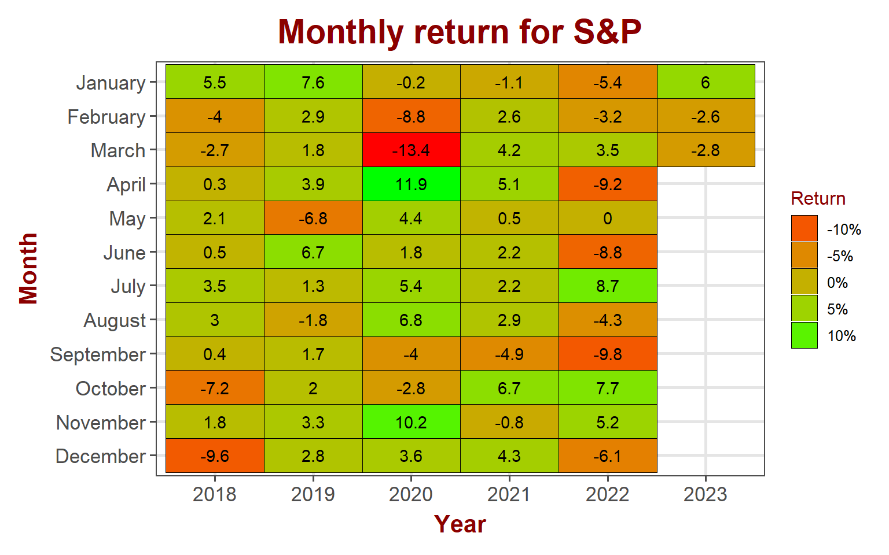
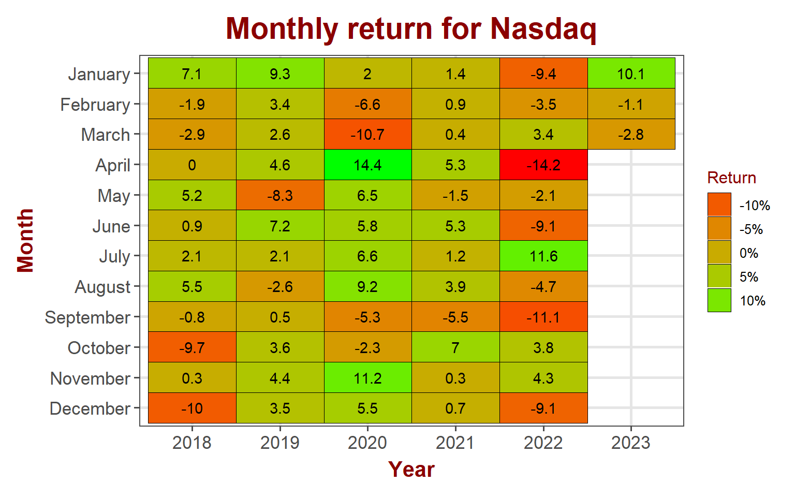
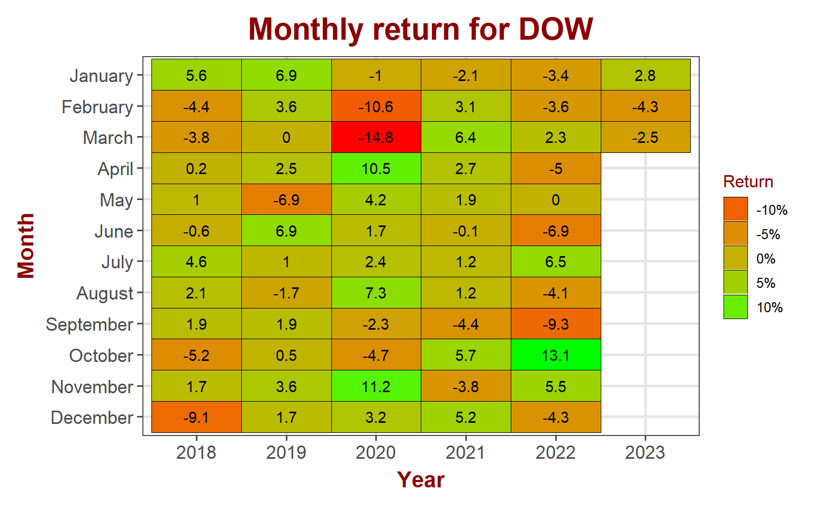
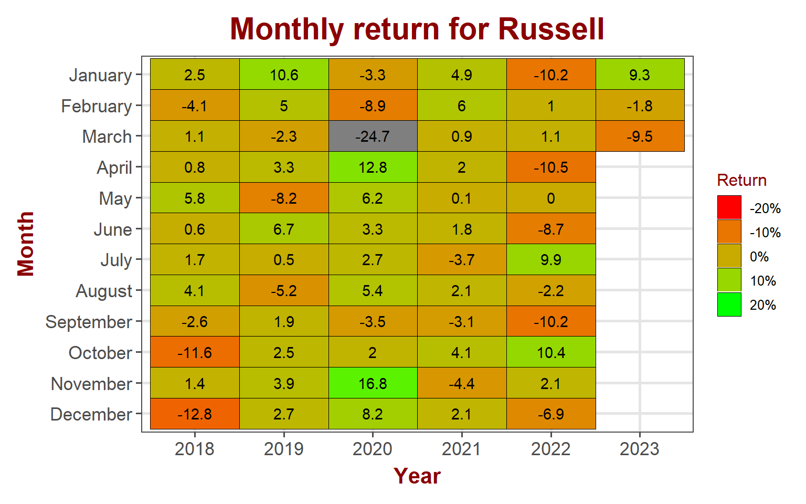
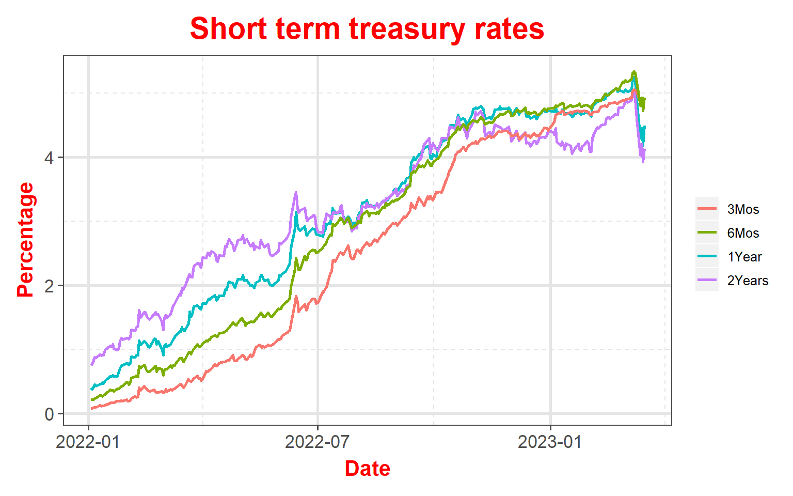
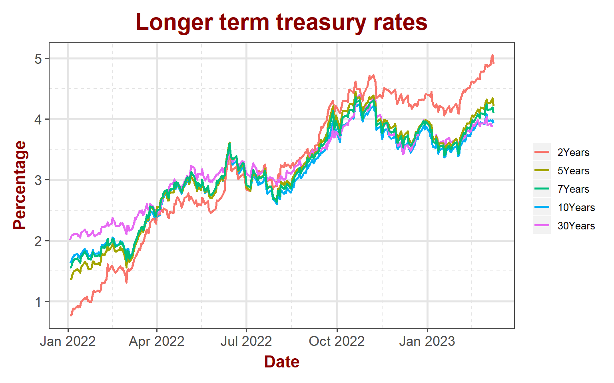
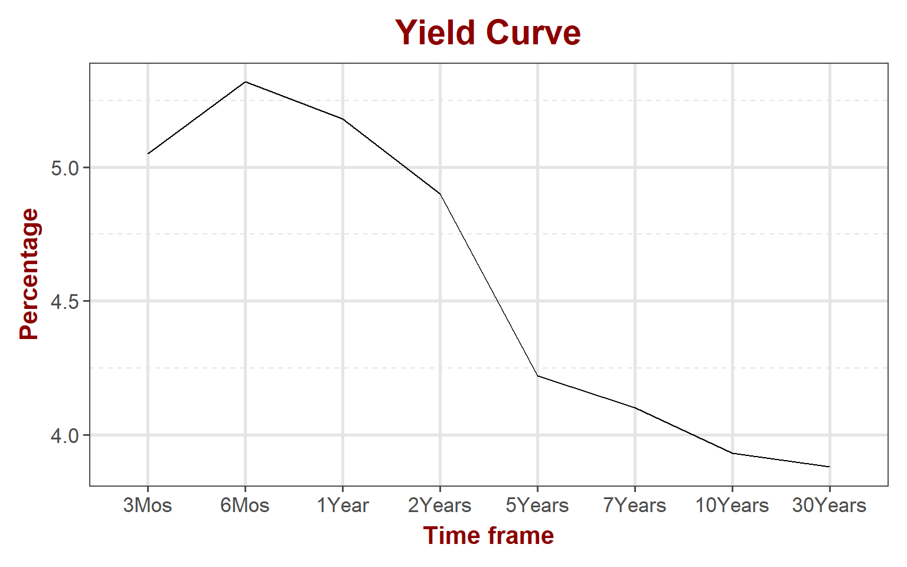
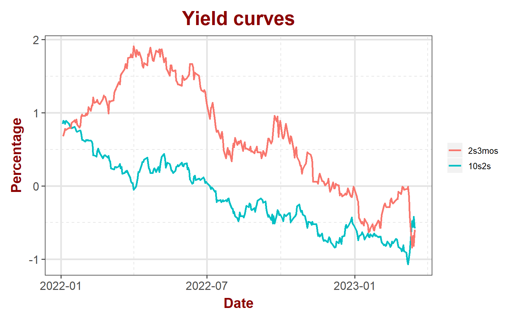

<link href="index_files/libs/tabwid-1.1.2/tabwid.css" rel="stylesheet" />

-   <a href="#equity-markets" id="toc-equity-markets">Equity markets</a>
    -   <a href="#sp-500" id="toc-sp-500">S&amp;P 500</a>
    -   <a href="#nasdaq" id="toc-nasdaq">NASDAQ</a>
    -   <a href="#dow-jones" id="toc-dow-jones">DOW Jones</a>
    -   <a href="#russell" id="toc-russell">Russell</a>
-   <a href="#bond-markets" id="toc-bond-markets">Bond markets</a>
    -   <a href="#interest-rates" id="toc-interest-rates">Interest rates</a>
    -   <a href="#yeild-curve" id="toc-yeild-curve">Yeild Curve</a>
    -   <a href="#disclaimer" id="toc-disclaimer">Disclaimer</a>

## Equity markets

It's a brutal week in the equity markets. Major indices lost over 4.5% for the week while small caps lost over 8%. Sell-off triggered by central banks comments and intensified with the failure of Silicaon Valley bank. Major volatility made a come back to the markets with VIX gaining close to 30% for the week.

<table data-quarto-disable-processing='true' class='cl-40d2546c'><caption></caption><thead><tr style="overflow-wrap:break-word;"><th class="cl-40c9accc">
Index
</th><th class="cl-40c9accd">
Pre. Close
</th><th class="cl-40c9accc">
Week
</th><th class="cl-40c9accd">
Open
</th><th class="cl-40c9accd">
High
</th><th class="cl-40c9accd">
Low
</th><th class="cl-40c9accd">
Close
</th><th class="cl-40c9accd">
Weekly Return
</th></tr></thead><tbody><tr style="overflow-wrap:break-word;"><td class="cl-40c9acd6">
S&amp;P 500
</td><td class="cl-40c9acd7">
4,046
</td><td class="cl-40c9acd6">
202310
</td><td class="cl-40c9acd7">
4,055
</td><td class="cl-40c9acd7">
4,078
</td><td class="cl-40c9acd7">
3,846
</td><td class="cl-40c9acd7">
3,862
</td><td class="cl-40c9acd7">
-4.66%
</td></tr><tr style="overflow-wrap:break-word;"><td class="cl-40c9ace0">
Nasdaq
</td><td class="cl-40c9ace1">
11,689
</td><td class="cl-40c9ace0">
202310
</td><td class="cl-40c9ace1">
11,737
</td><td class="cl-40c9ace1">
11,828
</td><td class="cl-40c9ace1">
11,094
</td><td class="cl-40c9ace1">
11,139
</td><td class="cl-40c9ace1">
-4.82%
</td></tr><tr style="overflow-wrap:break-word;"><td class="cl-40c9acd6">
Dow Jones
</td><td class="cl-40c9acd7">
33,391
</td><td class="cl-40c9acd6">
202310
</td><td class="cl-40c9acd7">
33,425
</td><td class="cl-40c9acd7">
33,572
</td><td class="cl-40c9acd7">
31,783
</td><td class="cl-40c9acd7">
31,910
</td><td class="cl-40c9acd7">
-4.54%
</td></tr><tr style="overflow-wrap:break-word;"><td class="cl-40c9ace0">
Russell
</td><td class="cl-40c9ace1">
1,928
</td><td class="cl-40c9ace0">
202310
</td><td class="cl-40c9ace1">
1,928
</td><td class="cl-40c9ace1">
1,929
</td><td class="cl-40c9ace1">
1,757
</td><td class="cl-40c9ace1">
1,773
</td><td class="cl-40c9ace1">
-8.41%
</td></tr><tr style="overflow-wrap:break-word;"><td class="cl-40c9acd6">
VIX
</td><td class="cl-40c9acd7">
18
</td><td class="cl-40c9acd6">
202310
</td><td class="cl-40c9acd7">
19
</td><td class="cl-40c9acd7">
29
</td><td class="cl-40c9acd7">
18
</td><td class="cl-40c9acd7">
25
</td><td class="cl-40c9acd7">
29.36%
</td></tr></tbody></table>

### S&P 500

S&P 500 turned red for the month with a 2.8% loss. The index is back to the multi-month resistance line that through out the 2022 downtrend. It will be interesting to see if it acts as a support and bounce back from here. Fundamentally, interest rates continues to go up, deepening the yield curve inversion. The inversion is over 100 basis points now.

#### S&P 500 sector performance

Financials is the biggest loser for the week with a 8.5% loss with Materials a close second at 7.6% loss. Losses at consumer staples and utilities were relative low.

<table data-quarto-disable-processing='true' class='cl-41b65b44'><caption></caption><thead><tr style="overflow-wrap:break-word;"><th class="cl-41a79168">
Ticker
</th><th class="cl-41a79168">
Sector
</th><th class="cl-41a79172">
Open
</th><th class="cl-41a79172">
High
</th><th class="cl-41a79172">
Low
</th><th class="cl-41a79172">
Close
</th><th class="cl-41a79172">
Weekly Return
</th></tr></thead><tbody><tr style="overflow-wrap:break-word;"><td class="cl-41a79173">
XLB
</td><td class="cl-41a79173">
Materials
</td><td class="cl-41a79174">
84.3
</td><td class="cl-41a79174">
84.3
</td><td class="cl-41a79174">
77.8
</td><td class="cl-41a79174">
78.2
</td><td class="cl-41a79174">
-7.59%
</td></tr><tr style="overflow-wrap:break-word;"><td class="cl-41a7917c">
XLC
</td><td class="cl-41a7917c">
Comm. Services
</td><td class="cl-41a7917d">
55.1
</td><td class="cl-41a7917d">
55.5
</td><td class="cl-41a7917d">
52.0
</td><td class="cl-41a7917d">
52.3
</td><td class="cl-41a7917d">
-4.57%
</td></tr><tr style="overflow-wrap:break-word;"><td class="cl-41a79173">
XLE
</td><td class="cl-41a79173">
Energy
</td><td class="cl-41a79174">
86.8
</td><td class="cl-41a79174">
87.4
</td><td class="cl-41a79174">
82.2
</td><td class="cl-41a79174">
82.6
</td><td class="cl-41a79174">
-5.31%
</td></tr><tr style="overflow-wrap:break-word;"><td class="cl-41a7917c">
XLF
</td><td class="cl-41a7917c">
Finance
</td><td class="cl-41a7917d">
36.0
</td><td class="cl-41a7917d">
36.2
</td><td class="cl-41a7917d">
32.5
</td><td class="cl-41a7917d">
32.9
</td><td class="cl-41a7917d">
-8.50%
</td></tr><tr style="overflow-wrap:break-word;"><td class="cl-41a79173">
XLI
</td><td class="cl-41a79173">
Industrial
</td><td class="cl-41a79174">
103.7
</td><td class="cl-41a79174">
104.2
</td><td class="cl-41a79174">
98.7
</td><td class="cl-41a79174">
99.0
</td><td class="cl-41a79174">
-4.50%
</td></tr><tr style="overflow-wrap:break-word;"><td class="cl-41a7917c">
XLK
</td><td class="cl-41a7917c">
Technology
</td><td class="cl-41a7917d">
141.1
</td><td class="cl-41a7917d">
142.7
</td><td class="cl-41a7917d">
135.2
</td><td class="cl-41a7917d">
135.8
</td><td class="cl-41a7917d">
-3.12%
</td></tr><tr style="overflow-wrap:break-word;"><td class="cl-41a79173">
XLP
</td><td class="cl-41a79173">
Consumer Staples
</td><td class="cl-41a79174">
72.3
</td><td class="cl-41a79174">
73.0
</td><td class="cl-41a79174">
70.8
</td><td class="cl-41a79174">
71.1
</td><td class="cl-41a79174">
-1.97%
</td></tr><tr style="overflow-wrap:break-word;"><td class="cl-41a7917c">
XLRE
</td><td class="cl-41a7917c">
Real Estate
</td><td class="cl-41a7917d">
39.0
</td><td class="cl-41a7917d">
39.0
</td><td class="cl-41a7917d">
36.0
</td><td class="cl-41a7917d">
36.1
</td><td class="cl-41a7917d">
-6.84%
</td></tr><tr style="overflow-wrap:break-word;"><td class="cl-41a79173">
XLU
</td><td class="cl-41a79173">
Utility
</td><td class="cl-41a79174">
66.3
</td><td class="cl-41a79174">
66.8
</td><td class="cl-41a79174">
64.1
</td><td class="cl-41a79174">
64.4
</td><td class="cl-41a79174">
-2.76%
</td></tr><tr style="overflow-wrap:break-word;"><td class="cl-41a7917c">
XLV
</td><td class="cl-41a7917c">
Health Care
</td><td class="cl-41a7917d">
129.3
</td><td class="cl-41a7917d">
129.7
</td><td class="cl-41a7917d">
123.7
</td><td class="cl-41a7917d">
124.2
</td><td class="cl-41a7917d">
-3.89%
</td></tr><tr style="overflow-wrap:break-word;"><td class="cl-41a79173">
XLY
</td><td class="cl-41a79173">
Consumer Discretionary
</td><td class="cl-41a79174">
146.7
</td><td class="cl-41a79174">
147.2
</td><td class="cl-41a79174">
137.7
</td><td class="cl-41a79174">
138.2
</td><td class="cl-41a79174">
-5.54%
</td></tr></tbody></table>

### NASDAQ

Technology stocks lost \~2.8% in February. Like S&P, turned negative for the month wiping out last week's gains.

### DOW Jones

DOW Jones lost \~2.3% in March so far. It started March with strong gains; 2.2% in the first three trading days but wiped out those gains and turned negative for the month with steep losses last week.

### Russell

Small cap stocks lost \~6.8% for the month of March.

## Bond markets

### Interest rates

As discussed in this blog last week, short term yields continued to inch up spelling trouble for stocks. Longer term rates appear to slow down a little but 2-year is still lot higher than 10-year and is sitting at 5% mark.

### Yeild Curve

Yield curve continues to slope negatively (inverted). At the higher end, it appears that it is starting to flatten but at the lower end, it still slopes significantly negative. The steep negative slope between 2-year and 5-year is uncomfortably high. It is now over 100 basis points.

Stock market cracked last week responding to signs from the bond market. Trouble at Silicon Valley bank appears to be specific to the company and other financial firms appear to have relatively robust risk management practices in place. Interesting times ahead for financial sector in the next few weeks to watch out.

### Disclaimer

Anything on this blog is not an investment advice. It is essential that you fully understand the risks involved before making any investment decisions. You should consult with a financial professional to help you assess your risk tolerance and to determine an investment strategy that is suitable for your individual needs.

Please note that this disclaimer is not exhaustive and is provided for informational purposes only. Investing involves risks, and it is your responsibility to carefully consider the risks before making any investment decisions.
