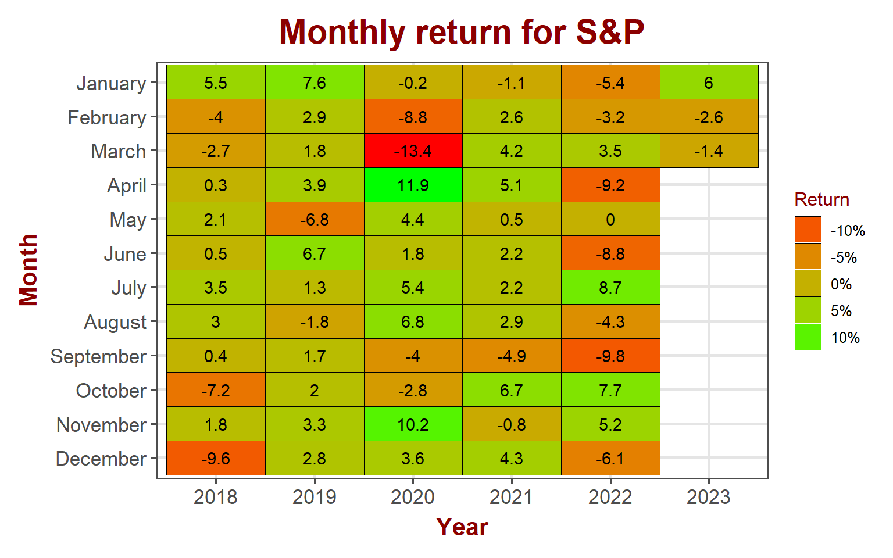
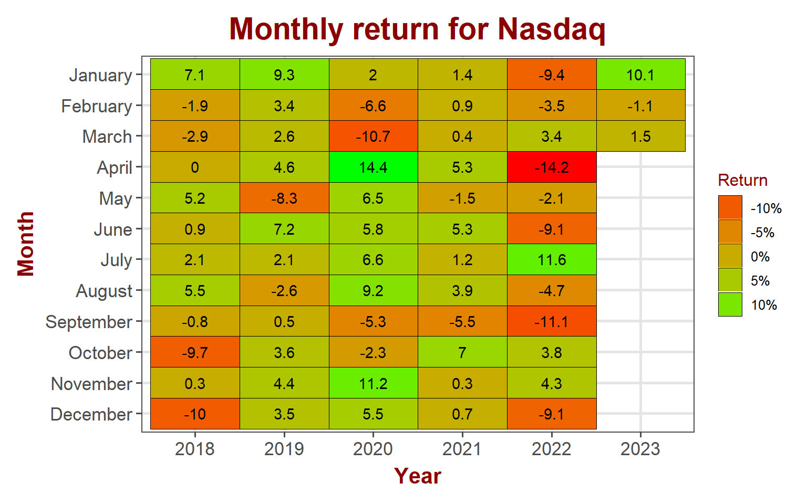
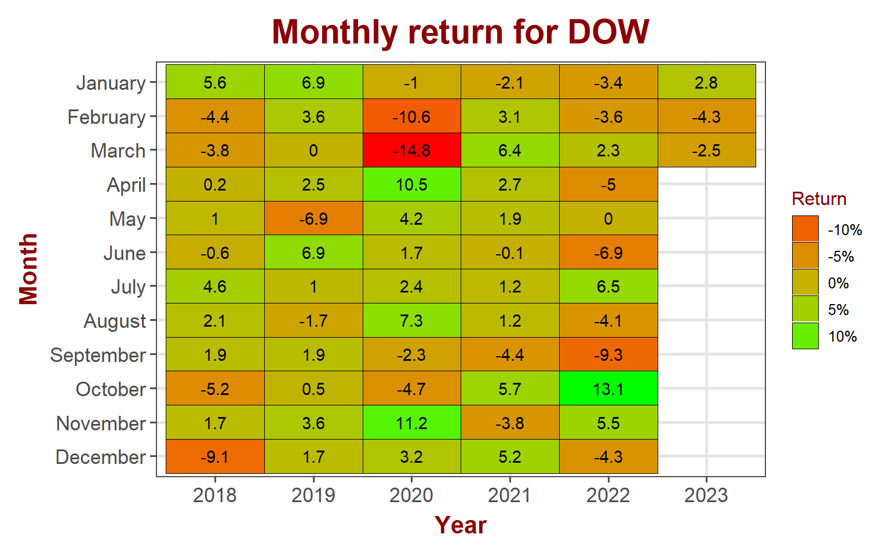
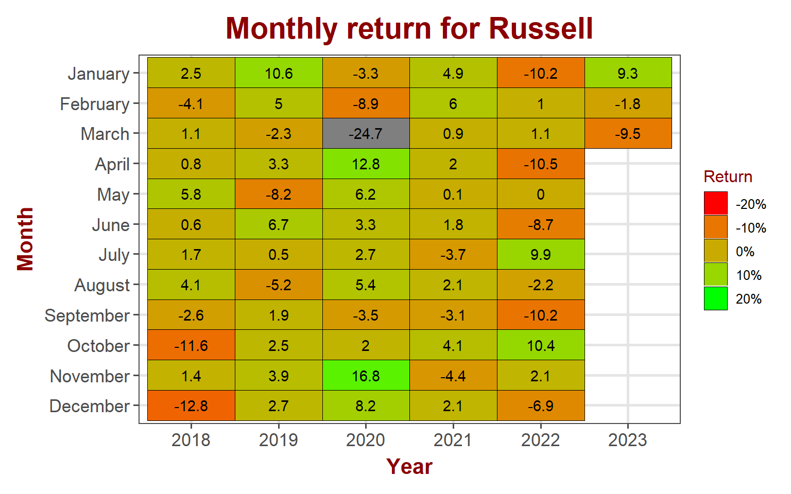
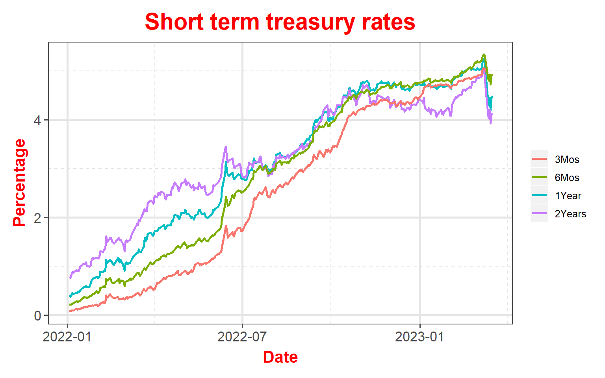
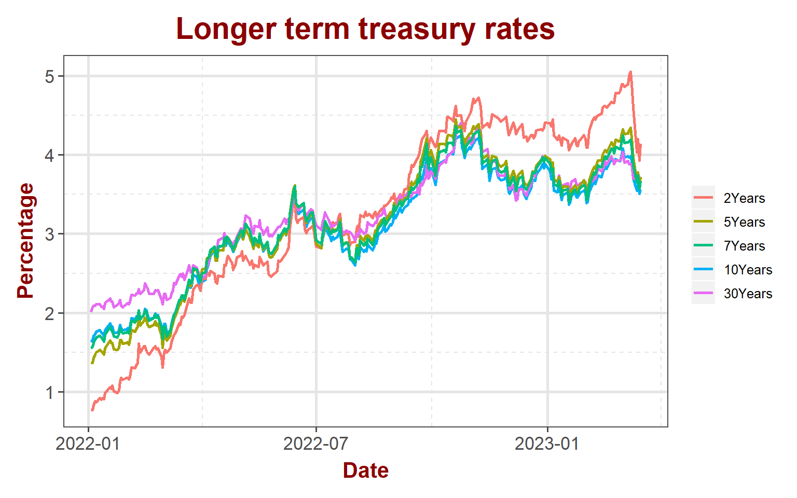
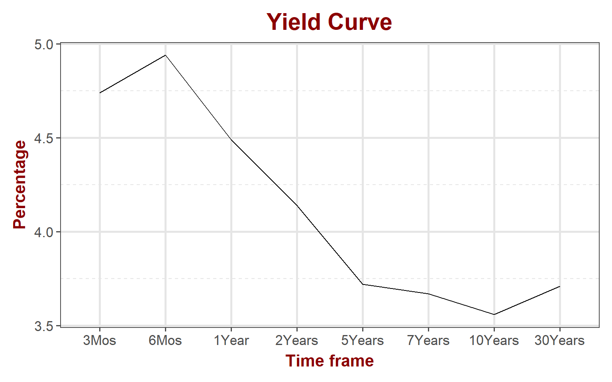
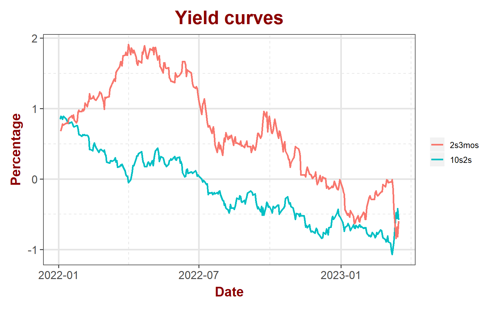

## Equity markets

Major indices broke the losing streak this week to post impressive gains. Tech stocks led the market with a solid 4.3% gain for NASDAQ while S&P posted impressive 1.4% gain. DOW and small caps did not participate in the rally. Troubles in the banking sector did not deter the markets to post impressive gains. However, participation from small caps will confirm if the rally has any legs.

<table data-quarto-disable-processing='true' class='cl-37efb816'><caption></caption><thead><tr style="overflow-wrap:break-word;"><th class="cl-37e7edca">
Index
</th><th class="cl-37e7edd4">
Pre. Close
</th><th class="cl-37e7edca">
Week
</th><th class="cl-37e7edd4">
Open
</th><th class="cl-37e7edd4">
High
</th><th class="cl-37e7edd4">
Low
</th><th class="cl-37e7edd4">
Close
</th><th class="cl-37e7edd4">
Weekly Return
</th></tr></thead><tbody><tr style="overflow-wrap:break-word;"><td class="cl-37e7edd5">
S&amp;P 500
</td><td class="cl-37e7edde">
3,862
</td><td class="cl-37e7edd5">
202311
</td><td class="cl-37e7edde">
3,835
</td><td class="cl-37e7edde">
3,964
</td><td class="cl-37e7edde">
3,809
</td><td class="cl-37e7edde">
3,917
</td><td class="cl-37e7edde">
1.42%
</td></tr><tr style="overflow-wrap:break-word;"><td class="cl-37e7eddf">
Nasdaq
</td><td class="cl-37e7ede0">
11,139
</td><td class="cl-37e7eddf">
202311
</td><td class="cl-37e7ede0">
11,041
</td><td class="cl-37e7ede0">
11,773
</td><td class="cl-37e7ede0">
10,983
</td><td class="cl-37e7ede0">
11,631
</td><td class="cl-37e7ede0">
4.32%
</td></tr><tr style="overflow-wrap:break-word;"><td class="cl-37e7edd5">
Dow Jones
</td><td class="cl-37e7edde">
31,910
</td><td class="cl-37e7edd5">
202311
</td><td class="cl-37e7edde">
31,820
</td><td class="cl-37e7edde">
32,307
</td><td class="cl-37e7edde">
31,430
</td><td class="cl-37e7edde">
31,862
</td><td class="cl-37e7edde">
-0.15%
</td></tr><tr style="overflow-wrap:break-word;"><td class="cl-37e7eddf">
Russell
</td><td class="cl-37e7ede0">
1,773
</td><td class="cl-37e7eddf">
202311
</td><td class="cl-37e7ede0">
1,755
</td><td class="cl-37e7ede0">
1,802
</td><td class="cl-37e7ede0">
1,717
</td><td class="cl-37e7ede0">
1,726
</td><td class="cl-37e7ede0">
-2.68%
</td></tr><tr style="overflow-wrap:break-word;"><td class="cl-37e7edd5">
VIX
</td><td class="cl-37e7edde">
25
</td><td class="cl-37e7edd5">
202311
</td><td class="cl-37e7edde">
24
</td><td class="cl-37e7edde">
31
</td><td class="cl-37e7edde">
22
</td><td class="cl-37e7edde">
26
</td><td class="cl-37e7edde">
2.82%
</td></tr></tbody></table>

### S&P 500

S&P 500 still red for the month with a 1.4% loss. The index bounced back from multi-month resistance line that is acting as support now. On macro side, 2-year treasury yield dropped significantly.

#### S&P 500 sector performance

Energy sector lost 6.8% while Financials continues to lose with a 5.9% loss for the week. Technology and communication services gained over 5%.

<table data-quarto-disable-processing='true' class='cl-392cf8ce'><caption></caption><thead><tr style="overflow-wrap:break-word;"><th class="cl-392574b4">
Ticker
</th><th class="cl-392574b4">
Sector
</th><th class="cl-392574b4">
Week
</th><th class="cl-392574be">
Open
</th><th class="cl-392574be">
High
</th><th class="cl-392574be">
Low
</th><th class="cl-392574be">
Close
</th><th class="cl-392574be">
Weekly Return
</th></tr></thead></table>

### NASDAQ

Technology stocks turned green with \~1.5% gain in March.

### DOW Jones

DOW Jones lost \~2.5% in March so far. It continues to underperform other indices this year.

### Russell

Small cap stocks lost \~9.5% for the month of March. It gave up all gains for the year.

## Bond markets

### Interest rates

2-year yield crashed over 100 basis points for the week, finally in-line with other longer term maturities. The gap between 2-year and longer term maturities is narrower now. This may be the first sign that the steepness of the yield curve is receding, at least on the higher end of the yield curve.

### Yeild Curve

As of 3/16/2023, yield curve continues to slope negatively (inverted). Steep drop in 2-year yield helps to further flatten on the higher end but at the lower end, it still slopes significantly negative.

The 10s2s has shown a highly positive trend this week, surpassing the 2s3mos mark for the first time since the start of 2022. This suggests that investors anticipation that the end of most rate hikes by the FED is near. The upcoming FOMC meeting on Wednesday 3/22 will provide clarity on the FED's future policies. While the typical expectation is for a 25 to 50 basis points hike, given the recent opening of a new discount window for banks, FED might as well surprise us with a pause.

### Disclaimer

Anything on this blog is not an investment advice. It is essential that you fully understand the risks involved before making any investment decisions. You should consult with a financial professional to help you assess your risk tolerance and to determine an investment strategy that is suitable for your individual needs.

Please note that this disclaimer is not exhaustive and is provided for informational purposes only. Investing involves risks, and it is your responsibility to carefully consider the risks before making any investment decisions.
