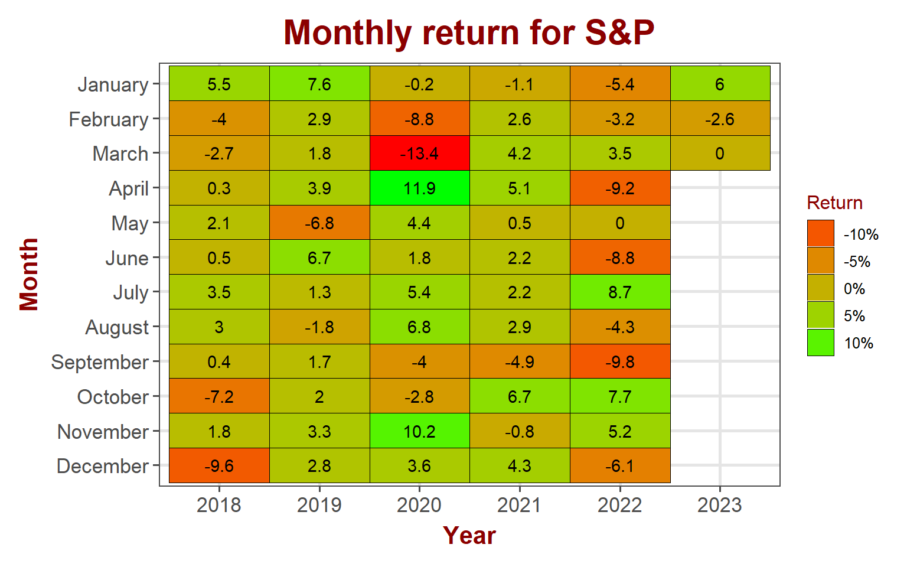
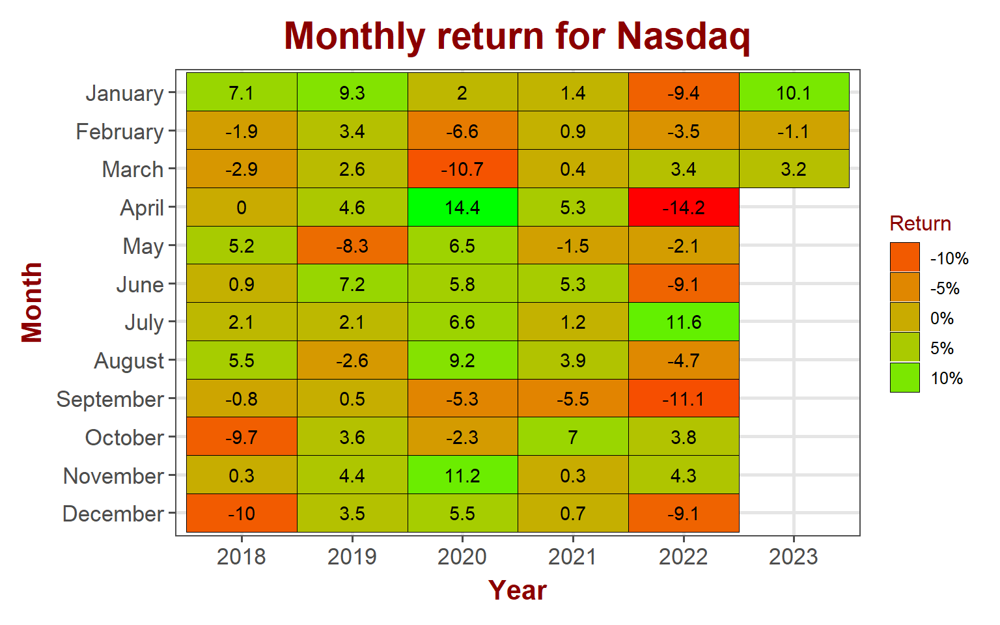
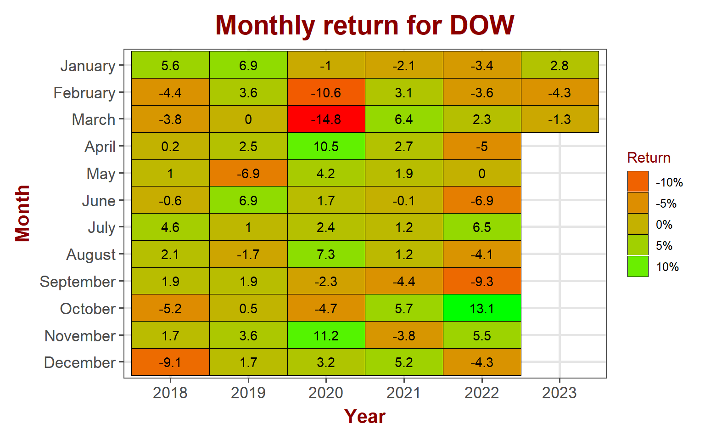
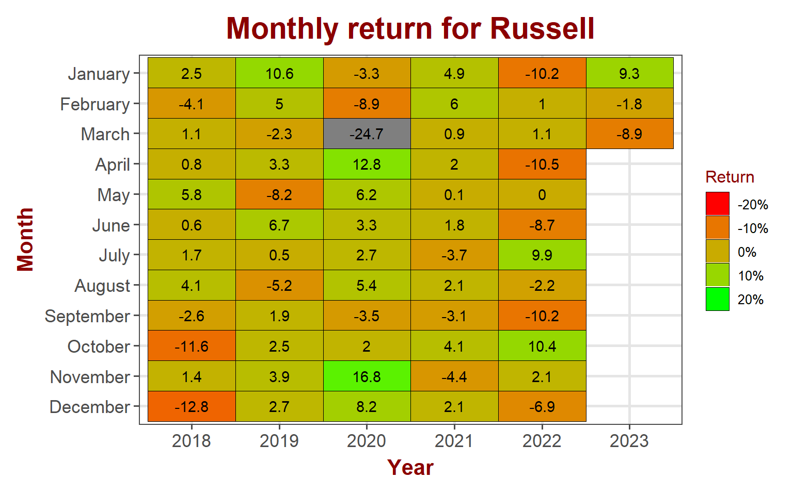
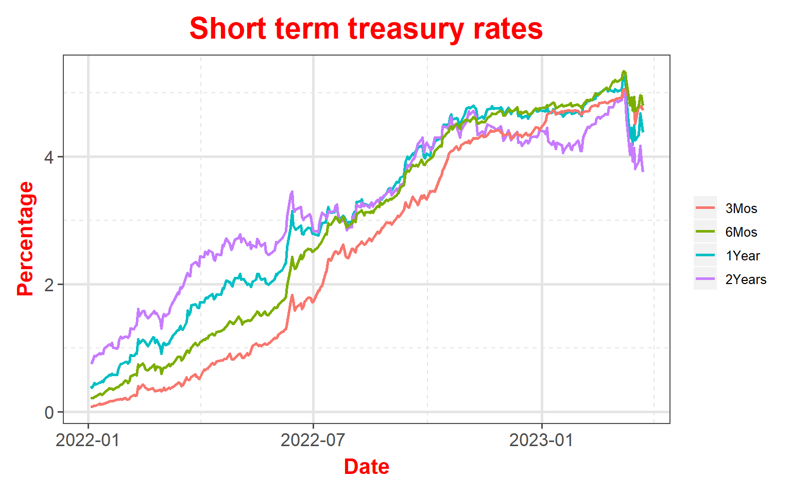
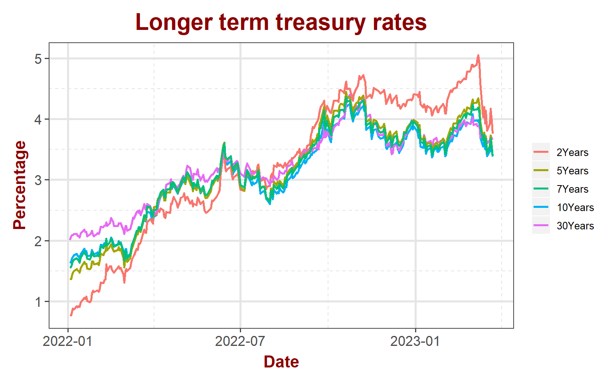
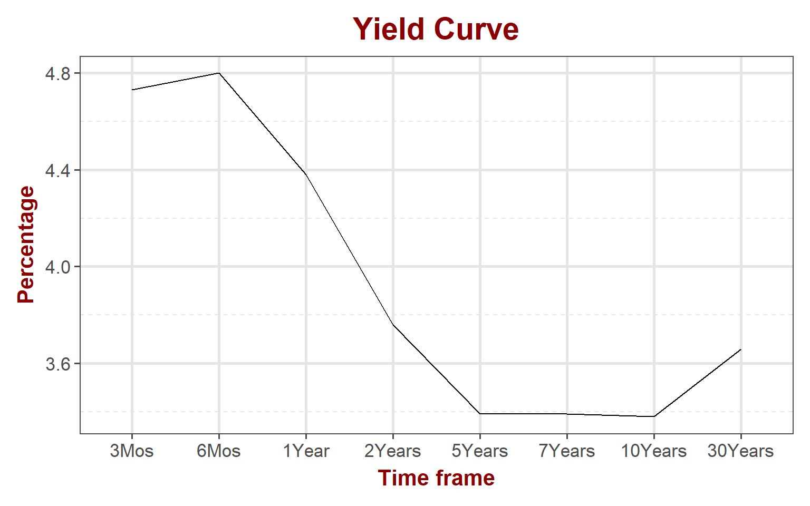
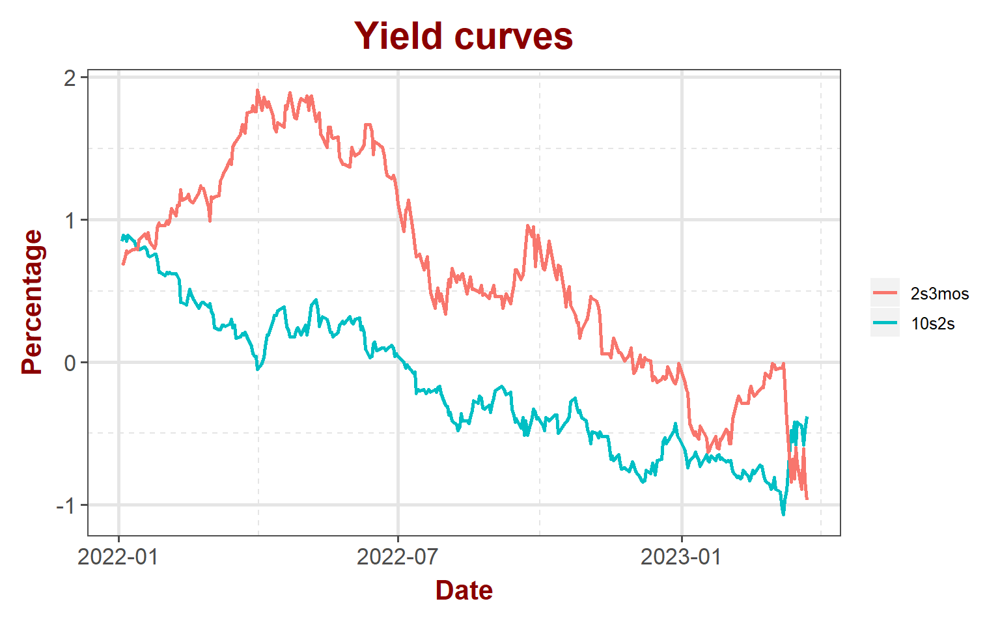

## Equity markets

Rally continued in the equity markets last week. Stocks sold off on the 25 basis point rate increase but bounced back to end the week in green. Dow finally participated in the rally but small caps lagged the overall market.

<table data-quarto-disable-processing='true' class='cl-c69f3a16'><caption></caption><thead><tr style="overflow-wrap:break-word;"><th class="cl-c6961fe4">
Index
</th><th class="cl-c6961fee">
Pre. Close
</th><th class="cl-c6961fee">
Open
</th><th class="cl-c6961fee">
High
</th><th class="cl-c6961fee">
Low
</th><th class="cl-c6961fee">
Close
</th><th class="cl-c6961fee">
Weekly Return
</th></tr></thead><tbody><tr style="overflow-wrap:break-word;"><td class="cl-c6961fef">
S&amp;P 500
</td><td class="cl-c6961ff8">
3,917
</td><td class="cl-c6961ff8">
3,917.47
</td><td class="cl-c6961ff8">
4,039
</td><td class="cl-c6961ff8">
3,909
</td><td class="cl-c6961ff8">
3,971
</td><td class="cl-c6961ff8">
1.38%
</td></tr><tr style="overflow-wrap:break-word;"><td class="cl-c6961ff9">
Nasdaq
</td><td class="cl-c6961ffa">
11,631
</td><td class="cl-c6961ffa">
11,614.39
</td><td class="cl-c6961ffa">
12,014
</td><td class="cl-c6961ffa">
11,551
</td><td class="cl-c6961ffa">
11,824
</td><td class="cl-c6961ffa">
1.65%
</td></tr><tr style="overflow-wrap:break-word;"><td class="cl-c6961fef">
Dow Jones
</td><td class="cl-c6961ff8">
31,862
</td><td class="cl-c6961ff8">
31,872.33
</td><td class="cl-c6961ff8">
32,762
</td><td class="cl-c6961ff8">
31,805
</td><td class="cl-c6961ff8">
32,238
</td><td class="cl-c6961ff8">
1.17%
</td></tr><tr style="overflow-wrap:break-word;"><td class="cl-c6961ff9">
Russell
</td><td class="cl-c6961ffa">
1,726
</td><td class="cl-c6961ffa">
1,733.51
</td><td class="cl-c6961ffa">
1,788
</td><td class="cl-c6961ffa">
1,695
</td><td class="cl-c6961ffa">
1,735
</td><td class="cl-c6961ffa">
0.52%
</td></tr><tr style="overflow-wrap:break-word;"><td class="cl-c6961fef">
VIX
</td><td class="cl-c6961ff8">
26
</td><td class="cl-c6961ff8">
27.77
</td><td class="cl-c6961ff8">
29
</td><td class="cl-c6961ff8">
20
</td><td class="cl-c6961ff8">
22
</td><td class="cl-c6961ff8">
-15.99%
</td></tr></tbody></table>

### S&P 500

S&P 500 is pretty much flat for the month. The index sold-off to the multi-month resistance line that is acting as support now and promptly bounced back from it. S&P literally played ping-pong in the month of March

#### S&P 500 sector performance

Sell off in the financials finally slowed and the sector remained flat for the week. Real estate and Utilities lost out for the week while Communication services and Technology gained.

<table data-quarto-disable-processing='true' class='cl-c7dbe672'><caption></caption><thead><tr style="overflow-wrap:break-word;"><th class="cl-c7d3d5ea">
Ticker
</th><th class="cl-c7d3d5ea">
Sector
</th><th class="cl-c7d3d5f4">
Open
</th><th class="cl-c7d3d5f4">
High
</th><th class="cl-c7d3d5f4">
Low
</th><th class="cl-c7d3d5f4">
Close
</th><th class="cl-c7d3d5f4">
Weekly Return
</th></tr></thead><tbody><tr style="overflow-wrap:break-word;"><td class="cl-c7d3d5f5">
XLB
</td><td class="cl-c7d3d5f5">
Materials
</td><td class="cl-c7d3d5fe">
77.6
</td><td class="cl-c7d3d5fe">
78.1
</td><td class="cl-c7d3d5fe">
75.1
</td><td class="cl-c7d3d5fe">
76.8
</td><td class="cl-c7d3d5fe">
1.72%
</td></tr><tr style="overflow-wrap:break-word;"><td class="cl-c7d3d5ff">
XLC
</td><td class="cl-c7d3d5ff">
Comm. Services
</td><td class="cl-c7d3d608">
55.9
</td><td class="cl-c7d3d608">
57.1
</td><td class="cl-c7d3d608">
55.4
</td><td class="cl-c7d3d608">
56.6
</td><td class="cl-c7d3d608">
2.98%
</td></tr><tr style="overflow-wrap:break-word;"><td class="cl-c7d3d5f5">
XLE
</td><td class="cl-c7d3d5f5">
Energy
</td><td class="cl-c7d3d5fe">
79.3
</td><td class="cl-c7d3d5fe">
80.8
</td><td class="cl-c7d3d5fe">
75.8
</td><td class="cl-c7d3d5fe">
77.9
</td><td class="cl-c7d3d5fe">
1.20%
</td></tr><tr style="overflow-wrap:break-word;"><td class="cl-c7d3d5ff">
XLF
</td><td class="cl-c7d3d5ff">
Finance
</td><td class="cl-c7d3d608">
31.9
</td><td class="cl-c7d3d608">
32.0
</td><td class="cl-c7d3d608">
30.4
</td><td class="cl-c7d3d608">
31.0
</td><td class="cl-c7d3d608">
0.03%
</td></tr><tr style="overflow-wrap:break-word;"><td class="cl-c7d3d5f5">
XLI
</td><td class="cl-c7d3d5f5">
Industrial
</td><td class="cl-c7d3d5fe">
98.7
</td><td class="cl-c7d3d5fe">
99.1
</td><td class="cl-c7d3d5fe">
95.2
</td><td class="cl-c7d3d5fe">
96.9
</td><td class="cl-c7d3d5fe">
0.25%
</td></tr><tr style="overflow-wrap:break-word;"><td class="cl-c7d3d5ff">
XLK
</td><td class="cl-c7d3d5ff">
Technology
</td><td class="cl-c7d3d608">
144.3
</td><td class="cl-c7d3d608">
147.6
</td><td class="cl-c7d3d608">
142.8
</td><td class="cl-c7d3d608">
146.0
</td><td class="cl-c7d3d608">
1.74%
</td></tr><tr style="overflow-wrap:break-word;"><td class="cl-c7d3d5f5">
XLP
</td><td class="cl-c7d3d5f5">
Consumer Staples
</td><td class="cl-c7d3d5fe">
72.9
</td><td class="cl-c7d3d5fe">
73.1
</td><td class="cl-c7d3d5fe">
71.9
</td><td class="cl-c7d3d5fe">
73.0
</td><td class="cl-c7d3d5fe">
1.19%
</td></tr><tr style="overflow-wrap:break-word;"><td class="cl-c7d3d5ff">
XLRE
</td><td class="cl-c7d3d5ff">
Real Estate
</td><td class="cl-c7d3d608">
36.6
</td><td class="cl-c7d3d608">
36.6
</td><td class="cl-c7d3d608">
34.3
</td><td class="cl-c7d3d608">
35.5
</td><td class="cl-c7d3d608">
-1.99%
</td></tr><tr style="overflow-wrap:break-word;"><td class="cl-c7d3d5f5">
XLU
</td><td class="cl-c7d3d5f5">
Utility
</td><td class="cl-c7d3d5fe">
67.1
</td><td class="cl-c7d3d5fe">
67.2
</td><td class="cl-c7d3d5fe">
63.7
</td><td class="cl-c7d3d5fe">
65.7
</td><td class="cl-c7d3d5fe">
-1.91%
</td></tr><tr style="overflow-wrap:break-word;"><td class="cl-c7d3d5ff">
XLV
</td><td class="cl-c7d3d5ff">
Health Care
</td><td class="cl-c7d3d608">
127.5
</td><td class="cl-c7d3d608">
128.3
</td><td class="cl-c7d3d608">
125.0
</td><td class="cl-c7d3d608">
127.3
</td><td class="cl-c7d3d608">
1.14%
</td></tr><tr style="overflow-wrap:break-word;"><td class="cl-c7d3d5f5">
XLY
</td><td class="cl-c7d3d5f5">
Consumer Discretionary
</td><td class="cl-c7d3d5fe">
143.3
</td><td class="cl-c7d3d5fe">
146.6
</td><td class="cl-c7d3d5fe">
139.8
</td><td class="cl-c7d3d5fe">
141.6
</td><td class="cl-c7d3d5fe">
0.17%
</td></tr></tbody></table>

### NASDAQ

Technology stocks continued to gain and posted \~3.2% gain in March. Tech is slowly starting to outperform the broader market.

### DOW Jones

DOW Jones lost \~1.3% in March so far.

### Russell

Small cap pared some of it's losses in the week for a total loss \~8.9% for the month of March. It is still in the red for the year.

## Bond markets

### Interest rates

2-year continues to drop relative to other maturities.

### Yeild Curve

Yield curve continues to slope negatively (inverted). While 5-year to 10-year stayed flat, 10-30 years turned positive after a long time. It turned positive on the lower end as well betweek 3-6months.

The 10s2s continues to positive trend over 2s3mos mark. Fed followed through with the 25 basis points increase. Markets are now expecting Fed to pause sometime and start cutting by the end of this year, which should be good news for equities.

### Disclaimer

Anything on this blog is not an investment advice. It is essential that you fully understand the risks involved before making any investment decisions. You should consult with a financial professional to help you assess your risk tolerance and to determine an investment strategy that is suitable for your individual needs.

Please note that this disclaimer is not exhaustive and is provided for informational purposes only. Investing involves risks, and it is your responsibility to carefully consider the risks before making any investment decisions.
