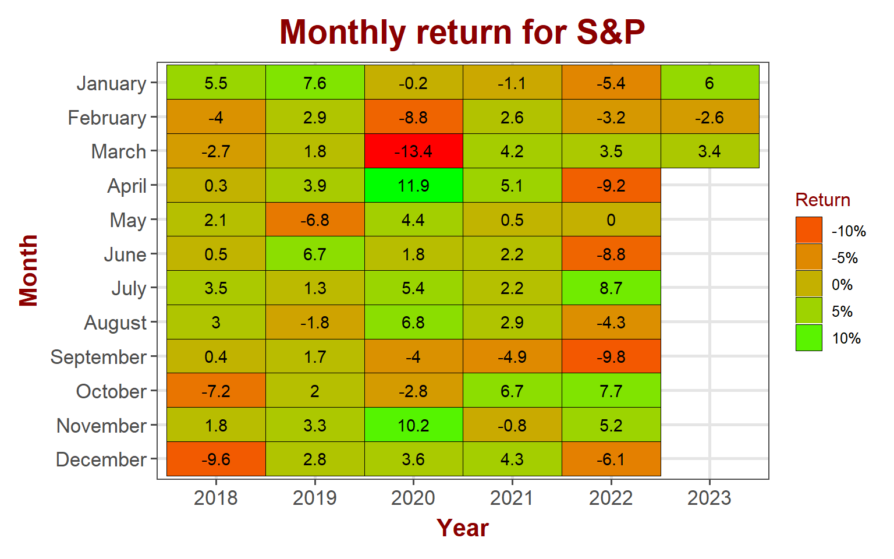
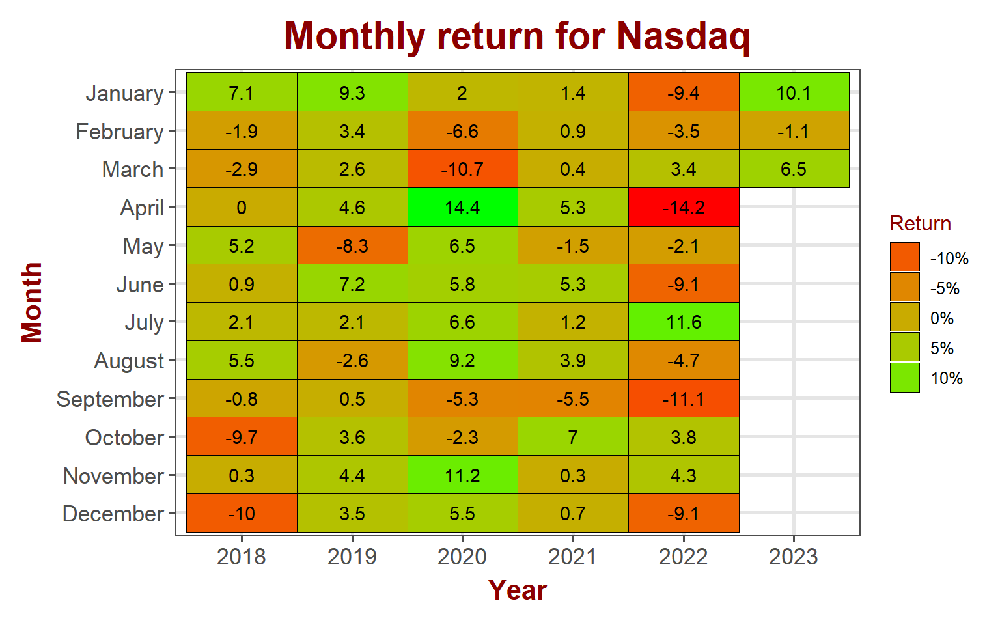
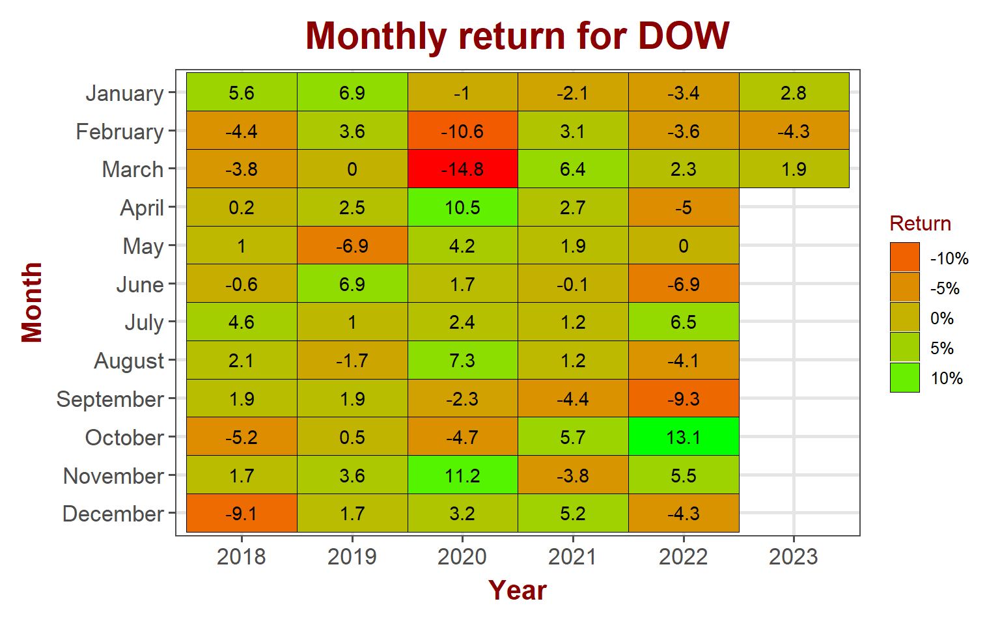
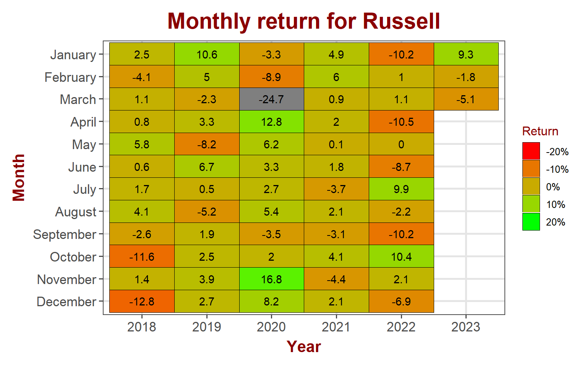
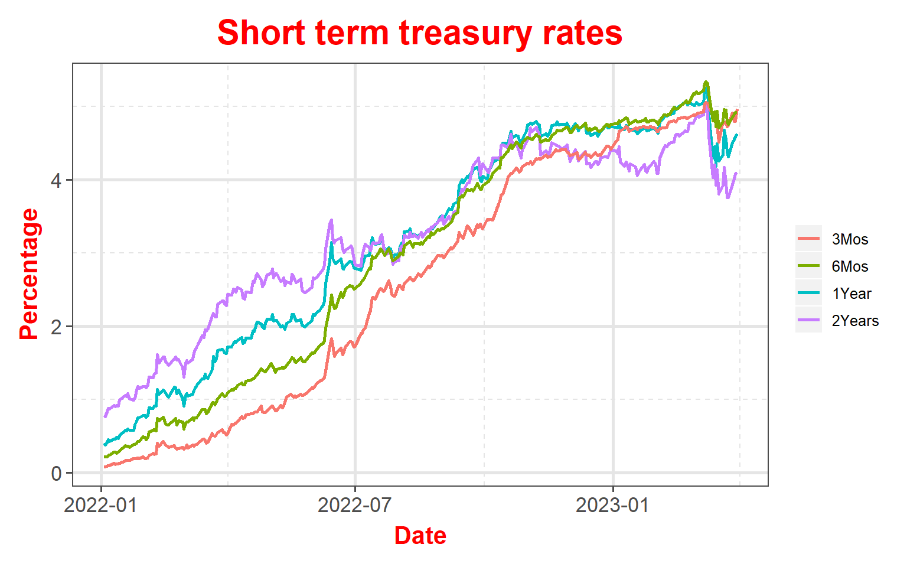
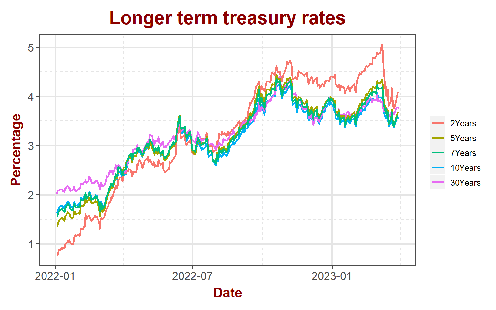
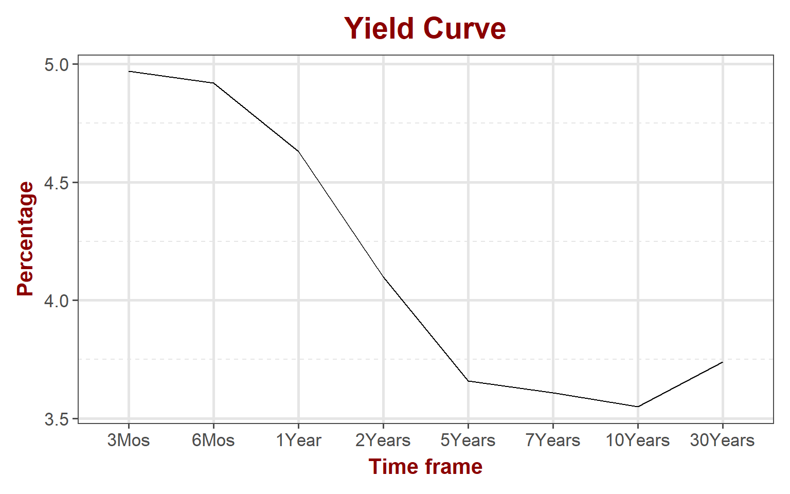
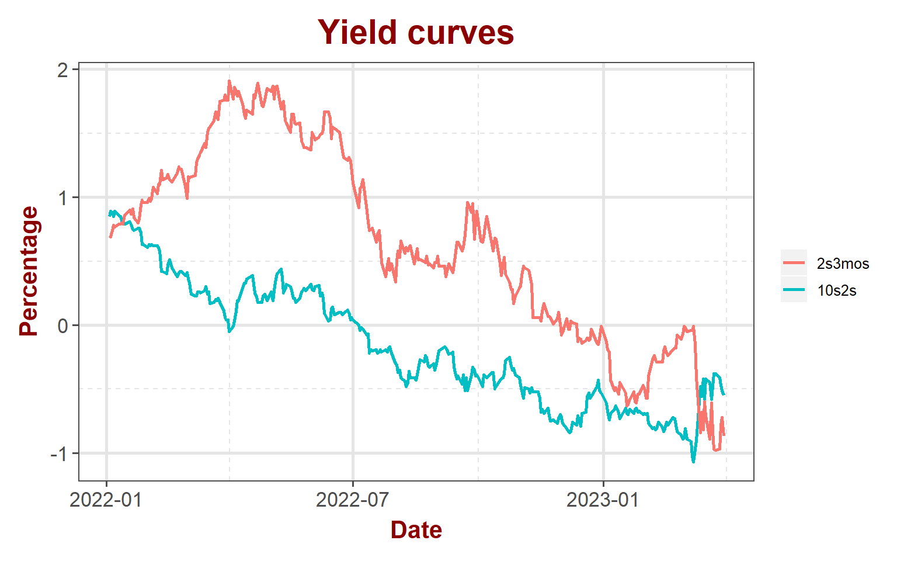

## Equity markets

Rally continued in the equity markets. Solid gains across the board with major indexes gaining over 3% for the week. Small caps participated in the rally as well with 3.8% gain for the week. VIX lost 15% and is below 20.

<table data-quarto-disable-processing='true' class='cl-fbee670c'><caption></caption><thead><tr style="overflow-wrap:break-word;"><th class="cl-fbe6d8ac">
Index
</th><th class="cl-fbe6d8b6">
Pre. Close
</th><th class="cl-fbe6d8ac">
Week
</th><th class="cl-fbe6d8b6">
Open
</th><th class="cl-fbe6d8b6">
High
</th><th class="cl-fbe6d8b6">
Low
</th><th class="cl-fbe6d8b6">
Close
</th><th class="cl-fbe6d8b6">
Weekly Return
</th></tr></thead><tbody><tr style="overflow-wrap:break-word;"><td class="cl-fbe6d8b7">
S&amp;P 500
</td><td class="cl-fbe6d8b8">
3,971
</td><td class="cl-fbe6d8b7">
202313
</td><td class="cl-fbe6d8b8">
3,983
</td><td class="cl-fbe6d8b8">
4,111
</td><td class="cl-fbe6d8b8">
3,952
</td><td class="cl-fbe6d8b8">
4,109
</td><td class="cl-fbe6d8b8">
3.42%
</td></tr><tr style="overflow-wrap:break-word;"><td class="cl-fbe6d8c0">
Nasdaq
</td><td class="cl-fbe6d8ca">
11,824
</td><td class="cl-fbe6d8c0">
202313
</td><td class="cl-fbe6d8ca">
11,869
</td><td class="cl-fbe6d8ca">
12,228
</td><td class="cl-fbe6d8ca">
11,635
</td><td class="cl-fbe6d8ca">
12,222
</td><td class="cl-fbe6d8ca">
3.31%
</td></tr><tr style="overflow-wrap:break-word;"><td class="cl-fbe6d8b7">
Dow Jones
</td><td class="cl-fbe6d8b8">
32,238
</td><td class="cl-fbe6d8b7">
202313
</td><td class="cl-fbe6d8b8">
32,277
</td><td class="cl-fbe6d8b8">
33,291
</td><td class="cl-fbe6d8b8">
32,277
</td><td class="cl-fbe6d8b8">
33,274
</td><td class="cl-fbe6d8b8">
3.16%
</td></tr><tr style="overflow-wrap:break-word;"><td class="cl-fbe6d8c0">
Russell
</td><td class="cl-fbe6d8ca">
1,735
</td><td class="cl-fbe6d8c0">
202313
</td><td class="cl-fbe6d8ca">
1,748
</td><td class="cl-fbe6d8ca">
1,803
</td><td class="cl-fbe6d8ca">
1,742
</td><td class="cl-fbe6d8ca">
1,802
</td><td class="cl-fbe6d8ca">
3.82%
</td></tr><tr style="overflow-wrap:break-word;"><td class="cl-fbe6d8b7">
VIX
</td><td class="cl-fbe6d8b8">
22
</td><td class="cl-fbe6d8b7">
202313
</td><td class="cl-fbe6d8b8">
22
</td><td class="cl-fbe6d8b8">
23
</td><td class="cl-fbe6d8b8">
19
</td><td class="cl-fbe6d8b8">
19
</td><td class="cl-fbe6d8b8">
-15.06%
</td></tr></tbody></table>

### S&P 500

S&P 500 bounced back from the support line with a solid 3.4% gains for the week. S&P ended march in green with 3.4% gain for the month. The index started March strongly but lost steam in the mid month, only to bounce back in the last week of the month. April is traditionally a strong month for stocks but it is to be noted that last year, S&P lost over 9% in April.

#### S&P 500 sector performance

Rally was robust across all S&P sectors. Energy sector, which was last week's loser, bounced back with a solid 6.34% for the week. Consumer discretionary and real estate were closely behind energy. Consumer staples and communication services lagged behind while financials gained 3.7% for the week.

<table data-quarto-disable-processing='true' class='cl-fd409b7a'><caption></caption><thead><tr style="overflow-wrap:break-word;"><th class="cl-fd371078">
Ticker
</th><th class="cl-fd371078">
Sector
</th><th class="cl-fd371078">
Week
</th><th class="cl-fd371082">
Open
</th><th class="cl-fd371082">
High
</th><th class="cl-fd371082">
Low
</th><th class="cl-fd371082">
Close
</th><th class="cl-fd371082">
Weekly Return
</th></tr></thead><tbody><tr style="overflow-wrap:break-word;"><td class="cl-fd37108c">
XLB
</td><td class="cl-fd37108c">
Materials
</td><td class="cl-fd37108c">
202313
</td><td class="cl-fd371096">
77.6
</td><td class="cl-fd371096">
80.7
</td><td class="cl-fd371096">
76.8
</td><td class="cl-fd371096">
80.66%
</td><td class="cl-fd371096">
5.01%
</td></tr><tr style="overflow-wrap:break-word;"><td class="cl-fd371097">
XLC
</td><td class="cl-fd371097">
Comm. Services
</td><td class="cl-fd371097">
202313
</td><td class="cl-fd3710a0">
56.6
</td><td class="cl-fd3710a0">
58.0
</td><td class="cl-fd3710a0">
55.6
</td><td class="cl-fd3710a0">
57.97%
</td><td class="cl-fd3710a0">
2.33%
</td></tr><tr style="overflow-wrap:break-word;"><td class="cl-fd37108c">
XLE
</td><td class="cl-fd37108c">
Energy
</td><td class="cl-fd37108c">
202313
</td><td class="cl-fd371096">
78.7
</td><td class="cl-fd371096">
83.0
</td><td class="cl-fd371096">
78.1
</td><td class="cl-fd371096">
82.83%
</td><td class="cl-fd371096">
6.34%
</td></tr><tr style="overflow-wrap:break-word;"><td class="cl-fd371097">
XLF
</td><td class="cl-fd371097">
Finance
</td><td class="cl-fd371097">
202313
</td><td class="cl-fd3710a0">
31.5
</td><td class="cl-fd3710a0">
32.2
</td><td class="cl-fd3710a0">
31.2
</td><td class="cl-fd3710a0">
32.15%
</td><td class="cl-fd3710a0">
3.74%
</td></tr><tr style="overflow-wrap:break-word;"><td class="cl-fd37108c">
XLI
</td><td class="cl-fd37108c">
Industrial
</td><td class="cl-fd37108c">
202313
</td><td class="cl-fd371096">
97.7
</td><td class="cl-fd371096">
101.2
</td><td class="cl-fd371096">
97.1
</td><td class="cl-fd371096">
101.18%
</td><td class="cl-fd371096">
4.41%
</td></tr><tr style="overflow-wrap:break-word;"><td class="cl-fd371097">
XLK
</td><td class="cl-fd371097">
Technology
</td><td class="cl-fd371097">
202313
</td><td class="cl-fd3710a0">
146.2
</td><td class="cl-fd3710a0">
151.2
</td><td class="cl-fd3710a0">
142.8
</td><td class="cl-fd3710a0">
151.01%
</td><td class="cl-fd3710a0">
3.46%
</td></tr><tr style="overflow-wrap:break-word;"><td class="cl-fd37108c">
XLP
</td><td class="cl-fd37108c">
Consumer Staples
</td><td class="cl-fd37108c">
202313
</td><td class="cl-fd371096">
73.2
</td><td class="cl-fd371096">
74.7
</td><td class="cl-fd371096">
73.2
</td><td class="cl-fd371096">
74.71%
</td><td class="cl-fd371096">
2.38%
</td></tr><tr style="overflow-wrap:break-word;"><td class="cl-fd371097">
XLRE
</td><td class="cl-fd371097">
Real Estate
</td><td class="cl-fd371097">
202313
</td><td class="cl-fd3710a0">
35.7
</td><td class="cl-fd3710a0">
37.4
</td><td class="cl-fd3710a0">
35.0
</td><td class="cl-fd3710a0">
37.38%
</td><td class="cl-fd3710a0">
5.27%
</td></tr><tr style="overflow-wrap:break-word;"><td class="cl-fd37108c">
XLU
</td><td class="cl-fd37108c">
Utility
</td><td class="cl-fd37108c">
202313
</td><td class="cl-fd371096">
65.9
</td><td class="cl-fd371096">
67.7
</td><td class="cl-fd371096">
65.6
</td><td class="cl-fd371096">
67.69%
</td><td class="cl-fd371096">
3.04%
</td></tr><tr style="overflow-wrap:break-word;"><td class="cl-fd371097">
XLV
</td><td class="cl-fd371097">
Health Care
</td><td class="cl-fd371097">
202313
</td><td class="cl-fd3710a0">
128.2
</td><td class="cl-fd3710a0">
129.5
</td><td class="cl-fd3710a0">
126.7
</td><td class="cl-fd3710a0">
129.46%
</td><td class="cl-fd3710a0">
1.70%
</td></tr><tr style="overflow-wrap:break-word;"><td class="cl-fd37108c">
XLY
</td><td class="cl-fd37108c">
Consumer Discretionary
</td><td class="cl-fd37108c">
202313
</td><td class="cl-fd371096">
142.9
</td><td class="cl-fd371096">
149.6
</td><td class="cl-fd371096">
140.7
</td><td class="cl-fd371096">
149.54%
</td><td class="cl-fd371096">
5.62%
</td></tr></tbody></table>

### NASDAQ

NASDAW gained \~3.5% last week to close the month with a solid 6.5% gain. Gains in tech indicate that investors are expecting that the much of the rate hikes is near the end.

### DOW Jones

DOW Jones gained \~1.9% in March. Blue chips continue to under perform the broader market this year with a modest 0.4% gain for the year.

### Russell

Small cap stocks lost \~5.1% for the month of March. It turned green for the year with an impressive gains at the end of march.

## Bond markets

### Interest rates

Treasuries were pretty much flat last week but the yield curve inversion continues to be steep

### Yield Curve

Yield curve appears to be flattening at the higher end but continues to be very steep at the lower end.

### Disclaimer

Anything on this blog is not an investment advice. It is essential that you fully understand the risks involved before making any investment decisions. You should consult with a financial professional to help you assess your risk tolerance and to determine an investment strategy that is suitable for your individual needs.

Please note that this disclaimer is not exhaustive and is provided for informational purposes only. Investing involves risks, and it is your responsibility to carefully consider the risks before making any investment decisions.
