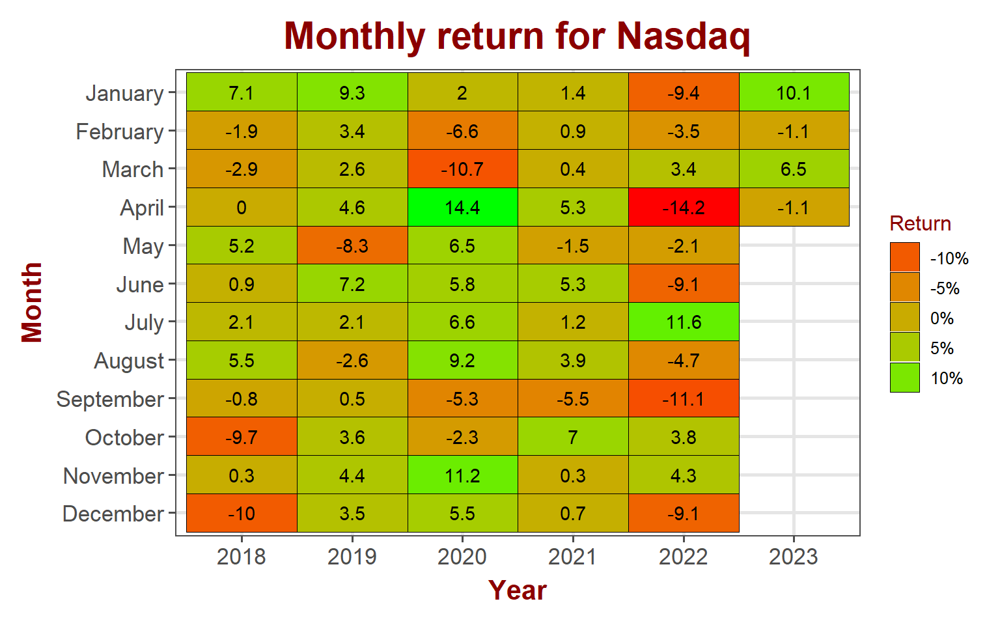

## Equity markets

Markets took a breather this week after the impressive gains the week prior. S&P stayed pretty flat with a loss of 0.1% while Nasdaq lost 1.1% and Russell lost 2.7%. Blue chips managed a 0.6% gain.

<table data-quarto-disable-processing='true' class='cl-f3f6fcfa'><caption></caption><thead><tr style="overflow-wrap:break-word;"><th class="cl-f3eebc20">
Index
</th><th class="cl-f3eebc2a">
Pre. Close
</th><th class="cl-f3eebc20">
Week
</th><th class="cl-f3eebc2a">
Open
</th><th class="cl-f3eebc2a">
High
</th><th class="cl-f3eebc2a">
Low
</th><th class="cl-f3eebc2a">
Close
</th><th class="cl-f3eebc2a">
Weekly Return
</th></tr></thead><tbody><tr style="overflow-wrap:break-word;"><td class="cl-f3eebc34">
S&amp;P 500
</td><td class="cl-f3eebc3e">
4,109
</td><td class="cl-f3eebc34">
202314
</td><td class="cl-f3eebc3e">
4,102
</td><td class="cl-f3eebc3e">
4,133
</td><td class="cl-f3eebc3e">
4,070
</td><td class="cl-f3eebc3e">
4,105
</td><td class="cl-f3eebc3e">
-0.10%
</td></tr><tr style="overflow-wrap:break-word;"><td class="cl-f3eebc3f">
Nasdaq
</td><td class="cl-f3eebc48">
12,222
</td><td class="cl-f3eebc3f">
202314
</td><td class="cl-f3eebc48">
12,146
</td><td class="cl-f3eebc48">
12,225
</td><td class="cl-f3eebc48">
11,898
</td><td class="cl-f3eebc48">
12,088
</td><td class="cl-f3eebc48">
-1.10%
</td></tr><tr style="overflow-wrap:break-word;"><td class="cl-f3eebc34">
Dow Jones
</td><td class="cl-f3eebc3e">
33,274
</td><td class="cl-f3eebc34">
202314
</td><td class="cl-f3eebc3e">
33,246
</td><td class="cl-f3eebc3e">
33,635
</td><td class="cl-f3eebc3e">
33,246
</td><td class="cl-f3eebc3e">
33,485
</td><td class="cl-f3eebc3e">
0.63%
</td></tr><tr style="overflow-wrap:break-word;"><td class="cl-f3eebc3f">
Russell
</td><td class="cl-f3eebc48">
1,802
</td><td class="cl-f3eebc3f">
202314
</td><td class="cl-f3eebc48">
1,804
</td><td class="cl-f3eebc48">
1,812
</td><td class="cl-f3eebc48">
1,743
</td><td class="cl-f3eebc48">
1,754
</td><td class="cl-f3eebc48">
-2.70%
</td></tr><tr style="overflow-wrap:break-word;"><td class="cl-f3eebc34">
VIX
</td><td class="cl-f3eebc3e">
19
</td><td class="cl-f3eebc34">
202314
</td><td class="cl-f3eebc3e">
20
</td><td class="cl-f3eebc3e">
20
</td><td class="cl-f3eebc3e">
18
</td><td class="cl-f3eebc3e">
18
</td><td class="cl-f3eebc3e">
-1.62%
</td></tr></tbody></table>

### S&P 500

S&P started April with a flat week. April over the last 4 years was pretty interesting with big gains/losses. It will be interesting to see how April 2023 turns out to be in the next few weeks.

#### S&P 500 sector performance

Investors turned to safety with nice gains for Utilities and health card. Consumer discretionary lost over 3% while financials lost 0.5%, putting a pause for big losses for the sector.

<table data-quarto-disable-processing='true' class='cl-f532f218'><caption></caption><thead><tr style="overflow-wrap:break-word;"><th class="cl-f5286884">
Ticker
</th><th class="cl-f5286884">
Sector
</th><th class="cl-f5286884">
Week
</th><th class="cl-f528688e">
Open
</th><th class="cl-f528688e">
High
</th><th class="cl-f528688e">
Low
</th><th class="cl-f528688e">
Close
</th><th class="cl-f528688e">
Weekly Return
</th></tr></thead><tbody><tr style="overflow-wrap:break-word;"><td class="cl-f528688f">
XLB
</td><td class="cl-f528688f">
Materials
</td><td class="cl-f528688f">
202314
</td><td class="cl-f5286890">
80.8
</td><td class="cl-f5286890">
81.4
</td><td class="cl-f5286890">
79.0
</td><td class="cl-f5286890">
79.63%
</td><td class="cl-f5286890">
-1.28%
</td></tr><tr style="overflow-wrap:break-word;"><td class="cl-f5286898">
XLC
</td><td class="cl-f5286898">
Comm. Services
</td><td class="cl-f5286898">
202314
</td><td class="cl-f5286899">
57.5
</td><td class="cl-f5286899">
59.1
</td><td class="cl-f5286899">
57.5
</td><td class="cl-f5286899">
58.93%
</td><td class="cl-f5286899">
1.66%
</td></tr><tr style="overflow-wrap:break-word;"><td class="cl-f528688f">
XLE
</td><td class="cl-f528688f">
Energy
</td><td class="cl-f528688f">
202314
</td><td class="cl-f5286890">
86.3
</td><td class="cl-f5286890">
87.1
</td><td class="cl-f5286890">
84.2
</td><td class="cl-f5286890">
84.98%
</td><td class="cl-f5286890">
2.60%
</td></tr><tr style="overflow-wrap:break-word;"><td class="cl-f5286898">
XLF
</td><td class="cl-f5286898">
Finance
</td><td class="cl-f5286898">
202314
</td><td class="cl-f5286899">
32.1
</td><td class="cl-f5286899">
32.3
</td><td class="cl-f5286899">
31.7
</td><td class="cl-f5286899">
31.99%
</td><td class="cl-f5286899">
-0.50%
</td></tr><tr style="overflow-wrap:break-word;"><td class="cl-f528688f">
XLI
</td><td class="cl-f528688f">
Industrial
</td><td class="cl-f528688f">
202314
</td><td class="cl-f5286890">
101.0
</td><td class="cl-f5286890">
101.8
</td><td class="cl-f5286890">
97.3
</td><td class="cl-f5286890">
97.77%
</td><td class="cl-f5286890">
-3.37%
</td></tr><tr style="overflow-wrap:break-word;"><td class="cl-f5286898">
XLK
</td><td class="cl-f5286898">
Technology
</td><td class="cl-f5286898">
202314
</td><td class="cl-f5286899">
150.1
</td><td class="cl-f5286899">
151.5
</td><td class="cl-f5286899">
146.5
</td><td class="cl-f5286899">
149.07%
</td><td class="cl-f5286899">
-1.28%
</td></tr><tr style="overflow-wrap:break-word;"><td class="cl-f528688f">
XLP
</td><td class="cl-f528688f">
Consumer Staples
</td><td class="cl-f528688f">
202314
</td><td class="cl-f5286890">
74.8
</td><td class="cl-f5286890">
75.6
</td><td class="cl-f5286890">
74.5
</td><td class="cl-f5286890">
75.36%
</td><td class="cl-f5286890">
0.87%
</td></tr><tr style="overflow-wrap:break-word;"><td class="cl-f5286898">
XLRE
</td><td class="cl-f5286898">
Real Estate
</td><td class="cl-f5286898">
202314
</td><td class="cl-f5286899">
37.3
</td><td class="cl-f5286899">
37.6
</td><td class="cl-f5286899">
36.6
</td><td class="cl-f5286899">
37.10%
</td><td class="cl-f5286899">
-0.75%
</td></tr><tr style="overflow-wrap:break-word;"><td class="cl-f528688f">
XLU
</td><td class="cl-f528688f">
Utility
</td><td class="cl-f528688f">
202314
</td><td class="cl-f5286890">
67.4
</td><td class="cl-f5286890">
70.0
</td><td class="cl-f5286890">
66.8
</td><td class="cl-f5286890">
69.81%
</td><td class="cl-f5286890">
3.13%
</td></tr><tr style="overflow-wrap:break-word;"><td class="cl-f5286898">
XLV
</td><td class="cl-f5286898">
Health Care
</td><td class="cl-f5286898">
202314
</td><td class="cl-f5286899">
129.6
</td><td class="cl-f5286899">
134.1
</td><td class="cl-f5286899">
129.2
</td><td class="cl-f5286899">
133.52%
</td><td class="cl-f5286899">
3.14%
</td></tr><tr style="overflow-wrap:break-word;"><td class="cl-f528688f">
XLY
</td><td class="cl-f528688f">
Consumer Discretionary
</td><td class="cl-f528688f">
202314
</td><td class="cl-f5286890">
148.2
</td><td class="cl-f5286890">
149.0
</td><td class="cl-f5286890">
142.9
</td><td class="cl-f5286890">
144.93%
</td><td class="cl-f5286890">
-3.08%
</td></tr></tbody></table>

### NASDAQ

Nasdaq's 1.1% loss this month so far pales in comparison to what it did in April in the last 4 years. Like S&P, it's losses/gains in April are historically high.

### DOW Jones

Contrary to the trend, DOW gained 0.6% in April so far.

### Russell

Small caps did not participate in the rally so far, losing 2.7% in April so far, posing doubts about the strength of this rally in S&P and Tech.

## Bond markets

### Interest rates

Treasury yields continue to trend lower across the yield curve.

### Yield Curve

Yield curve continues to flatten on the higher end. On the lower end, it is still very steep sloping negatively. Appears to be a long way ahead for it to at least flatten.

### Disclaimer

Anything on this blog is not an investment advice. It is essential that you fully understand the risks involved before making any investment decisions. You should consult with a financial professional to help you assess your risk tolerance and to determine an investment strategy that is suitable for your individual needs.

Please note that this disclaimer is not exhaustive and is provided for informational purposes only. Investing involves risks, and it is your responsibility to carefully consider the risks before making any investment decisions.
