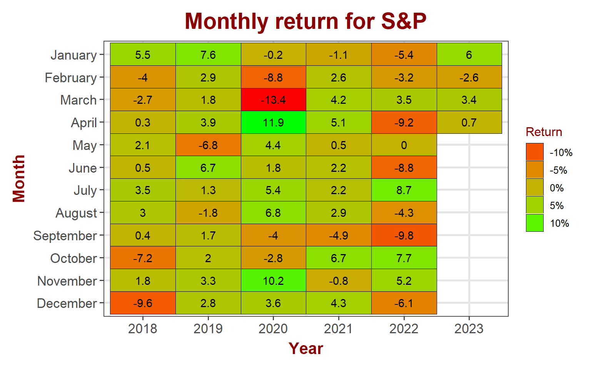
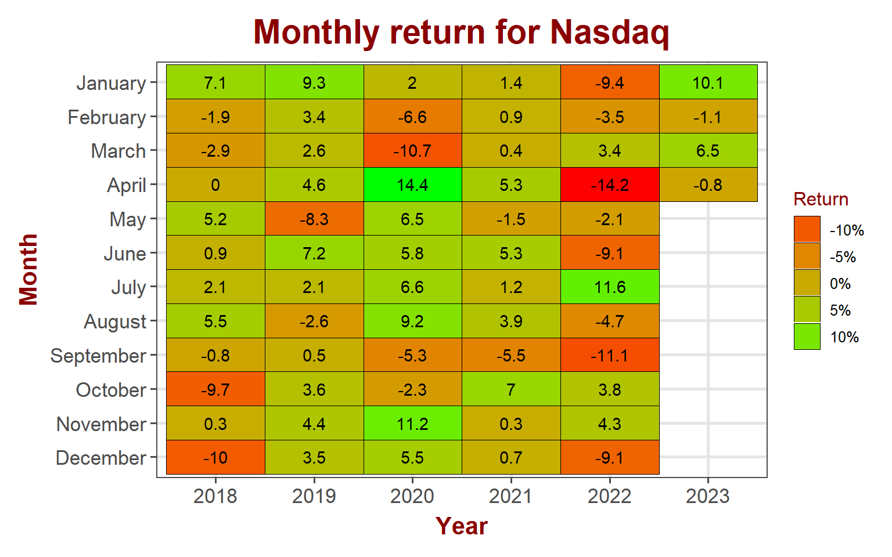
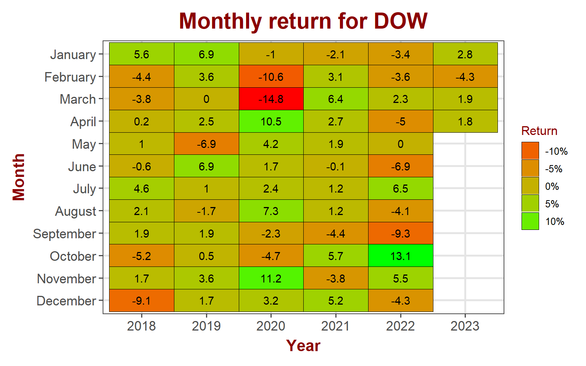
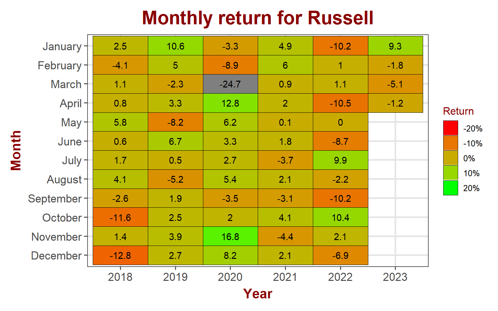
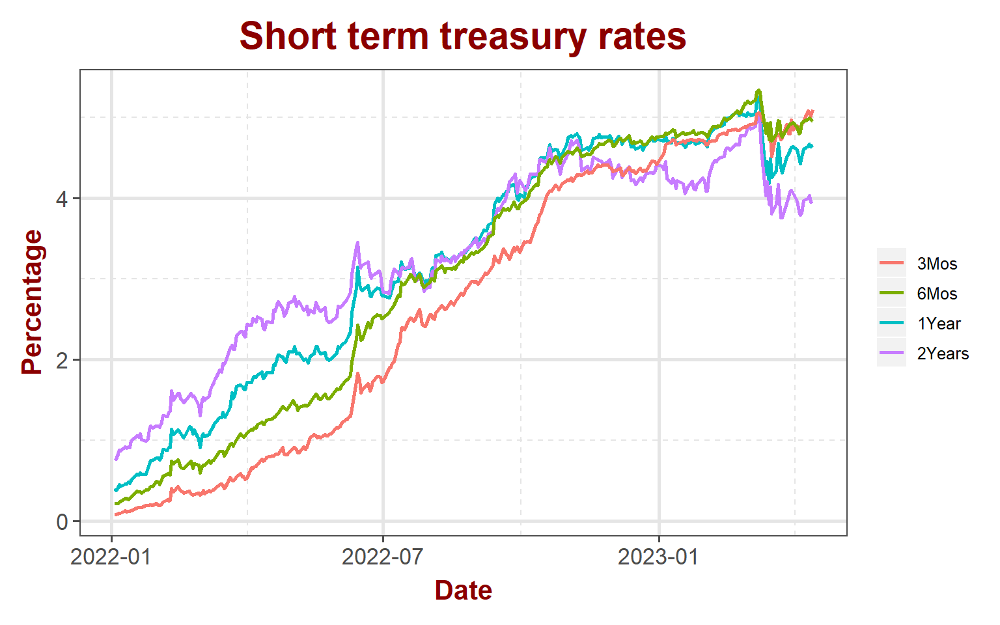
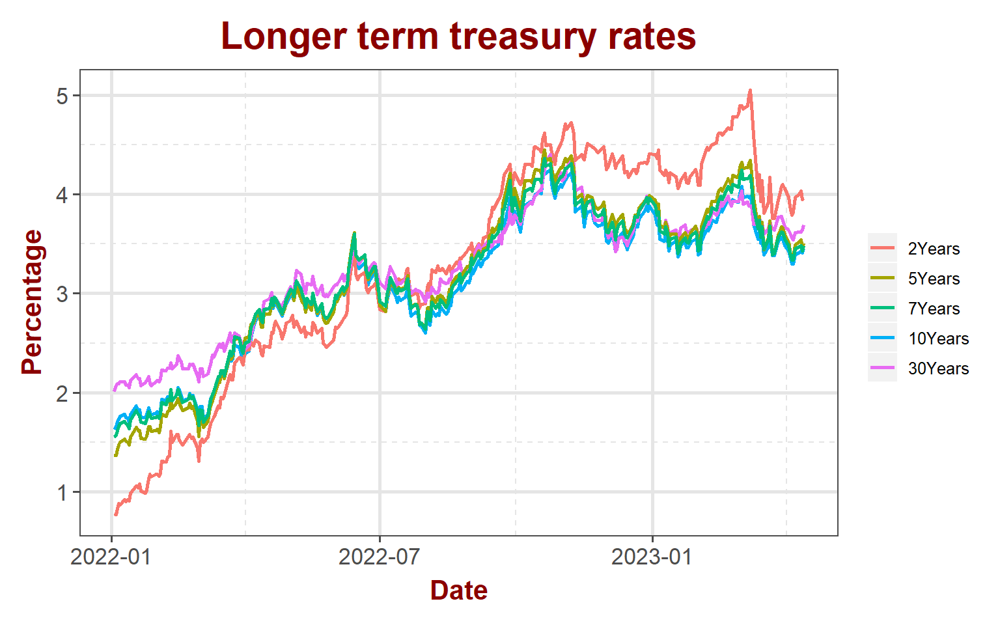
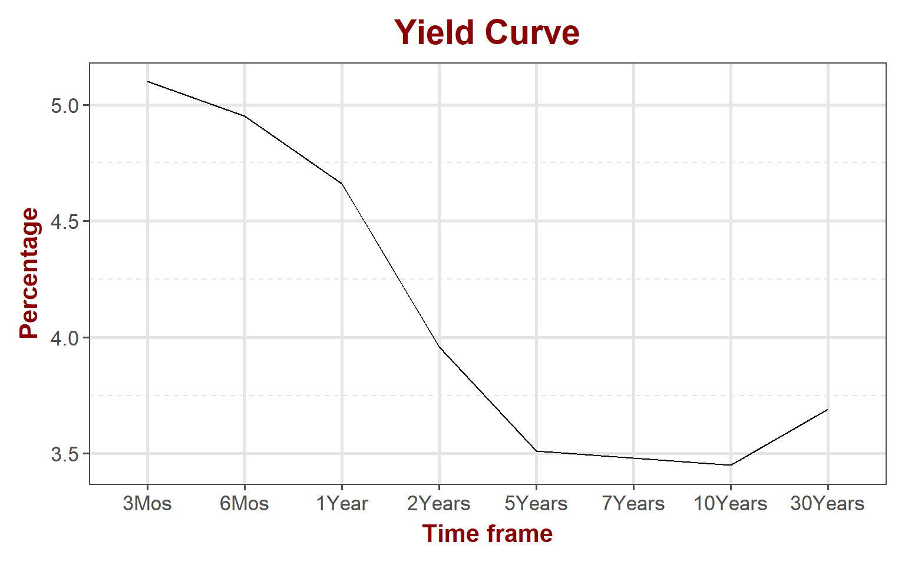
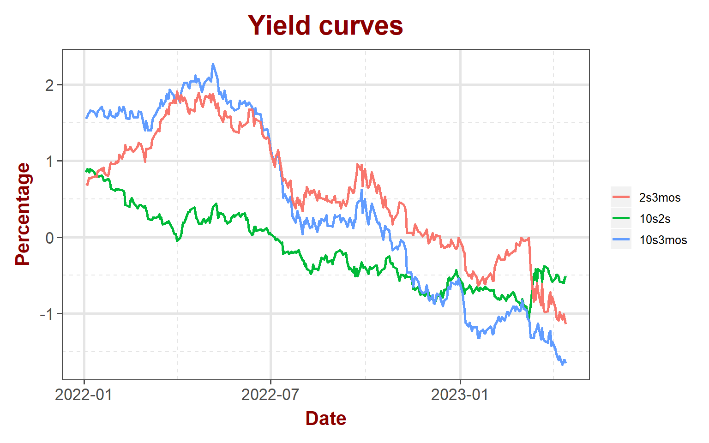

## Equity markets

Equity markets held pretty well after breaking out. S&P gained 0.8% while Blue chips outperformed with 1.2% gain last week. Small gaps gained 1.5%. VIX dropped 7.5%. Markets are at an inflection point right now. S&P at the recent highs with VIX at recent lows.

<table data-quarto-disable-processing='true' class='cl-05f21b62'><caption></caption><thead><tr style="overflow-wrap:break-word;"><th class="cl-05ea6e76">
Index
</th><th class="cl-05ea6e80">
Pre. Close
</th><th class="cl-05ea6e76">
Week
</th><th class="cl-05ea6e80">
Open
</th><th class="cl-05ea6e80">
High
</th><th class="cl-05ea6e80">
Low
</th><th class="cl-05ea6e80">
Close
</th><th class="cl-05ea6e80">
Weekly Return
</th></tr></thead><tbody><tr style="overflow-wrap:break-word;"><td class="cl-05ea6e81">
S&amp;P 500
</td><td class="cl-05ea6e8a">
4,105
</td><td class="cl-05ea6e81">
202315
</td><td class="cl-05ea6e8a">
4,085
</td><td class="cl-05ea6e8a">
4,163
</td><td class="cl-05ea6e8a">
4,073
</td><td class="cl-05ea6e8a">
4,138
</td><td class="cl-05ea6e8a">
0.79%
</td></tr><tr style="overflow-wrap:break-word;"><td class="cl-05ea6e8b">
Nasdaq
</td><td class="cl-05ea6e8c">
12,088
</td><td class="cl-05ea6e8b">
202315
</td><td class="cl-05ea6e8c">
11,975
</td><td class="cl-05ea6e8c">
12,206
</td><td class="cl-05ea6e8c">
11,917
</td><td class="cl-05ea6e8c">
12,123
</td><td class="cl-05ea6e8c">
0.29%
</td></tr><tr style="overflow-wrap:break-word;"><td class="cl-05ea6e81">
Dow Jones
</td><td class="cl-05ea6e8a">
33,485
</td><td class="cl-05ea6e81">
202315
</td><td class="cl-05ea6e8a">
33,425
</td><td class="cl-05ea6e8a">
34,083
</td><td class="cl-05ea6e8a">
33,343
</td><td class="cl-05ea6e8a">
33,886
</td><td class="cl-05ea6e8a">
1.19%
</td></tr><tr style="overflow-wrap:break-word;"><td class="cl-05ea6e8b">
Russell
</td><td class="cl-05ea6e8c">
1,754
</td><td class="cl-05ea6e8b">
202315
</td><td class="cl-05ea6e8c">
1,749
</td><td class="cl-05ea6e8c">
1,805
</td><td class="cl-05ea6e8c">
1,745
</td><td class="cl-05ea6e8c">
1,781
</td><td class="cl-05ea6e8c">
1.51%
</td></tr><tr style="overflow-wrap:break-word;"><td class="cl-05ea6e81">
VIX
</td><td class="cl-05ea6e8a">
18
</td><td class="cl-05ea6e81">
202315
</td><td class="cl-05ea6e8a">
19
</td><td class="cl-05ea6e8a">
20
</td><td class="cl-05ea6e8a">
17
</td><td class="cl-05ea6e8a">
17
</td><td class="cl-05ea6e8a">
-7.50%
</td></tr></tbody></table>

### S&P 500

S&P gained 0.7% in April so far. The coming week will make or break the index when many companies in S&P are reporting their quarterly results. Any downward revisions to earnings estimates will cause analysts to markdown S&P earnings, which could result in market volatility again.

#### S&P 500 sector performance

Financials finally brushed off fears and posted an impressive 2.8% gain for the week. Strong earnings and guidance from JP Morgan helped boost financial sector. Energy followed through with an impressive 2.65% gain for the week. Real estate lost 1.35% while safe utilities lost 1.3%

<table data-quarto-disable-processing='true' class='cl-073c7c24'><caption></caption><thead><tr style="overflow-wrap:break-word;"><th class="cl-0733609e">
Ticker
</th><th class="cl-0733609e">
Sector
</th><th class="cl-0733609e">
Week
</th><th class="cl-073360a8">
Open
</th><th class="cl-073360a8">
High
</th><th class="cl-073360a8">
Low
</th><th class="cl-073360a8">
Close
</th><th class="cl-073360a8">
Weekly Return
</th></tr></thead><tbody><tr style="overflow-wrap:break-word;"><td class="cl-073360a9">
XLB
</td><td class="cl-073360a9">
Materials
</td><td class="cl-073360a9">
202315
</td><td class="cl-073360b2">
79.3
</td><td class="cl-073360b2">
81.9
</td><td class="cl-073360b2">
79.2
</td><td class="cl-073360b2">
80.93%
</td><td class="cl-073360b2">
1.63%
</td></tr><tr style="overflow-wrap:break-word;"><td class="cl-073360b3">
XLC
</td><td class="cl-073360b3">
Comm. Services
</td><td class="cl-073360b3">
202315
</td><td class="cl-073360b4">
58.5
</td><td class="cl-073360b4">
59.4
</td><td class="cl-073360b4">
58.0
</td><td class="cl-073360b4">
59.23%
</td><td class="cl-073360b4">
0.51%
</td></tr><tr style="overflow-wrap:break-word;"><td class="cl-073360a9">
XLE
</td><td class="cl-073360a9">
Energy
</td><td class="cl-073360a9">
202315
</td><td class="cl-073360b2">
85.3
</td><td class="cl-073360b2">
87.7
</td><td class="cl-073360b2">
85.3
</td><td class="cl-073360b2">
87.23%
</td><td class="cl-073360b2">
2.65%
</td></tr><tr style="overflow-wrap:break-word;"><td class="cl-073360b3">
XLF
</td><td class="cl-073360b3">
Finance
</td><td class="cl-073360b3">
202315
</td><td class="cl-073360b4">
31.9
</td><td class="cl-073360b4">
33.1
</td><td class="cl-073360b4">
31.8
</td><td class="cl-073360b4">
32.88%
</td><td class="cl-073360b4">
2.78%
</td></tr><tr style="overflow-wrap:break-word;"><td class="cl-073360a9">
XLI
</td><td class="cl-073360a9">
Industrial
</td><td class="cl-073360a9">
202315
</td><td class="cl-073360b2">
97.4
</td><td class="cl-073360b2">
100.4
</td><td class="cl-073360b2">
97.4
</td><td class="cl-073360b2">
99.83%
</td><td class="cl-073360b2">
2.11%
</td></tr><tr style="overflow-wrap:break-word;"><td class="cl-073360b3">
XLK
</td><td class="cl-073360b3">
Technology
</td><td class="cl-073360b3">
202315
</td><td class="cl-073360b4">
147.6
</td><td class="cl-073360b4">
149.9
</td><td class="cl-073360b4">
146.5
</td><td class="cl-073360b4">
148.65%
</td><td class="cl-073360b4">
-0.28%
</td></tr><tr style="overflow-wrap:break-word;"><td class="cl-073360a9">
XLP
</td><td class="cl-073360a9">
Consumer Staples
</td><td class="cl-073360a9">
202315
</td><td class="cl-073360b2">
75.1
</td><td class="cl-073360b2">
75.8
</td><td class="cl-073360b2">
74.6
</td><td class="cl-073360b2">
75.18%
</td><td class="cl-073360b2">
-0.24%
</td></tr><tr style="overflow-wrap:break-word;"><td class="cl-073360b3">
XLRE
</td><td class="cl-073360b3">
Real Estate
</td><td class="cl-073360b3">
202315
</td><td class="cl-073360b4">
36.9
</td><td class="cl-073360b4">
37.9
</td><td class="cl-073360b4">
36.3
</td><td class="cl-073360b4">
36.60%
</td><td class="cl-073360b4">
-1.35%
</td></tr><tr style="overflow-wrap:break-word;"><td class="cl-073360a9">
XLU
</td><td class="cl-073360a9">
Utility
</td><td class="cl-073360a9">
202315
</td><td class="cl-073360b2">
69.4
</td><td class="cl-073360b2">
70.2
</td><td class="cl-073360b2">
68.3
</td><td class="cl-073360b2">
68.89%
</td><td class="cl-073360b2">
-1.32%
</td></tr><tr style="overflow-wrap:break-word;"><td class="cl-073360b3">
XLV
</td><td class="cl-073360b3">
Health Care
</td><td class="cl-073360b3">
202315
</td><td class="cl-073360b4">
133.2
</td><td class="cl-073360b4">
135.8
</td><td class="cl-073360b4">
132.5
</td><td class="cl-073360b4">
134.57%
</td><td class="cl-073360b4">
0.79%
</td></tr><tr style="overflow-wrap:break-word;"><td class="cl-073360a9">
XLY
</td><td class="cl-073360a9">
Consumer Discretionary
</td><td class="cl-073360a9">
202315
</td><td class="cl-073360b2">
143.4
</td><td class="cl-073360b2">
147.8
</td><td class="cl-073360b2">
142.6
</td><td class="cl-073360b2">
146.90%
</td><td class="cl-073360b2">
1.36%
</td></tr></tbody></table>

### NASDAQ

Nasdaq is still negative for the month losing 0.8% so far in April.

### DOW Jones

Dow outperformed other indices after a long time. It gained 1.8% so far in April.

### Russell

While small caps are still negative in April losing 1.2%, they put an impressive performance last week.

## Bond markets

### Interest rates

Short term rates inching up while long term rates staying flat to decreasing. This is further steepening the yield curve. Increasing short term rates and S&P at recent highs indicates that there may be some pain in store for equities in the weeks ahead.

### Yield Curve

Yield curve continues to flatten on the higher end. On the lower end, it is still very steep sloping negatively. Appears to be a long way ahead for it to at least flatten.

### Disclaimer

Anything on this blog is not an investment advice. It is essential that you fully understand the risks involved before making any investment decisions. You should consult with a financial professional to help you assess your risk tolerance and to determine an investment strategy that is suitable for your individual needs.

Please note that this disclaimer is not exhaustive and is provided for informational purposes only. Investing involves risks, and it is your responsibility to carefully consider the risks before making any investment decisions.
