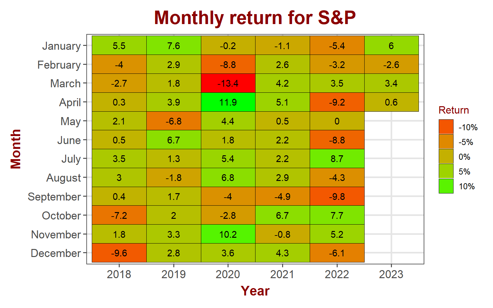
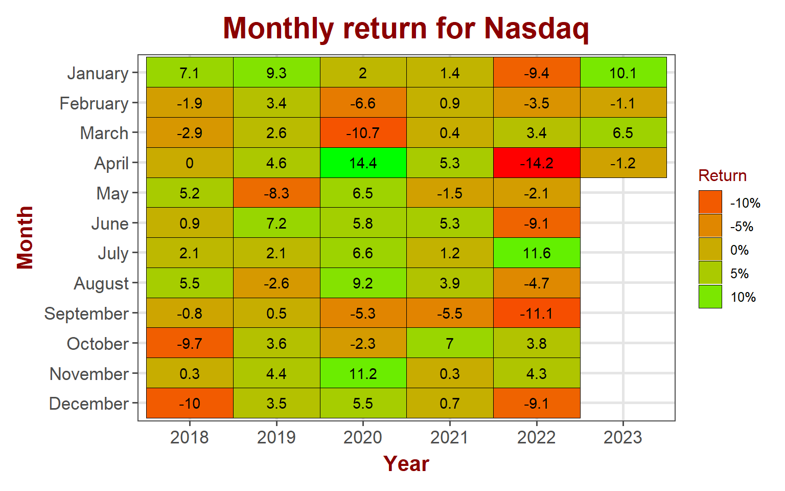
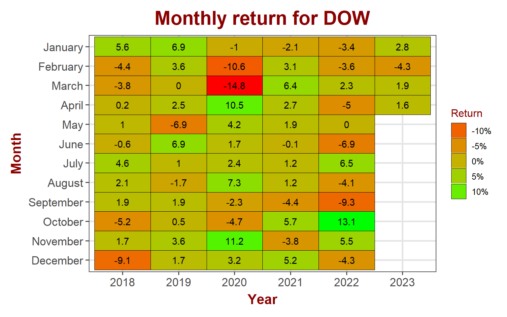
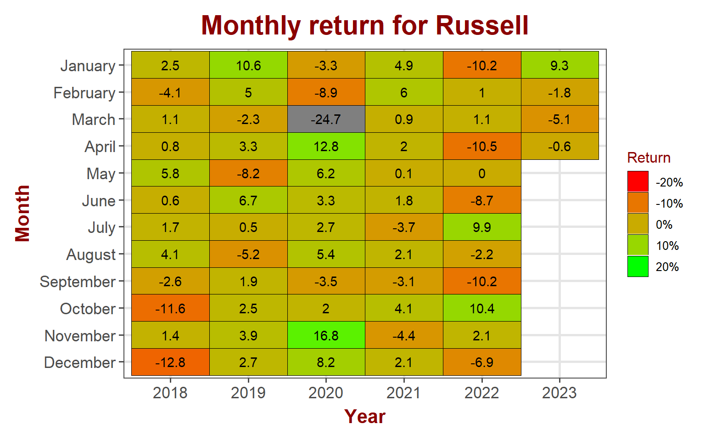
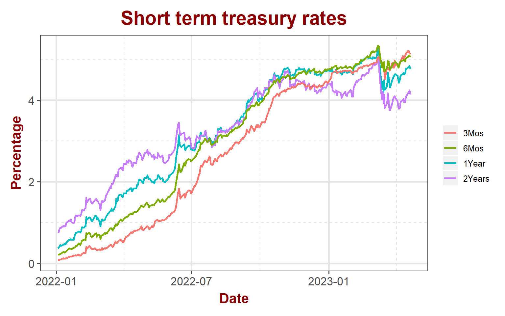
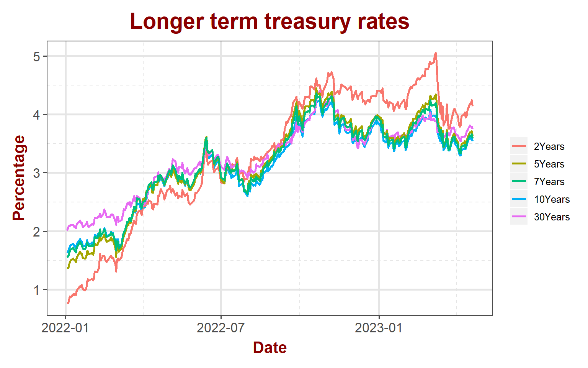
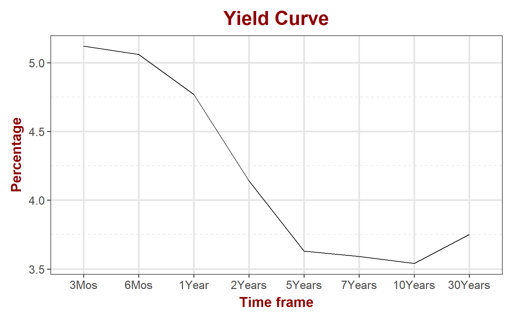
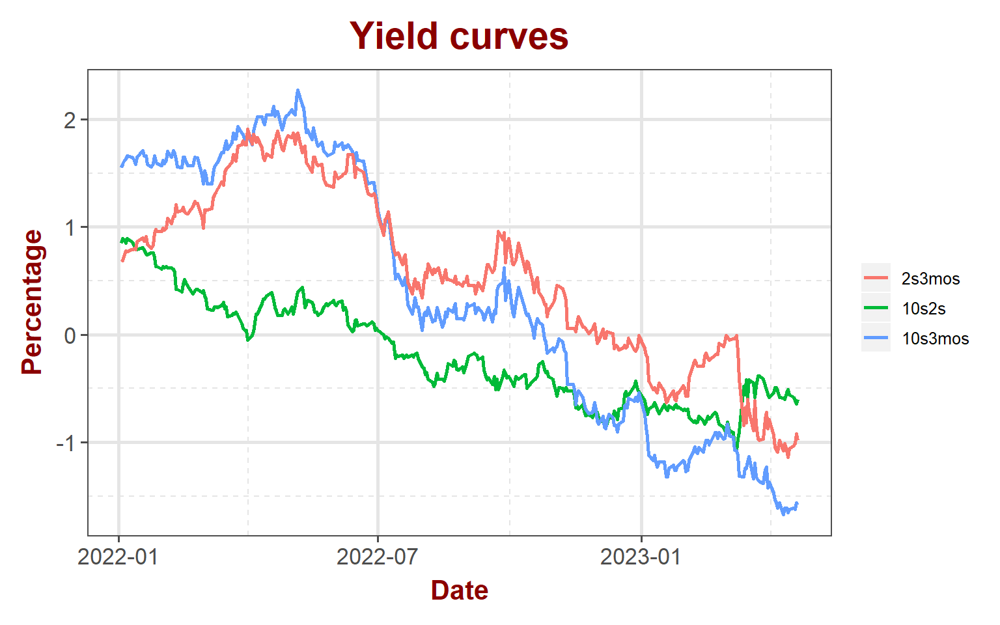

<link href="index_files/libs/tabwid-1.1.3/tabwid.css" rel="stylesheet" />

## Equity markets

Side ways chop continued in the equity markets last week, consolidating above the break out. Markets pretty much stayed flat with small losses except small caps that managed to gain 0.6% last week.

<table data-quarto-disable-processing='true' class='cl-e7faa422'><caption></caption><thead><tr style="overflow-wrap:break-word;"><th class="cl-e7f270b8">
Index
</th><th class="cl-e7f270c2">
Pre. Close
</th><th class="cl-e7f270b8">
Week
</th><th class="cl-e7f270c2">
Open
</th><th class="cl-e7f270c2">
High
</th><th class="cl-e7f270c2">
Low
</th><th class="cl-e7f270c2">
Close
</th><th class="cl-e7f270c2">
Weekly Return
</th></tr></thead><tbody><tr style="overflow-wrap:break-word;"><td class="cl-e7f270c3">
S&amp;P 500
</td><td class="cl-e7f270cc">
4,138
</td><td class="cl-e7f270c3">
202316
</td><td class="cl-e7f270cc">
4,137
</td><td class="cl-e7f270cc">
4,169
</td><td class="cl-e7f270cc">
4,114
</td><td class="cl-e7f270cc">
4,134
</td><td class="cl-e7f270cc">
-0.10%
</td></tr><tr style="overflow-wrap:break-word;"><td class="cl-e7f270cd">
Nasdaq
</td><td class="cl-e7f270d6">
12,123
</td><td class="cl-e7f270cd">
202316
</td><td class="cl-e7f270d6">
12,108
</td><td class="cl-e7f270d6">
12,245
</td><td class="cl-e7f270d6">
11,987
</td><td class="cl-e7f270d6">
12,072
</td><td class="cl-e7f270d6">
-0.42%
</td></tr><tr style="overflow-wrap:break-word;"><td class="cl-e7f270c3">
Dow Jones
</td><td class="cl-e7f270cc">
33,886
</td><td class="cl-e7f270c3">
202316
</td><td class="cl-e7f270cc">
33,930
</td><td class="cl-e7f270cc">
34,019
</td><td class="cl-e7f270cc">
33,678
</td><td class="cl-e7f270cc">
33,809
</td><td class="cl-e7f270cc">
-0.23%
</td></tr><tr style="overflow-wrap:break-word;"><td class="cl-e7f270cd">
Russell
</td><td class="cl-e7f270d6">
1,781
</td><td class="cl-e7f270cd">
202316
</td><td class="cl-e7f270d6">
1,784
</td><td class="cl-e7f270d6">
1,810
</td><td class="cl-e7f270d6">
1,777
</td><td class="cl-e7f270d6">
1,792
</td><td class="cl-e7f270d6">
0.58%
</td></tr><tr style="overflow-wrap:break-word;"><td class="cl-e7f270c3">
VIX
</td><td class="cl-e7f270cc">
17
</td><td class="cl-e7f270c3">
202316
</td><td class="cl-e7f270cc">
18
</td><td class="cl-e7f270cc">
18
</td><td class="cl-e7f270cc">
16
</td><td class="cl-e7f270cc">
17
</td><td class="cl-e7f270cc">
-1.77%
</td></tr></tbody></table>

### S&P 500

S&P gained 0.6% in April so far. Quarterly results in the coming weeks will decide the direction for markets. Many companies are scheduled to report in the next couple of weeks.

### NASDAQ

Nasdaq is negative for the month losing 1.2% so far in April.

### DOW Jones

Dow gained 1.6% so far in April.

### Russell

While small caps are still negative in April losing 0.6%, they are showing relative strength over the overall markets.

## Bond markets

### Interest rates

Interest rates continue to inch up. Stocks are holding up at recent highs while interest rates continue to inch up. This may indicate that investor are believing that the interest rates are at near highs.

### Yield Curve

Nothing much changed on the yield curve. It still has steep negative slope on the lower end. The yield curve inversion is steepest now with no signs of relief.

### Disclaimer

Anything on this blog is not an investment advice. It is essential that you fully understand the risks involved before making any investment decisions. You should consult with a financial professional to help you assess your risk tolerance and to determine an investment strategy that is suitable for your individual needs.

Please note that this disclaimer is not exhaustive and is provided for informational purposes only. Investing involves risks, and it is your responsibility to carefully consider the risks before making any investment decisions.
