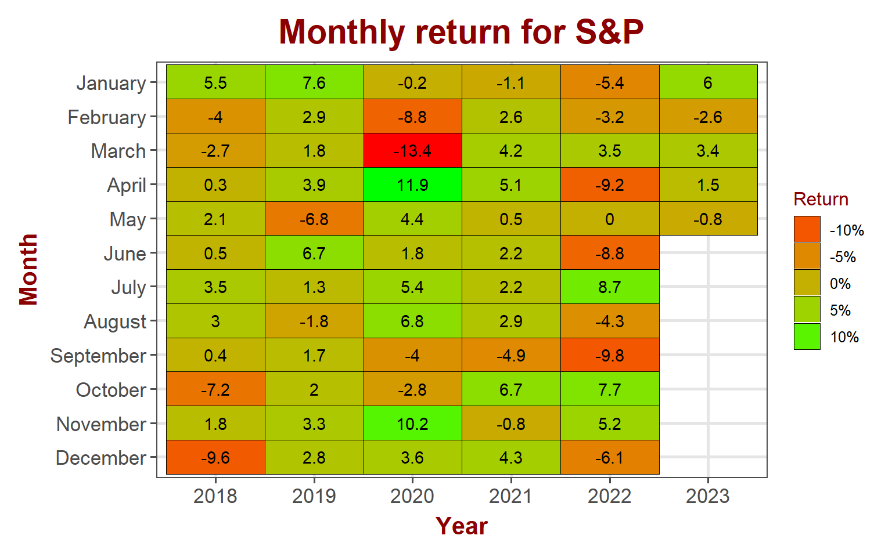
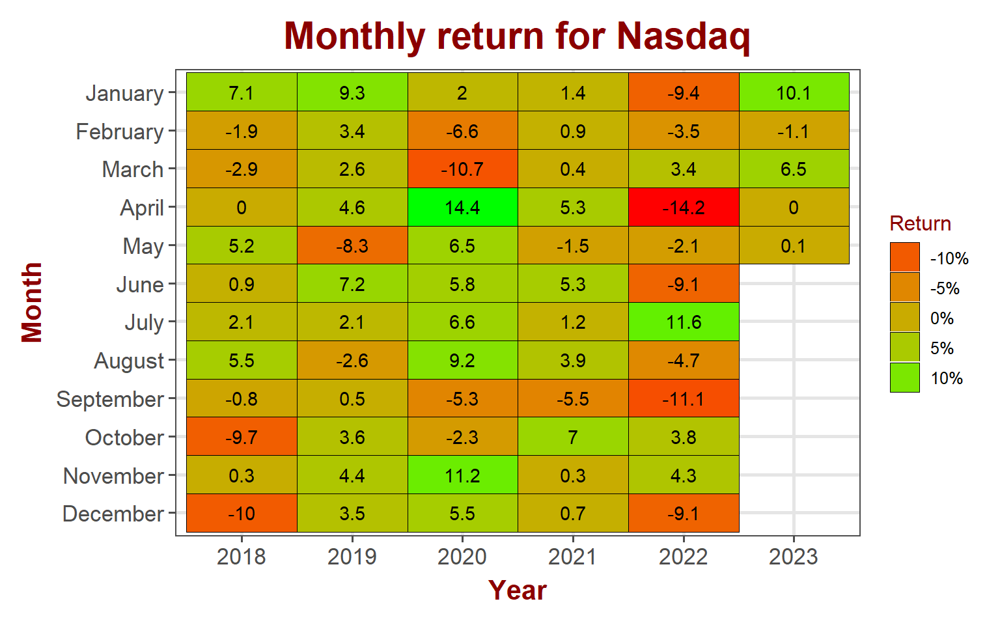
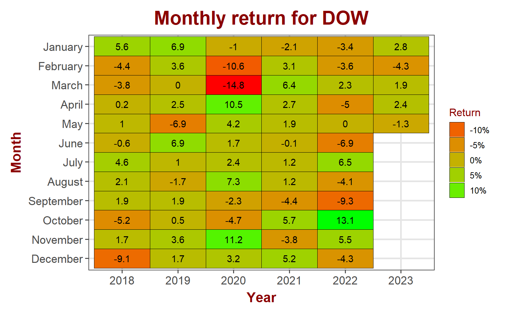
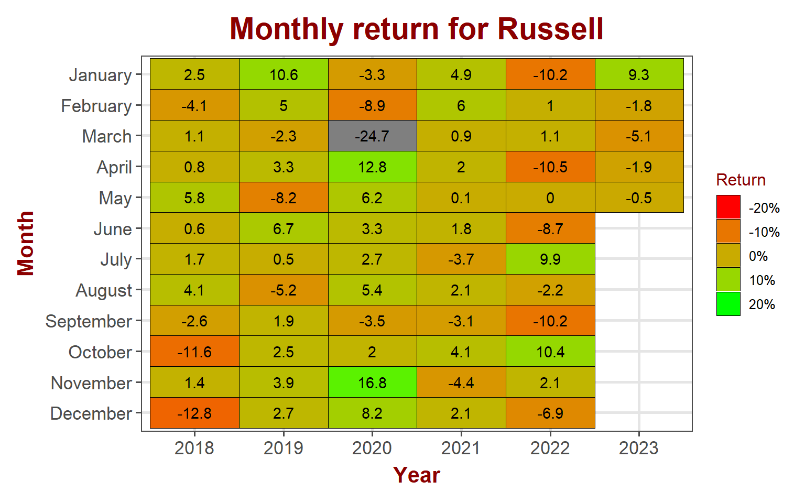
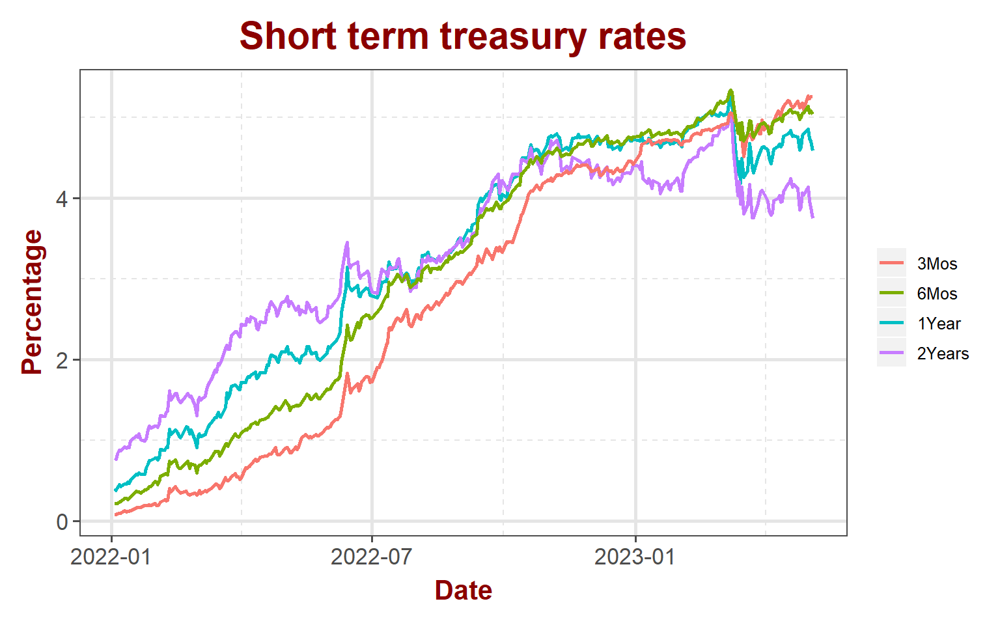
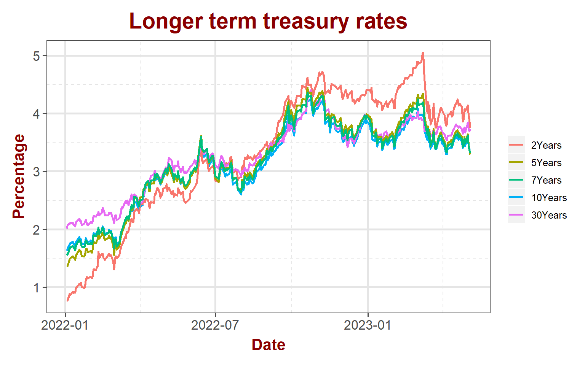
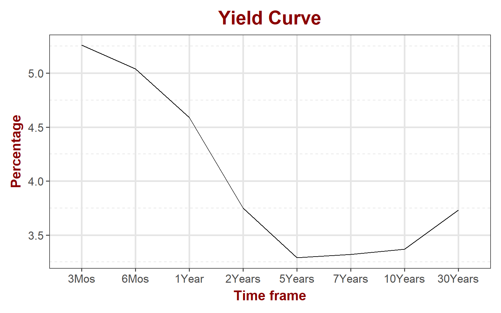
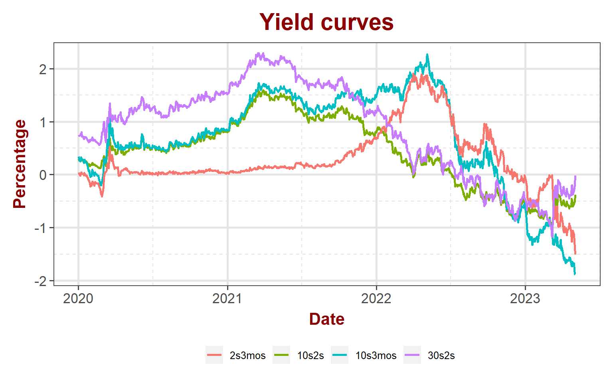

<link href="index_files/libs/tabwid-1.1.3/tabwid.css" rel="stylesheet" />

## Equity markets

Stock market had strong gains this week barring small caps. While S&P, Nasdaq and DOW enjoyed strong gains, small caps lost 1.27%. VIX continues to trend down and is now under 16.

<table data-quarto-disable-processing='true' class='cl-c4217dc4'><caption></caption><thead><tr style="overflow-wrap:break-word;"><th class="cl-c41949b0">
Index
</th><th class="cl-c41949b1">
Pre. Close
</th><th class="cl-c41949b0">
Week
</th><th class="cl-c41949b1">
Open
</th><th class="cl-c41949b1">
High
</th><th class="cl-c41949b1">
Low
</th><th class="cl-c41949b1">
Close
</th><th class="cl-c41949b1">
Weekly Return
</th></tr></thead><tbody><tr style="overflow-wrap:break-word;"><td class="cl-c41949ba">
S&amp;P 500
</td><td class="cl-c41949bb">
4,169
</td><td class="cl-c41949ba">
202318
</td><td class="cl-c41949bb">
4,167
</td><td class="cl-c41949bb">
4,187
</td><td class="cl-c41949bb">
4,048
</td><td class="cl-c41949bb">
4,136
</td><td class="cl-c41949bb">
-0.80%
</td></tr><tr style="overflow-wrap:break-word;"><td class="cl-c41949c4">
Nasdaq
</td><td class="cl-c41949c5">
12,227
</td><td class="cl-c41949c4">
202318
</td><td class="cl-c41949c5">
12,210
</td><td class="cl-c41949c5">
12,265
</td><td class="cl-c41949c5">
11,925
</td><td class="cl-c41949c5">
12,235
</td><td class="cl-c41949c5">
0.07%
</td></tr><tr style="overflow-wrap:break-word;"><td class="cl-c41949ba">
Dow Jones
</td><td class="cl-c41949bb">
34,098
</td><td class="cl-c41949ba">
202318
</td><td class="cl-c41949bb">
34,117
</td><td class="cl-c41949bb">
34,258
</td><td class="cl-c41949bb">
32,938
</td><td class="cl-c41949bb">
33,674
</td><td class="cl-c41949bb">
-1.25%
</td></tr><tr style="overflow-wrap:break-word;"><td class="cl-c41949c4">
Russell
</td><td class="cl-c41949c5">
1,769
</td><td class="cl-c41949c4">
202318
</td><td class="cl-c41949c5">
1,765
</td><td class="cl-c41949c5">
1,785
</td><td class="cl-c41949c5">
1,705
</td><td class="cl-c41949c5">
1,760
</td><td class="cl-c41949c5">
-0.52%
</td></tr><tr style="overflow-wrap:break-word;"><td class="cl-c41949ba">
VIX
</td><td class="cl-c41949bb">
15.8
</td><td class="cl-c41949ba">
202318
</td><td class="cl-c41949bb">
16.4
</td><td class="cl-c41949bb">
21.3
</td><td class="cl-c41949bb">
15.5
</td><td class="cl-c41949bb">
17.2
</td><td class="cl-c41949bb">
8.56%
</td></tr></tbody></table>

### S&P 500

S&P gained 1.5% in April so far. The index is sitting near the January's highs. FOMC on Wednesday could create volatility and set the direction for the index. The current expectations are for the Fed to raise another 25 basis points.

#### S&P 500 sector performance

Communication services and Technology led the index with 3.8% and 2% gains while utilities and industrials dragged the index with 0.9% and 0.6% losses respectively.

<table data-quarto-disable-processing='true' class='cl-c4f100ee'><caption></caption><thead><tr style="overflow-wrap:break-word;"><th class="cl-c4e7e22a">
Ticker
</th><th class="cl-c4e7e22a">
Sector
</th><th class="cl-c4e7e22a">
Week
</th><th class="cl-c4e7e234">
Open
</th><th class="cl-c4e7e234">
High
</th><th class="cl-c4e7e234">
Low
</th><th class="cl-c4e7e234">
Close
</th><th class="cl-c4e7e234">
Weekly Return
</th></tr></thead><tbody><tr style="overflow-wrap:break-word;"><td class="cl-c4e7e23e">
XLB
</td><td class="cl-c4e7e23e">
Materials
</td><td class="cl-c4e7e23e">
202318
</td><td class="cl-c4e7e248">
80.7
</td><td class="cl-c4e7e248">
81.0
</td><td class="cl-c4e7e248">
78.1
</td><td class="cl-c4e7e248">
79.66%
</td><td class="cl-c4e7e248">
-1.10%
</td></tr><tr style="overflow-wrap:break-word;"><td class="cl-c4e7e249">
XLC
</td><td class="cl-c4e7e249">
Comm. Services
</td><td class="cl-c4e7e249">
202318
</td><td class="cl-c4e7e24a">
59.8
</td><td class="cl-c4e7e24a">
60.1
</td><td class="cl-c4e7e24a">
57.4
</td><td class="cl-c4e7e24a">
58.33%
</td><td class="cl-c4e7e24a">
-2.62%
</td></tr><tr style="overflow-wrap:break-word;"><td class="cl-c4e7e23e">
XLE
</td><td class="cl-c4e7e23e">
Energy
</td><td class="cl-c4e7e23e">
202318
</td><td class="cl-c4e7e248">
84.1
</td><td class="cl-c4e7e248">
85.1
</td><td class="cl-c4e7e248">
77.9
</td><td class="cl-c4e7e248">
80.23%
</td><td class="cl-c4e7e248">
-5.76%
</td></tr><tr style="overflow-wrap:break-word;"><td class="cl-c4e7e249">
XLF
</td><td class="cl-c4e7e249">
Finance
</td><td class="cl-c4e7e249">
202318
</td><td class="cl-c4e7e24a">
33.3
</td><td class="cl-c4e7e24a">
33.4
</td><td class="cl-c4e7e24a">
31.3
</td><td class="cl-c4e7e24a">
32.33%
</td><td class="cl-c4e7e24a">
-2.53%
</td></tr><tr style="overflow-wrap:break-word;"><td class="cl-c4e7e23e">
XLI
</td><td class="cl-c4e7e23e">
Industrial
</td><td class="cl-c4e7e23e">
202318
</td><td class="cl-c4e7e248">
100.0
</td><td class="cl-c4e7e248">
101.1
</td><td class="cl-c4e7e248">
97.5
</td><td class="cl-c4e7e248">
99.51%
</td><td class="cl-c4e7e248">
-0.49%
</td></tr><tr style="overflow-wrap:break-word;"><td class="cl-c4e7e249">
XLK
</td><td class="cl-c4e7e249">
Technology
</td><td class="cl-c4e7e249">
202318
</td><td class="cl-c4e7e24a">
150.7
</td><td class="cl-c4e7e24a">
151.8
</td><td class="cl-c4e7e24a">
146.9
</td><td class="cl-c4e7e24a">
151.24%
</td><td class="cl-c4e7e24a">
0.27%
</td></tr><tr style="overflow-wrap:break-word;"><td class="cl-c4e7e23e">
XLP
</td><td class="cl-c4e7e23e">
Consumer Staples
</td><td class="cl-c4e7e23e">
202318
</td><td class="cl-c4e7e248">
77.3
</td><td class="cl-c4e7e248">
77.8
</td><td class="cl-c4e7e248">
76.2
</td><td class="cl-c4e7e248">
77.18%
</td><td class="cl-c4e7e248">
-0.34%
</td></tr><tr style="overflow-wrap:break-word;"><td class="cl-c4e7e249">
XLRE
</td><td class="cl-c4e7e249">
Real Estate
</td><td class="cl-c4e7e249">
202318
</td><td class="cl-c4e7e24a">
37.6
</td><td class="cl-c4e7e24a">
37.8
</td><td class="cl-c4e7e24a">
36.4
</td><td class="cl-c4e7e24a">
37.44%
</td><td class="cl-c4e7e24a">
-0.82%
</td></tr><tr style="overflow-wrap:break-word;"><td class="cl-c4e7e23e">
XLU
</td><td class="cl-c4e7e23e">
Utility
</td><td class="cl-c4e7e23e">
202318
</td><td class="cl-c4e7e248">
68.8
</td><td class="cl-c4e7e248">
69.8
</td><td class="cl-c4e7e248">
67.5
</td><td class="cl-c4e7e248">
69.03%
</td><td class="cl-c4e7e248">
0.07%
</td></tr><tr style="overflow-wrap:break-word;"><td class="cl-c4e7e249">
XLV
</td><td class="cl-c4e7e249">
Health Care
</td><td class="cl-c4e7e249">
202318
</td><td class="cl-c4e7e24a">
133.7
</td><td class="cl-c4e7e24a">
134.9
</td><td class="cl-c4e7e24a">
131.8
</td><td class="cl-c4e7e24a">
133.59%
</td><td class="cl-c4e7e24a">
0.04%
</td></tr><tr style="overflow-wrap:break-word;"><td class="cl-c4e7e23e">
XLY
</td><td class="cl-c4e7e23e">
Consumer Discretionary
</td><td class="cl-c4e7e23e">
202318
</td><td class="cl-c4e7e248">
147.5
</td><td class="cl-c4e7e248">
147.9
</td><td class="cl-c4e7e248">
144.0
</td><td class="cl-c4e7e248">
147.19%
</td><td class="cl-c4e7e248">
-0.45%
</td></tr></tbody></table>

### NASDAQ

Nasdaq is essentially flat for the month. Historically volatile April proved to be a non-event month so far for NASDAQ. Wednesday's FOMC has the potential to change that.

### DOW Jones

Blue chips continue to outperform with 2.4% gain in April.

### Russell

Small caps continue to under perform losing 1.9% in April so far. Lack of participation from small caps in this rally casts serious doubts on the continuation of the rally into the future. It will not be a bad idea to get some protection ahead of the volatile FOMC this coming week.

## Bond markets

### Interest rates

Story remains same in the bond markets. Short term rates inching up slightly while the long term rates continue to trend sideways. The action provides no relief to the ever steepening yield curve.

### Yield Curve

Lower end of the yield curve is still very steep sloping negatively. No signs of it flattening anytime soon.

### Disclaimer

Anything on this blog is not an investment advice. It is essential that you fully understand the risks involved before making any investment decisions. You should consult with a financial professional to help you assess your risk tolerance and to determine an investment strategy that is suitable for your individual needs.

Please note that this disclaimer is not exhaustive and is provided for informational purposes only. Investing involves risks, and it is your responsibility to carefully consider the risks before making any investment decisions.
