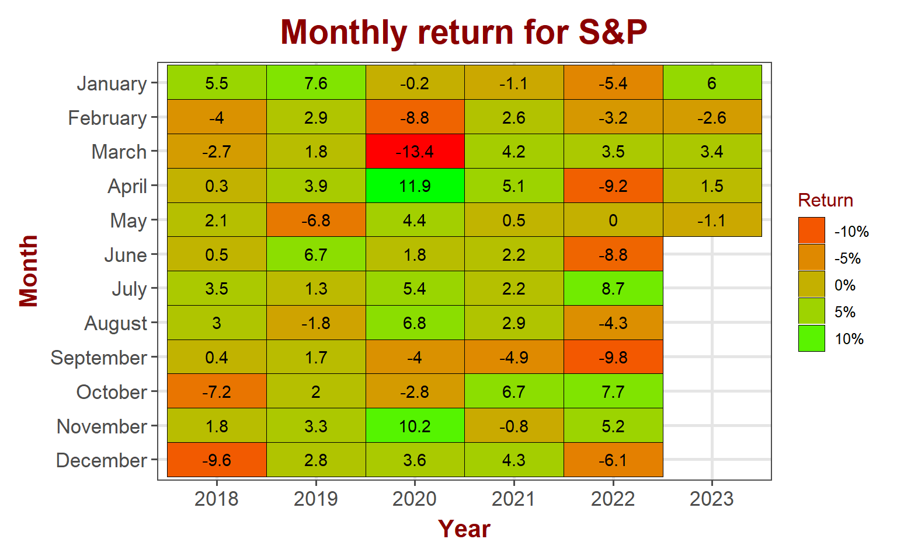
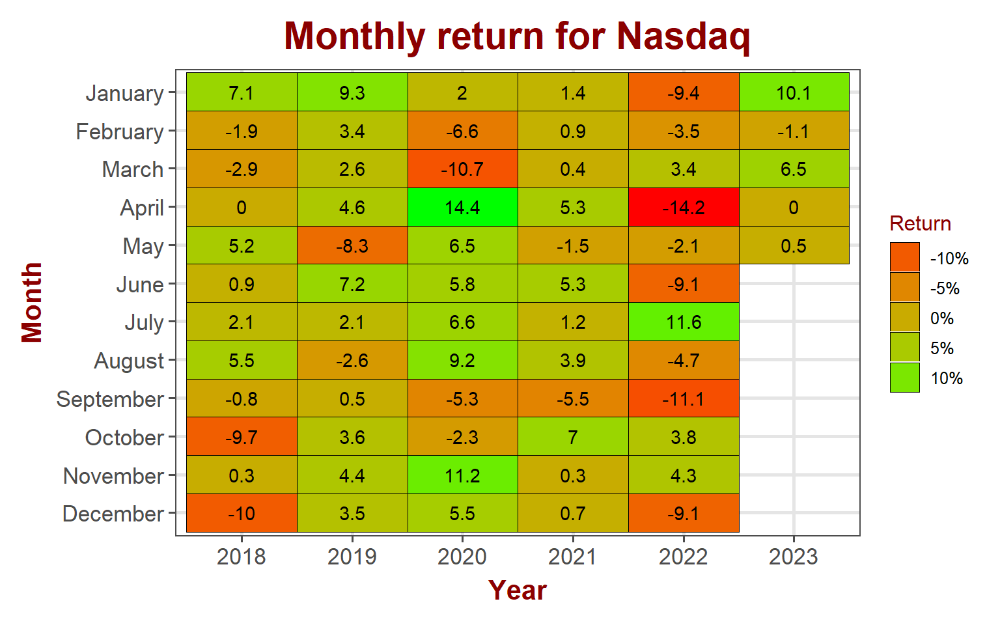
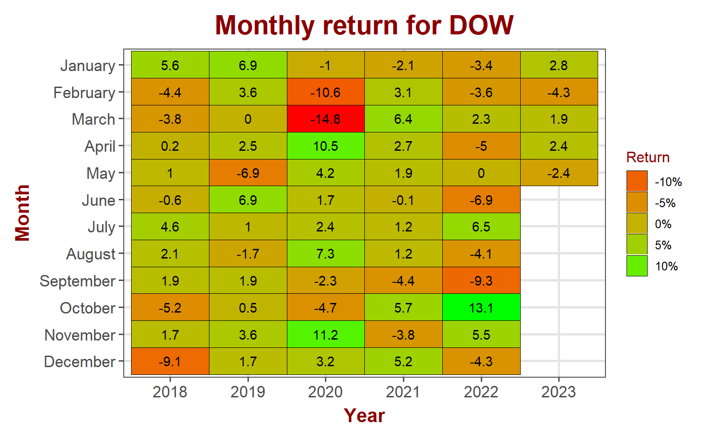
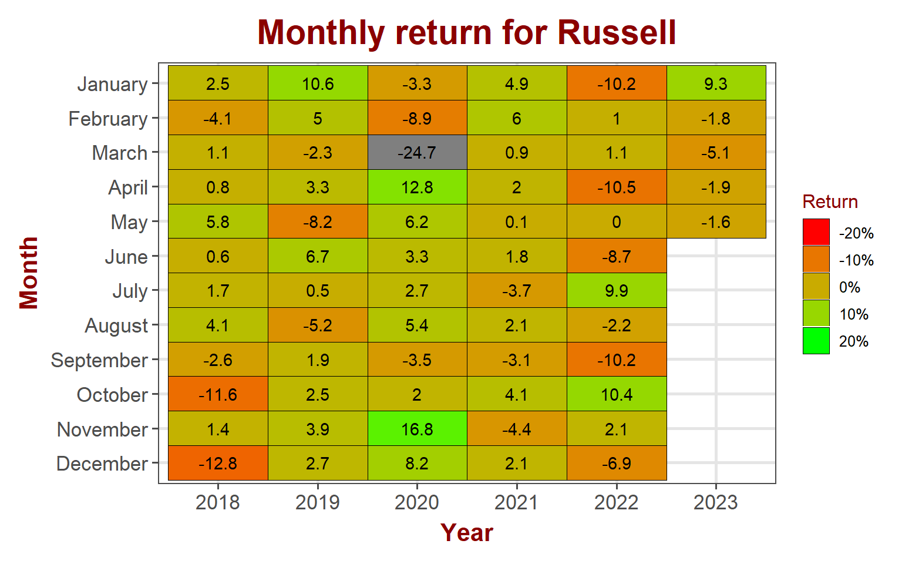
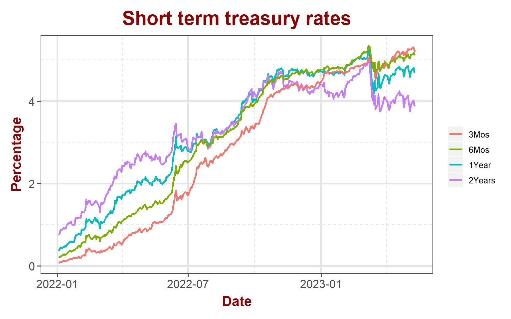
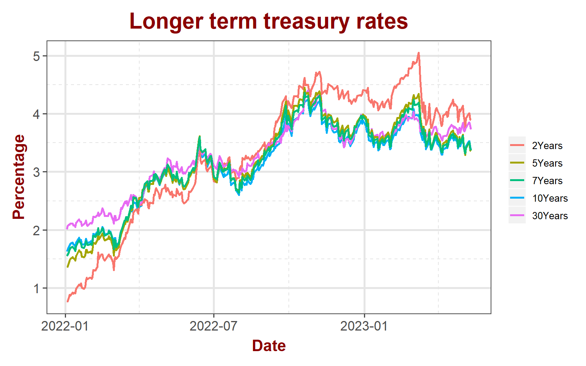
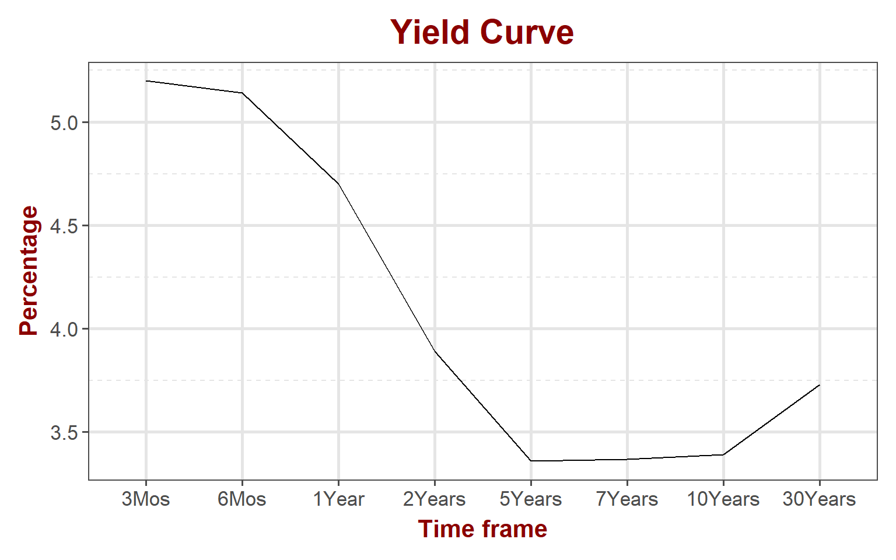
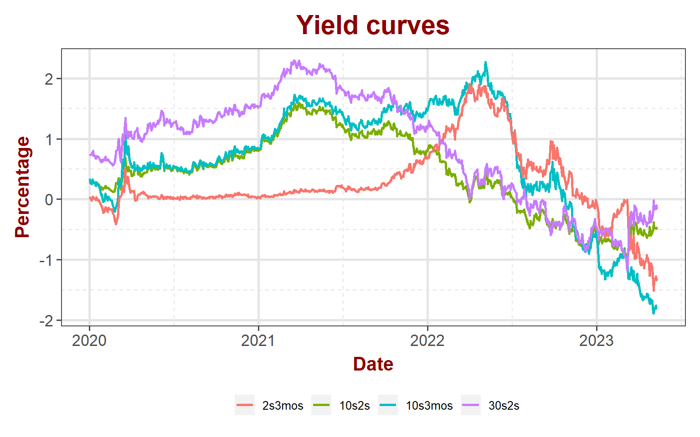

<link href="index_files/libs/tabwid-1.1.3/tabwid.css" rel="stylesheet" />

## Equity markets

Equity markets stayed flat for the week, pretty much chopping all week. Now that majority of the S&P companies earnings reports are out of the way, markets are looking for the next catalyst to find direction. Indices held pretty good through much of the company earnings.

<table data-quarto-disable-processing='true' class='cl-295dad78'><caption></caption><thead><tr style="overflow-wrap:break-word;"><th class="cl-2954ab1a">
Index
</th><th class="cl-2954ab2e">
Pre. Close
</th><th class="cl-2954ab1a">
Week
</th><th class="cl-2954ab2e">
Open
</th><th class="cl-2954ab2e">
High
</th><th class="cl-2954ab2e">
Low
</th><th class="cl-2954ab2e">
Close
</th><th class="cl-2954ab2e">
Weekly Return
</th></tr></thead><tbody><tr style="overflow-wrap:break-word;"><td class="cl-2954ab2f">
S&amp;P 500
</td><td class="cl-2954ab38">
4,136
</td><td class="cl-2954ab2f">
202319
</td><td class="cl-2954ab38">
4,137
</td><td class="cl-2954ab38">
4,154
</td><td class="cl-2954ab38">
4,099
</td><td class="cl-2954ab38">
4,124
</td><td class="cl-2954ab38">
-0.29%
</td></tr><tr style="overflow-wrap:break-word;"><td class="cl-2954ab39">
Nasdaq
</td><td class="cl-2954ab42">
12,235
</td><td class="cl-2954ab39">
202319
</td><td class="cl-2954ab42">
12,232
</td><td class="cl-2954ab42">
12,365
</td><td class="cl-2954ab42">
12,174
</td><td class="cl-2954ab42">
12,285
</td><td class="cl-2954ab42">
0.40%
</td></tr><tr style="overflow-wrap:break-word;"><td class="cl-2954ab2f">
Dow Jones
</td><td class="cl-2954ab38">
33,674
</td><td class="cl-2954ab2f">
202319
</td><td class="cl-2954ab38">
33,715
</td><td class="cl-2954ab38">
33,772
</td><td class="cl-2954ab38">
33,111
</td><td class="cl-2954ab38">
33,301
</td><td class="cl-2954ab38">
-1.12%
</td></tr><tr style="overflow-wrap:break-word;"><td class="cl-2954ab39">
Russell
</td><td class="cl-2954ab42">
1,760
</td><td class="cl-2954ab39">
202319
</td><td class="cl-2954ab42">
1,766
</td><td class="cl-2954ab42">
1,773
</td><td class="cl-2954ab42">
1,731
</td><td class="cl-2954ab42">
1,741
</td><td class="cl-2954ab42">
-1.09%
</td></tr><tr style="overflow-wrap:break-word;"><td class="cl-2954ab2f">
VIX
</td><td class="cl-2954ab38">
17.2
</td><td class="cl-2954ab2f">
202319
</td><td class="cl-2954ab38">
17.7
</td><td class="cl-2954ab38">
18.3
</td><td class="cl-2954ab38">
16.4
</td><td class="cl-2954ab38">
17.0
</td><td class="cl-2954ab38">
-0.94%
</td></tr></tbody></table>

### S&P 500

S&P lost 1.1% for the month. The index is pretty much range bound since the end of March and continued to chop.

#### S&P 500 sector performance

Energy sector continued losing this week with a loss of 2.1% with materials closing behind it losing 1.96%. Communication services bounced back from last week's losses gaining 2.37% for the week.

<table data-quarto-disable-processing='true' class='cl-2a3a0b24'><caption></caption><thead><tr style="overflow-wrap:break-word;"><th class="cl-2a31b5fa">
Ticker
</th><th class="cl-2a31b5fa">
Sector
</th><th class="cl-2a31b5fa">
Week
</th><th class="cl-2a31b604">
Open
</th><th class="cl-2a31b604">
High
</th><th class="cl-2a31b604">
Low
</th><th class="cl-2a31b604">
Close
</th><th class="cl-2a31b604">
Weekly Return
</th></tr></thead><tbody><tr style="overflow-wrap:break-word;"><td class="cl-2a31b60e">
XLB
</td><td class="cl-2a31b60e">
Materials
</td><td class="cl-2a31b60e">
202319
</td><td class="cl-2a31b60f">
80.2
</td><td class="cl-2a31b60f">
80.3
</td><td class="cl-2a31b60f">
77.4
</td><td class="cl-2a31b60f">
78.10%
</td><td class="cl-2a31b60f">
-1.96%
</td></tr><tr style="overflow-wrap:break-word;"><td class="cl-2a31b610">
XLC
</td><td class="cl-2a31b610">
Comm. Services
</td><td class="cl-2a31b610">
202319
</td><td class="cl-2a31b618">
58.2
</td><td class="cl-2a31b618">
60.0
</td><td class="cl-2a31b618">
58.2
</td><td class="cl-2a31b618">
59.71%
</td><td class="cl-2a31b618">
2.37%
</td></tr><tr style="overflow-wrap:break-word;"><td class="cl-2a31b60e">
XLE
</td><td class="cl-2a31b60e">
Energy
</td><td class="cl-2a31b60e">
202319
</td><td class="cl-2a31b60f">
81.4
</td><td class="cl-2a31b60f">
81.8
</td><td class="cl-2a31b60f">
77.8
</td><td class="cl-2a31b60f">
78.52%
</td><td class="cl-2a31b60f">
-2.13%
</td></tr><tr style="overflow-wrap:break-word;"><td class="cl-2a31b610">
XLF
</td><td class="cl-2a31b610">
Finance
</td><td class="cl-2a31b610">
202319
</td><td class="cl-2a31b618">
32.5
</td><td class="cl-2a31b618">
32.6
</td><td class="cl-2a31b618">
31.7
</td><td class="cl-2a31b618">
31.90%
</td><td class="cl-2a31b618">
-1.33%
</td></tr><tr style="overflow-wrap:break-word;"><td class="cl-2a31b60e">
XLI
</td><td class="cl-2a31b60e">
Industrial
</td><td class="cl-2a31b60e">
202319
</td><td class="cl-2a31b60f">
99.9
</td><td class="cl-2a31b60f">
100.1
</td><td class="cl-2a31b60f">
97.7
</td><td class="cl-2a31b60f">
98.48%
</td><td class="cl-2a31b60f">
-1.04%
</td></tr><tr style="overflow-wrap:break-word;"><td class="cl-2a31b610">
XLK
</td><td class="cl-2a31b610">
Technology
</td><td class="cl-2a31b610">
202319
</td><td class="cl-2a31b618">
150.9
</td><td class="cl-2a31b618">
152.2
</td><td class="cl-2a31b618">
149.8
</td><td class="cl-2a31b618">
150.95%
</td><td class="cl-2a31b618">
-0.19%
</td></tr><tr style="overflow-wrap:break-word;"><td class="cl-2a31b60e">
XLP
</td><td class="cl-2a31b60e">
Consumer Staples
</td><td class="cl-2a31b60e">
202319
</td><td class="cl-2a31b60f">
76.9
</td><td class="cl-2a31b60f">
77.2
</td><td class="cl-2a31b60f">
76.0
</td><td class="cl-2a31b60f">
77.12%
</td><td class="cl-2a31b60f">
-0.08%
</td></tr><tr style="overflow-wrap:break-word;"><td class="cl-2a31b610">
XLRE
</td><td class="cl-2a31b610">
Real Estate
</td><td class="cl-2a31b610">
202319
</td><td class="cl-2a31b618">
37.3
</td><td class="cl-2a31b618">
37.6
</td><td class="cl-2a31b618">
36.6
</td><td class="cl-2a31b618">
37.09%
</td><td class="cl-2a31b618">
-0.93%
</td></tr><tr style="overflow-wrap:break-word;"><td class="cl-2a31b60e">
XLU
</td><td class="cl-2a31b60e">
Utility
</td><td class="cl-2a31b60e">
202319
</td><td class="cl-2a31b60f">
69.0
</td><td class="cl-2a31b60f">
69.5
</td><td class="cl-2a31b60f">
68.2
</td><td class="cl-2a31b60f">
69.03%
</td><td class="cl-2a31b60f">
0.00%
</td></tr><tr style="overflow-wrap:break-word;"><td class="cl-2a31b610">
XLV
</td><td class="cl-2a31b610">
Health Care
</td><td class="cl-2a31b610">
202319
</td><td class="cl-2a31b618">
133.4
</td><td class="cl-2a31b618">
133.4
</td><td class="cl-2a31b618">
131.5
</td><td class="cl-2a31b618">
132.19%
</td><td class="cl-2a31b618">
-1.05%
</td></tr><tr style="overflow-wrap:break-word;"><td class="cl-2a31b60e">
XLY
</td><td class="cl-2a31b60e">
Consumer Discretionary
</td><td class="cl-2a31b60e">
202319
</td><td class="cl-2a31b60f">
147.6
</td><td class="cl-2a31b60f">
150.0
</td><td class="cl-2a31b60f">
146.6
</td><td class="cl-2a31b60f">
147.83%
</td><td class="cl-2a31b60f">
0.43%
</td></tr></tbody></table>

### NASDAQ

NASDAQ continued to show relative strength with 0.5% for the month. Any signs of central banks pausing or cutting rates should favor tech stocks for the rest of the year.

### DOW Jones

Blue chips lost 2.4% for the month so far. It has now given up all gains from April.

### Russell

Small caps continue to under perform losing 1.6% in May so far.

## Bond markets

### Interest rates

Story remains same in the treasure market. Short term rates keep raining/flat while longer term rates falling slightly.

### Yield Curve

Nothing changed on the yield curve front. Longer term 30s2s curve approaching zero while 10s2s is closely following. These two turning positive should bring some enthusiasm into the equity markets.

### Disclaimer

Anything on this blog is not an investment advice. It is essential that you fully understand the risks involved before making any investment decisions. You should consult with a financial professional to help you assess your risk tolerance and to determine an investment strategy that is suitable for your individual needs.

Please note that this disclaimer is not exhaustive and is provided for informational purposes only. Investing involves risks, and it is your responsibility to carefully consider the risks before making any investment decisions.
